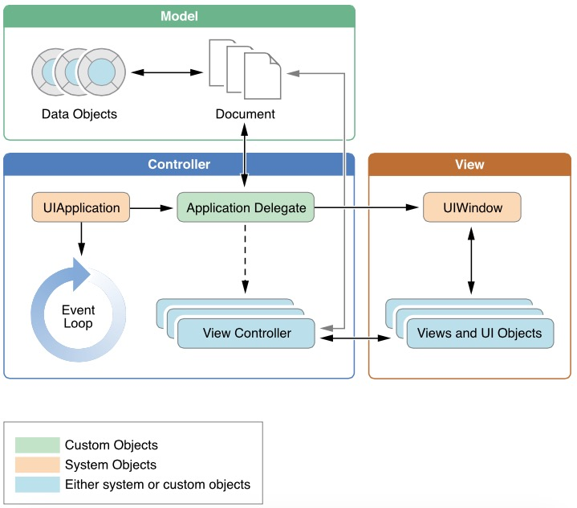

使用纯代码来开发iOS APP
===

* `UIApplication` - 管理事件循环以及其他高层级的app行为。
* `AppDelegate` - 定制代码的核心。紧随UIApplication之后，处理app初始化、状态转换以及许多高层级app事件。所有app都要有这个对象，所以常用于初始化app的数据结构。
* `UIDocument`,`data model`对象 - 存储应用内容以及指派给你的应用。
* `UIViewController` - 管理在屏幕上现实的应用的内容。
* `UIWindow` - 协调在一个屏幕上现实的一个或多个视图的呈现。
* `View`,`Control`,`Layer` - View以及Control提供app内容的虚拟呈现。 

