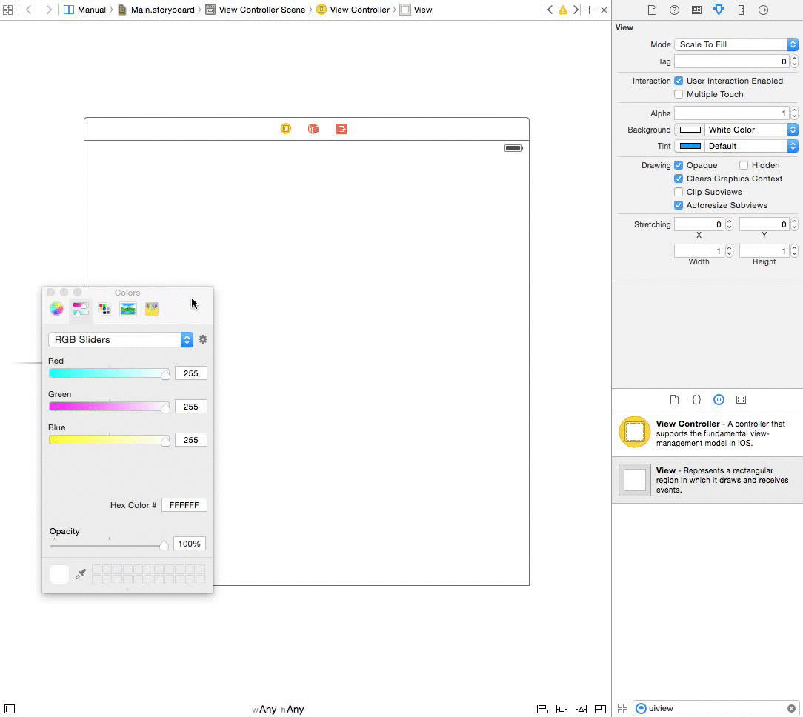
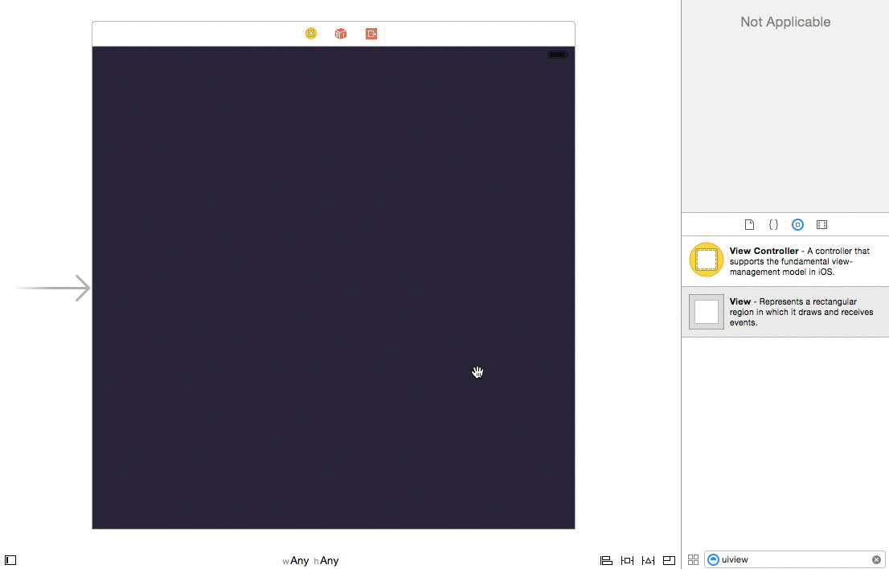
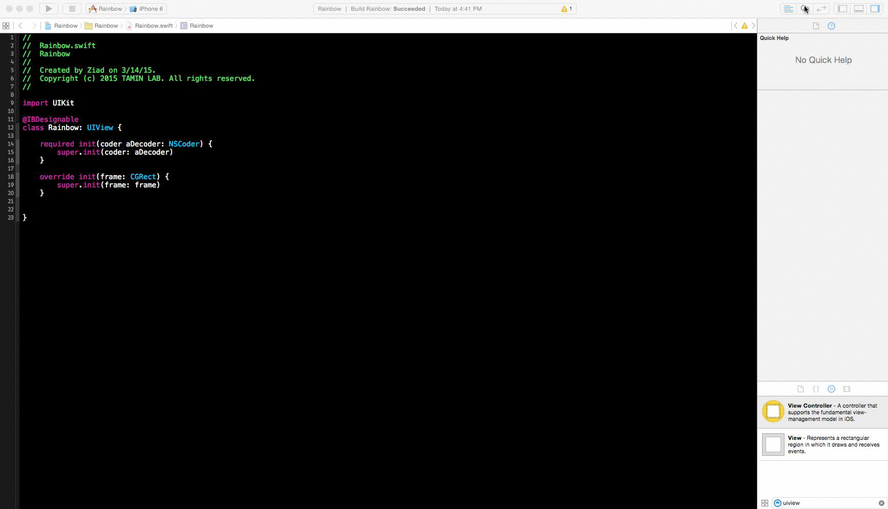

使用Swift在Xcode中创建自定义控件
===

[原文](http://www.appcoda.com/ibdesignable-ibinspectable-tutorial/)

#### IBDesignable and IBInspectable

> With IBDesignable and IBInspectable, developers are allowed to create interface (or view) that renders in Interface Builder in real time. In general, to apply this new feature, all you need to do is create a visual class by subclassing UIView or UIControl and then prefix the class name with @IBDesignable keyword in Swift. If you are using Objective-C, you use IB_DESIGNABLE macro instead. Here is a sample code in Swift:

使用IBDesignable以及IBInspectable，开发者们被允许创建界面（或视图），在Interface Builder中实时渲染。通常，运用这个特性，你需要做的就是继承UIView或者UIControl的一个虚拟子类，然后在Swift中使用`@IBDesignable`关键字进行标识。如果你使用Objective-C，你可以使用IB_DESIGNABLE宏代替。下面是一段加单的Swift示例代码：

```Swfit
@IBDesignable 
class Rainbow: UIView {
}
```

> In older versions of Xcode, you can edit the user-defined runtime attributes to change properties of an object (e.g. layer.cornerRadius) in Interface Builder. The problem is you have to key in the exact name of the properties. IBInspectable takes a step forward. When you prefix a property of the visual class with IBInspectable, the property will be exposed to the Interface Builder such that you can change its value in a much straightforward way:

在老版本的Xcode中，你可以在Interface Builder中编辑`user-defined`运行时属性来修改一个对象的特性（如：`layer.cornerRadius`。`IBInspectable`前进了一步。当你在一个虚拟子类前面使用`IBInspectable`关键字标识的时候，属性将会暴露给Interface Builder，这样你就可以使用一种非常直接的方式来修改它的值。

> Again if you are developing your app in Swift, what you have to do is just prefix your chosen property with the keyword @IBInspectable. Here is a sample code snippet:

如果你使用Swift开发你的应用，你需要做的仅仅是标识出`@IBInspectable`。下面是一个简单的示例代码段：

```Swift
 @IBInspectable var firstColor: UIColor = UIColor.blackColor() {
     // Update your UI when value changes
 }
```

#### Building Your Xcode Project

> Let’s get started by creating a new project in Xcode and choose Single View Application as a template, and name it RainbowDemo. We will use Swift in this project as the programming language, so don’t forget to choose it when creating the project.

让我们从在Xcode中创建一个新的项目并选择SingleViewApplication模板开始，然后明明它为`RainbowDemo`。我们将在这个项目中使用Swfit作为开发语言，所以在创建项目的时候不要忘记选择语言。

> Once finished, select the Main.storyboard in the Project Navigator and drag a View object from the Object Library to the View Controller. Change its color to #38334C (or whatever color you want) as well as set its size to 600 by 434. Then put it in the center of the main view. Don’t forget to change the color of the main view to the same color of the view object.

创建成功后，在项目导航中选择`Main.storyboard`，然后从对象库中拖拽一个视图对象到视图控制器。修改它的颜色为`#38334C`，以及设置它的尺寸为600*434。然后把它放到主视图的中间。不要忘记修改主视图的颜色与视图对象的颜色一致。



> With Xcode 6, you have to configure auto layout constraints for the view in order to support all types of iOS devices. Auto Layout is pretty powerful in the latest version of Xcode. For simple constraints, you can just click the Issues option of the Auto Layout menu and choose “Add Missing Contraints”, and Xcode will automatically configure the layout constraints for the view.

使用Xcode6，你需要为这个视图配置自动布局常量，以便支持全部的iOS设备。在最新一版本的Xcode中，自动布局（Auto Layout）是非常有力的。对于简单的约束，你可以仅仅点击自动布局菜单中的`Issues`并选择“Add Missing Contraints”，然后Xcode将为视图自动配置布局约束。



#### Creating Custom View Class

> Now that you’ve created the view in storyboard, it’s time to create our custom view class. We’ll use the Swift class template for the class creation. Name it “Rainbow”.

现在，你已经在Storyboard中创建了视图，是时候创建我们的自定义视图类了。我们将使用Swift类模板来创建类。命名它为“Rainbow”。


> Then insert the following code in the class:

然后在类中插入下面的代码：

```Swift
import UIKit
 
class Rainbow: UIView {
    required init(coder aDecoder: NSCoder) {
        super.init(coder: aDecoder)
    }
    
    override init(frame: CGRect) {
        super.init(frame: frame)
    }
}
```

> As mentioned before, the visual class is a subclass of UIView. In order to use our custom class in live rendering, we need to override both initializers as shown above. Next split the view by selecting the assistant editor:

就像上面提到的，这个虚拟类是UIView的子类。为了在渲染的时候使用我们的自定义类，我们需要重载上面呈现的代码。然后通过选择辅助编辑器来分割视图：


> Once done, select the main storyboard in the assistant editor, so you can see what you are building in real time. Remember to change the class name of the view to “Rainbow” under the Identity inspector:

一旦完成，在辅助编辑器中选择`Main.storyboard`，然后你可以看到你实时创建的东西。记得在`Identity Inspector`中更改视图的类名为`Rainbow`：



#### Implementing IBDesignable Controls

> The first step to enable a control for live rendering is to set the custom view as Designable by prefixing the class name with @IBDesignable:

启用控件的实时渲染的第一步是通过给类名加上`@IBDesignable`前缀来设置自定义视图为`Designable`。

```
@IBDesignable 
class Rainbow: UIView {
    ...
}
```

> It’s kinda simple as you can see. But this simple keyword would make your development much easier. Next, we will add a few properties for setting the colors of the circles. Insert these lines of code in the Rainbow class:

这就像你看到的一样简单。但是这个简单的关键字将使你的开发非常的容易。下一步，我们将添加一些属性来设置圈的颜色。在`Rainbow`类中，插入几行代码：

```
@IBInspectable var firstColor: UIColor = UIColor(red: (37.0/255.0), green: (252.0/255), blue: (244.0/255.0), alpha: 1.0)
@IBInspectable var secondColor: UIColor = UIColor(red: (171.0/255.0), green: (250.0/255), blue: (81.0/255.0), alpha: 1.0)
@IBInspectable var thirdColor: UIColor = UIColor(red: (238.0/255.0), green: (32.0/255), blue: (53.0/255.0), alpha: 1.0)
```

> Here, we predefine each property with a default colour, and tell it to redraw the view each time a user changes its value. Most importantly, we prefix each property with the @IBInspectable keyword. If you go to the Attributes inspectable of the view, you should find these properties visually:

这里，我们使用默认的颜色来预定义每一个属性，然后告诉他，在用户每一次更改它的值的时候重绘视图。最重要的是，我们给每一个属性都加上`@IBIspectable`关键字。如果你查看视图的属性指示器，你将找到这些视觉属性：


> Cool, right? By indicating the properties as IBInspectable, you can edit them visually using color picker.

很酷，对么？通过标识属性为`IBInspectable`，你可以使用颜色选取器来编辑他们。

> Okay let’s move to implement the main methods of the Rainbow class, which is used to draw a circle on the screen. Insert the following method in the class:

让我们开始实现`Rainbow`类用于在屏幕上绘制圆圈的主要方法。在类中插入下面的方法：

```
func addOval(lineWidth: CGFloat, path: CGPathRef, strokeStart: CGFloat, strokeEnd: CGFloat, strokeColor: UIColor, fillColor: UIColor, shadowRadius: CGFloat, shadowOpacity: Float, shadowOffsset: CGSize) {
    
    let arc = CAShapeLayer()
    arc.lineWidth = lineWidth
    arc.path = path
    arc.strokeStart = strokeStart
    arc.strokeEnd = strokeEnd
    arc.strokeColor = strokeColor.CGColor
    arc.fillColor = fillColor.CGColor
    arc.shadowColor = UIColor.blackColor().CGColor
    arc.shadowRadius = shadowRadius
    arc.shadowOpacity = shadowOpacity
    arc.shadowOffset = shadowOffsset
    layer.addSublayer(arc)
}
```

> To make the code clean and readable, we create a common method for drawing a full or half circle according to the parameters provided by the caller. It’s pretty straightforward to draw a circle or an arc using CAShapeLayer class. You can control the start and end of the stoke using the strokeStart and strokeEnd properties. By varying the value of stokeEnd between 0.0 and 1.0, you can draw a full or partial circle. The rest of the properties are just used to set the color of a stroke, shadow color, etc. You can check out the official documentation for details of all the properties available in CAShapeLayer.

为了使代码干净且可读，我们创建一个公共的方法根据调用者传入的参数来来绘制一整个或半个圆。它使用`CAShapeLayer`类漂亮地直接绘制一个圆或一个圆弧。你可以使用`strokeStart`以及`strokeEnd`属性来控制线的起点和终点。通过控制`strokeEnd`的值在0.0与1.0之间，你可以绘制一整个或部分圆。剩下的属性仅用于设置线的颜色、阴影颜色等。你可以在[官方文档](https://developer.apple.com/library/ios/documentation/GraphicsImaging/Reference/CAShapeLayer_class/)中查看在`CAShapeLayer`中可用的属性的细节。

> Next, insert the following methods in the Rainbow class:

接下来，插入下面的代码到Rainbow类中：

```
override func drawRect(rect: CGRect) {
    // Add ARCs
    self.addCirle(80, capRadius: 20, color: self.firstColor)
    self.addCirle(150, capRadius: 20, color: self.secondColor)
    self.addCirle(215, capRadius: 20, color: self.thirdColor)
}
 
func addCirle(arcRadius: CGFloat, capRadius: CGFloat, color: UIColor) {
    let X = CGRectGetMidX(self.bounds)
    let Y = CGRectGetMidY(self.bounds)
    
    // Bottom Oval
    let pathBottom = UIBezierPath(ovalInRect: CGRectMake((X - (arcRadius/2)), (Y - (arcRadius/2)), arcRadius, arcRadius)).CGPath
    self.addOval(20.0, path: pathBottom, strokeStart: 0, strokeEnd: 0.5, strokeColor: color, fillColor: UIColor.clearColor(), shadowRadius: 0, shadowOpacity: 0, shadowOffsset: CGSizeZero)
    
    // Middle Cap
    let pathMiddle = UIBezierPath(ovalInRect: CGRectMake((X - (capRadius/2)) - (arcRadius/2), (Y - (capRadius/2)), capRadius, capRadius)).CGPath
    self.addOval(0.0, path: pathMiddle, strokeStart: 0, strokeEnd: 1.0, strokeColor: color, fillColor: color, shadowRadius: 5.0, shadowOpacity: 0.5, shadowOffsset: CGSizeZero)
 
    // Top Oval
    let pathTop = UIBezierPath(ovalInRect: CGRectMake((X - (arcRadius/2)), (Y - (arcRadius/2)), arcRadius, arcRadius)).CGPath
    self.addOval(20.0, path: pathTop, strokeStart: 0.5, strokeEnd: 1.0, strokeColor: color, fillColor: UIColor.clearColor(), shadowRadius: 0, shadowOpacity: 0, shadowOffsset: CGSizeZero)
    
}
```

> The default implementation of the drawRect method does nothing. In order to draw circles in the view, we override the method to implement our own drawing code. The addCircle method takes in three parameters: arcRadius, capRadius and color. The arcRadius is the radius of the circle, while the capRadius is the radius of the rounded cap.

`drawRect`函数的默认实现什么都不做。为了在视图中绘制圆，我们重载这个函数来实现我们自己的绘制代码。`addCircle`方法使用三个参数：`arcRadius`、`capRadius`、`color`。`arcRadius`是圆的半径，`capRadius`是圆型覆盖的半径。

> The addCircle method makes use of UIBezierPath to draw the arcs and it works like this:
> 
> * First it draws a half circle at the bottom
> * Next it draws a full small circle at the edge of the arc.
> * Finally, it draws the other half of the circle

`addCircle`函数使用`UIBezierPath`来绘制圆弧，并且它像这样工作：

1. 首先，绘制一个半圆在底部。
2. 然后，绘制一整个小圆在弧的边界。
3. 最后，绘制这个圆的加一半。

> In the drawRect method, we call the addCircle method three times with different radius and color. This figure illustrates how the circles are drawn:

在`drawRect`函数中，我们使用不同的半径与颜色调用`addCircle`函数三次。这个特点阐述这些圆如何被绘制：

> [UIBezierPath](https://developer.apple.com/library/prerelease/ios/documentation/UIKit/Reference/UIBezierPath_class/index.html)


> With the IBInspectable properties, you are now free to change the color of each circle right in the Interface Builder without diving into the code:

使用`IBInspectable`属性，你现在可以在Interface Builder中自由地正确修改每一个圆，而不用沉浸在代码中。


> Obviously, you can further expose arcRadius as an IBInspectable property. I’ll leave it as an exercise for you.

显然地，你可以更深入的挖掘`arcRadius`作为一个`IBInspectable`属性。


#### Summary

> After going through this tutorial, I hope that you now understand how to use both IBDesignable and IBInspectable in Xcode 6. With the real-time preview in the Interface Builder, this new feature would allow you to create custom componenents in a more effcient way.

在随着这个教程做完之后，我希望你可以理解如何使用`IBDesignable`和`IBInspectable`在Xcode6当中。利用在Interface Builder的实时预览，新的特性允许你使用一种高效的方式创建自定义组件。

> For your reference, you can [download the complete Xcode project from here](https://github.com/appcoda/Rainbow-IBDesignable-Demo). As always, leave me comment and share your thought about the tutorial.

为了便于你参考，你可以[从这里下载完整的Xcode项目](https://github.com/appcoda/Rainbow-IBDesignable-Demo)。

#### Reference

1. [UIView](https://developer.apple.com/library/ios/documentation/UIKit/Reference/UIView_Class/index.html#//apple_ref/doc/uid/TP40006816)
2. 
2. [CAShapeLayer](https://developer.apple.com/library/ios/documentation/GraphicsImaging/Reference/CAShapeLayer_class/)
2. [UIBezierPath](https://developer.apple.com/library/prerelease/ios/documentation/UIKit/Reference/UIBezierPath_class/index.html)


