如何在Swift种使用iOS图表API创建漂亮的图表
===

[原文](http://www.appcoda.com/ios-charts-api-tutorial/)

Using charts to display data can help users understand the information more easily than they would if it were presented in a table, especially when dealing with a lot of data. With charts, you can easily see patterns in the data at a glance as opposed to reading through a whole table (or several tables) to get this information. The use of charts has been a common feature in business and fitness apps.

In this article, we’ll look at how to add charts to your application using the [ios-charts library](https://github.com/danielgindi/ios-charts) by [Daniel Cohen Gindi](https://github.com/danielgindi). ios-charts is an iOS port of the fairly popular Android library [MPAndroidChart](https://github.com/PhilJay/MPAndroidChart) created by [Philipp Jahoda](https://github.com/PhilJay). With this library, you can include various types of charts in your app fairly quickly and easily. With a few lines of code, you can have a fully working and interactive chart, that is highly customizable.

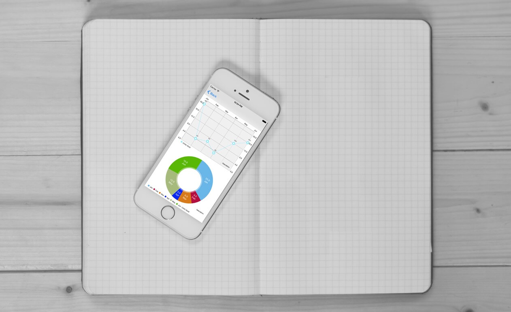

Core features of the library include:

* 8 different chart types
* Scaling on both axes (with touch-gesture, axes separately or pinch-zoom)
* Dragging / Panning (with touch-gesture)
* Combined-Charts (line-, bar-, scatter-, candle-stick-, bubble-)
* Dual (separate) Y-Axis
* Finger drawing (draw values into the chart with touch-gesture)
* Highlighting values (with customizeable popup-views)
* Multiple / Separate Axes
* Save chart to camera-roll / export to PNG/JPEG
* Predefined color templates
* Legends (generated automatically, customizable)
* Customizable Axes (both x- and y-axis)
* Animations (build up animations, on both x- and y-axis)
* Limit lines (providing additional information, maximums, e.t.c.)
* Fully customizable (paints, typefaces, legends, colors, background, gestures, dashed lines, e.t.c.)

这个库的核心特性包括：

* 8种不同的图表类型
* 在两个轴上缩放
* 拖拽（利用`touch-gesture`）
* 混合图表
* 双重Y-轴
* 手绘
* 高亮值
* 多重/分隔坐标轴
* 存储图表到相册或导出到PNG/JPEG
* 预定义颜色模板
* 自动生成、定义
* 定制坐标轴
* 动画
* 行数限制
* 完全的自定义支持

#### Getting Started

To get started, first [download the starter project](https://www.dropbox.com/s/9ehz8ca5g4npoc2/iOSChartsDemoStarter.zip?dl=0) we’ll be using in the tutorial. It’s of a simple application called iOSChartsDemo. When you run the app, you’ll get a table with two items: Bar Charts and Other Charts. On tapping on these list items, you’ll get empty views. In the project, I have created two view controllers which we’ll use: BarChartViewController and ChartsViewController.

为了开始学习，首先下载我们将在教程中使用的[起始项目](https://www.dropbox.com/s/9ehz8ca5g4npoc2/iOSChartsDemoStarter.zip?dl=0)。它是一个叫iOSChartsDemo的示例应用。当你运行这个应用，你将看到一个带有两个物件的表格：条型图和其他图表。当点击这些列表条目的时候，你将看到空的视图。在项目种，我已经创建了将使用的两个视图控制器：`BarChartViewController`以及`ChartsViewController`。

Next we’ll include the library in our project. You can use [CocoaPods](https://cocoapods.org/pods/Charts) to install the library, but here, we’ll do the manual installation.

接下来，我们将在项目种包含库。你可以使用CocoaPods来安装这个库，但是这里，我们将进行手动安装。

[Download the ios-charts project](https://github.com/danielgindi/ios-charts/archive/master.zip). The zip file contains the library (in a folder named Charts) and a demo project (named ChartsDemo). The demo project is a great resource to use if you want to learn more about the library.

下载[ios-charts projetc](https://github.com/danielgindi/ios-charts/archive/master.zip)。这个zip文件包含库（在一个命名为Charts的文件夹）以及一个demo项目（名字为ChartsDemo）。如果你想要学习关于这个库更多的内容demo项目是一个很有用的资源。

Unzip the downloaded file and copy the Charts folder and paste it into your project’s (iOSChartsDemo) root directory. Open this Charts folder in Finder and drag Charts.xcodeproj to your project in Xcode. You should have something similar to what’s shown below.

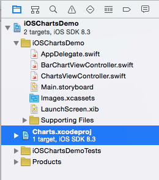

Next select your project from the Project Navigator and make sure that the iOSChartsDemo target is selected. In the General tab on the right, locate the Embedded Binaries section and hit the + in this section to add the charts framework. Select Charts.framework from the list and click Add.

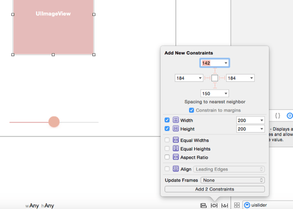

If you want to use the library in an Objective-C project you can read how to do this from the [Usage instructions](https://github.com/danielgindi/ios-charts#usage).

Build the project with Command-B or by going to Product > Build. If you don’t build the project first, Xcode will give the error “Cannot load underlying module for ‘Charts'” when you import the Charts framework into your files.

Now we are ready to create our first chart.

#### Creating a Bar Chart

Open BarChartViewController.swift file and add the following import statement.

```
import Charts
```

Open the storyboard file. We need to add the view that will show the chart. Select Bar Chart View Controller from the Documents Outline and in the Attributes Inspector, uncheck the Under Top Bars in Extend Edges. We don’t want the chart to extend itself underneath the navigation bar.

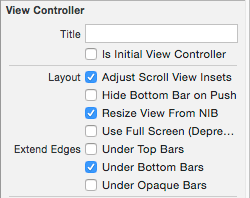

Next drag a View onto the Bar Chart View Controller and pin its edges as shown. This View is a child of the main View in the controller.

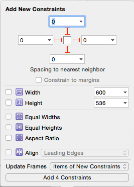

With this View still selected, go to the Identity Inspector and set its Class to BarChartView. Then use the Assistant Editor to add an outlet of the view to the BarChartViewController class. Name the outlet barChartView. You should have the following in the BarChartViewController class.

```
@IBOutlet weak var barChartView: BarChartView!
```

Run the project and select Bar Chart from the table, you should get a view with the message “No chart data available”.

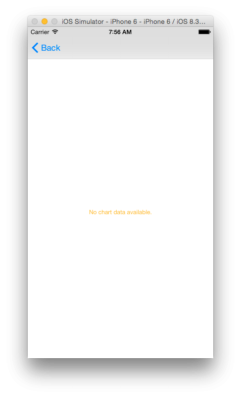

You can customize this message if you want to display something different for your [Blank Slates](http://blog.teamtreehouse.com/tips-for-creating-a-blank-slate) when no data is available for a chart to be generated. In viewDidLoad() add the following to the bottom of the function.

```
barChartView.noDataText = "You need to provide data for the chart."
```

Run the project and you’ll be presented with the custom message.


You can further add a description to this with the following. This can be used to explain to the user why the chart is empty and what they need to do in order to get data, for example a fitness app can let the user know that they need to record X number of runs before the data can be aggregated.

```
barChartView.noDataTextDescription = "GIVE REASON"
```

Add the following attribute to the class. We’ll use it to store some mock data for the chart.

```
var months: [String]!
```

Add the following function to the class. We’ll use it to set up the chart.

```
func setChart(dataPoints: [String], values: [Double]) {
    barChartView.noDataText = "You need to provide data for the chart."
        
}
```

Notice I have included the statement we had in viewDidLoad() here. Remove that statement from viewDidLoad(). We’ll use setChart() to customize the chart.

In viewDidLoad(), add the following to the bottom of the function.

```
months = ["Jan", "Feb", "Mar", "Apr", "May", "Jun", "Jul", "Aug", "Sep", "Oct", "Nov", "Dec"]
let unitsSold = [20.0, 4.0, 6.0, 3.0, 12.0, 16.0, 4.0, 18.0, 2.0, 4.0, 5.0, 4.0]
        
setChart(months, values: unitsSold)
```

We set some mock data that gives the number of units sold of some product for each month in a year. We then pass this data to setChart().

For a chart to display data, we need to create a BarChartData object and set it as the barChartView’s data attribute. Add the following to the botton of setChart()

```
var dataEntries: [BarChartDataEntry] = []
        
for i in 0..<dataPoints.count {
    let dataEntry = BarChartDataEntry(value: values[i], xIndex: i)
    dataEntries.append(dataEntry)
}
        
let chartDataSet = BarChartDataSet(yVals: dataEntries, label: "Units Sold")
let chartData = BarChartData(xVals: months, dataSet: chartDataSet)
barChartView.data = chartData
```

In the above code, we create an array of BarChartDataEntry objects. The BarChartDataEntry initializer takes the value of each data entry, the index of the entry the value corresponds to and an optional label.

We then use this object to create a BarChartDataSet which is created by passing in the array of BarChartDataEntry objects and a label to describe the data.

Finally we use this to create a BarChartData object which we set as our chart view’s data.

Run the app and you should have a bar chart of the data.

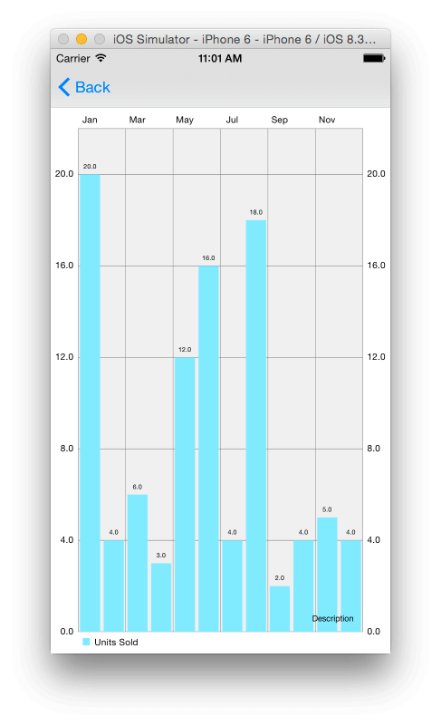

ou can set a description of the chart that will appear on the bottom right of the view. By default, the text is set to “Description” as you can see in the image above. A look through the documentation of [MPAndroidChart](https://github.com/PhilJay/MPAndroidChart/wiki/Getting-Started), shows that you should be able to change the location of the description, but looking through the iOS API, this wasn’t included. The library is still being maintained, so this might be added at a later date. If you want to change the location of the description, you can change this in the drawDescription(context) function of the ChartViewBase class which is a superclass of the BarChartView class.

For our app, we’ll remove the description text. Add the following to the bottom of setChart() to set the description text to an empty string.

```
barChartView.descriptionText = ""
```

#### Customizing the Chart

You can customize the look of the chart view by changing some of its attributes. We’ll look at some of these; you can have a look at the documentation to find out what else can be customized.

First we’ll change the default color of the bar chart. Add the following to the bottom of setChart()

```
chartDataSet.colors = [UIColor(red: 230/255, green: 126/255, blue: 34/255, alpha: 1)]
```

The above sets the colors that will be associated to our data set. We set this to an array of UIColor objects. Since we only have one color in our array, this will be used for all the entries.

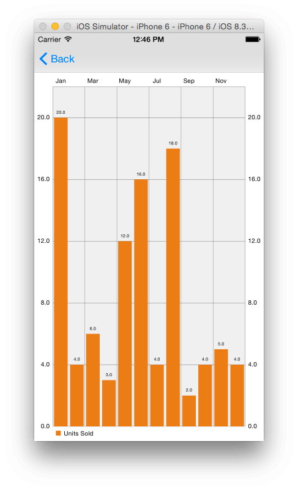

If you want a different color for each data entry, then you have to provide as many colors as the total number of data entries you have, in our case 12. If you give a lesser number of colors than the total entries, then the bars, starting from the left will be set to the different colors provided until the colors run out whereby the color scheme will be repeated (like the image below where we use a template, 5 colors are repeated throughout)

The API also comes with some predefined color templates you can use to set different colors for the data set. They include:

* ChartColorTemplates.liberty()
* ChartColorTemplates.joyful()
* ChartColorTemplates.pastel()
* ChartColorTemplates.colorful()
* ChartColorTemplates.vordiplom()

Using the ChartColorTemplates.colorful() template gives the following.

```
chartDataSet.colors = ChartColorTemplates.colorful()
```

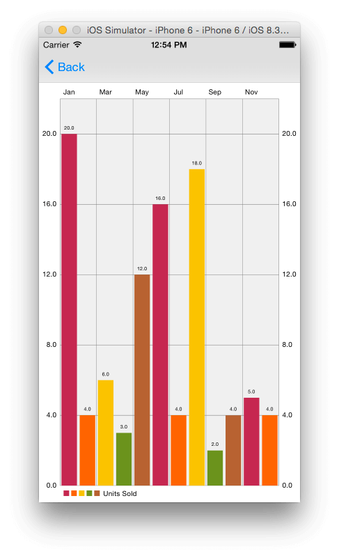

To change the position of the x-axis labels use the following.

```
barChartView.xAxis.labelPosition = .Bottom
```

Now the labels are at the bottom of the chart.

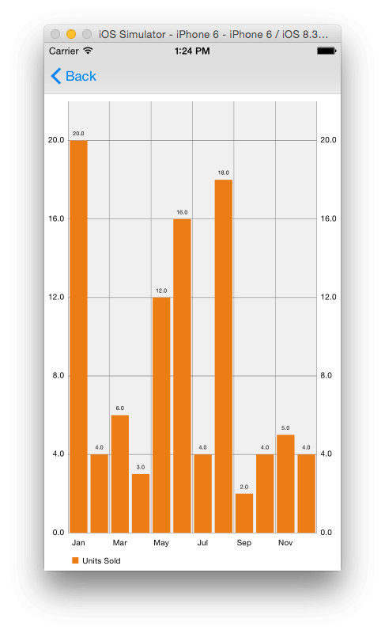

You can also change the chart’s background color with the following.

```
barChartView.backgroundColor = UIColor(red: 189/255, green: 195/255, blue: 199/255, alpha: 1)
```

With the above, you’ll get:

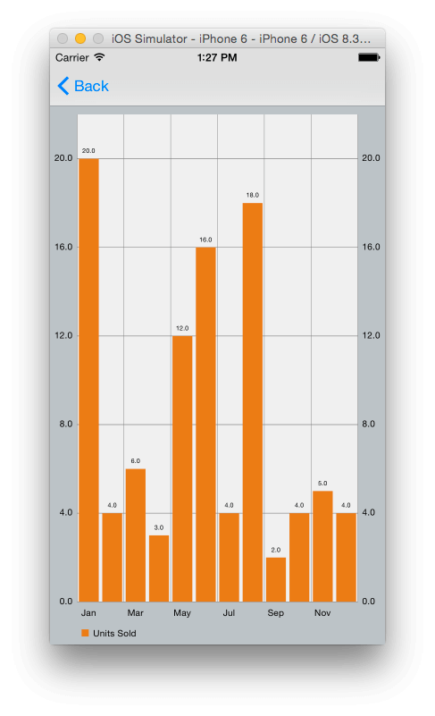

#### Animation

You can add some animation to the chart to make it more interesting. There are 3 main types of animation methods you can use to animate either both axes or the x and y axis seperately.

* animate(xAxisDuration: NSTimeInterval, yAxisDuration: NSTimeInterval)
* animate(xAxisDuration: NSTimeInterval)
* animate(yAxisDuration: NSTimeInterval)

You can add an optional ChartEasingOption to the above functions. The options available are:

* Linear
* EaseInQuad
* EaseOutQuad
* EaseInOutQuad
* EaseInCubic
* EaseOutCubic
* EaseInOutCubic
* EaseInQuart
* EaseOutQuart
* EaseInOutQuart
* EaseInQuint
* EaseOutQuint
* EaseInOutQuint
* EaseInSine
* EaseOutSine
* EaseInOutSine
* EaseInExpo
* EaseOutExpo
* EaseInOutExpo
* EaseInCirc
* EaseOutCirc
* EaseInOutCirc
* EaseInElastic
* EaseOutElastic
* EaseInOutElastic
* EaseInBack
* EaseOutBack
* EaseInOutBack
* EaseInBounce
* EaseOutBounce
* EaseInOutBounce

Add the following to setChart()

```
barChartView.animate(xAxisDuration: 2.0, yAxisDuration: 2.0)
```

Run the app and the bar chart will animate into view. We animate both axes in 2 seconds.

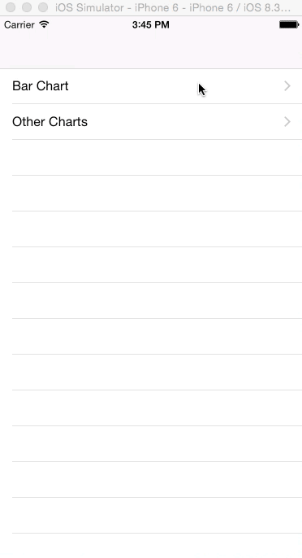

Change the above statement to:

```
barChartView.animate(xAxisDuration: 2.0, yAxisDuration: 2.0, easingOption: .EaseInBounce)
```

And you’ll see the effect of the above.

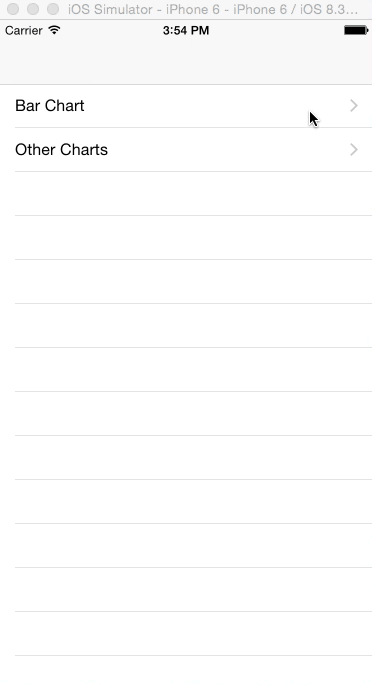

#### Limit Lines

The limit line is an additional feature for all Line, Bar and ScatterCharts. It allows the displaying of an additional line in the chart that marks a certain limit on the specified axis (x- or y-axis). Such a line can be used to set a target/goal value for the data and helps the user easily see where they didn’t meet the target.

To add a limit line to the chart, add the following to setData()

```
let ll = ChartLimitLine(limit: 10.0, label: "Target")
barChartView.rightAxis.addLimitLine(ll)
```

On running the app, you should see a red line marking the 10 units limit. In the above code we added a label to the limit line, but ChartLimitLine has another initializer that doesn’t take the label, so you can omit it if you prefer.

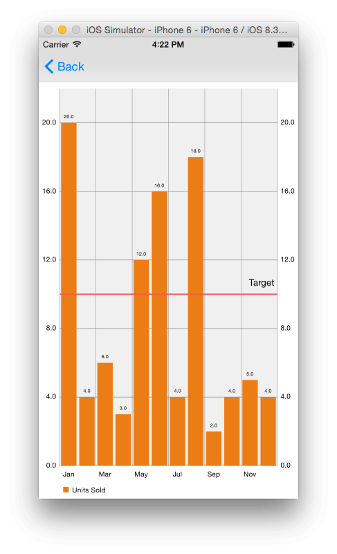

#### Touch Events

If you run the app, you’ll notice that zooming by pinching and double tapping work by default. Also, a tap on a bar highlights the tapped bar. It’s great that we get this functionality for free without writing any code for it, but you might want to add more functionality, for example take some action when the user taps on a bar.

To detect selections made inside the chart, we’ll use the ChartViewDelegate protocal.

Modify the class’ declaration as shown.

```
class BarChartViewController: UIViewController, ChartViewDelegate {
```

Add the following to viewDidLoad() after the call to super.viewDidLoad()

```
barChartView.delegate = self
```

Then add the following function to the class.

```
func chartValueSelected(chartView: ChartViewBase, entry: ChartDataEntry, dataSetIndex: Int, highlight: ChartHighlight) {
    println("\(entry.value) in \(months[entry.xIndex])")
}
```

The above is called when a value has been selected inside the chart view. Here we print out the value and month selected.

#### Saving the Chart

You can save the current state of a chart as an image. You can choose to save it to the camera roll or you can set a path for it to be saved to.

First we’ll add a Save button to the chart view. Open the storyboard file and locate the Bar Chart View Controller. Drag a Navigation Item to the view controller’s navigation bar, then drag a Bar Button Item and place it to the right corner of the Navigation Item. Remove the “Title” text of the Navigation Item’s Title attribute in the Attributes Inspector. Select the Bar Button Item and set its identifier to Save in the Attributes Inspector. You should have the following.

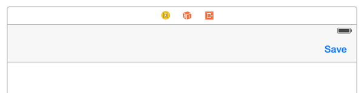

Next create an action for the button. Name it saveChart. You should have the following in the BarChartViewController class.

```
@IBAction func saveChart(sender: UIBarButtonItem) {
        
}
```

Modify the above method as shown.

```
@IBAction func saveChart(sender: UIBarButtonItem) {
    barChartView.saveToCameraRoll()
}
```

Run the app and when you tap the Save button, an image of the chart will be saved to the camera roll. You can view it using the Photos app.

You can instead set a path to save to with the following method.

```
barChartView.saveToPath(path: String, format: ChartViewBase.ImageFormat, compressionQuality: Double)
```

The format can be either .JPEG or .PNG and the compressionQuality is the compression quality for lossless formats (JPEG).

#### More Charts

Here we’ll look at a couple of other chart examples we can create. I won’t give detailed instructions since we’ve looked at most of what we’ll do.

First locate the Charts View Controller in the storyboard file and set the Class of the view labelled Pie Chart View to PieChartView in the Identity Inspector. Do the same for the Line Chart View, setting its class to LineChartView. Then create outlets for these two views named pieChartView and lineChartView respectively.

Then modify the ChartsViewController class as ahown.

```
import UIKit
import Charts
 
class ChartsViewController: UIViewController {
    
    @IBOutlet weak var lineChartView: LineChartView!
    @IBOutlet weak var pieChartView: PieChartView!
 
    override func viewDidLoad() {
        super.viewDidLoad()
 
        // Do any additional setup after loading the view.
        
        let months = ["Jan", "Feb", "Mar", "Apr", "May", "Jun"]
        let unitsSold = [20.0, 4.0, 6.0, 3.0, 12.0, 16.0]
        
        setChart(months, values: unitsSold)
        
    }
    
    func setChart(dataPoints: [String], values: [Double]) {
        
        var dataEntries: [ChartDataEntry] = []
        
        for i in 0..<dataPoints.count {
            let dataEntry = ChartDataEntry(value: values[i], xIndex: i)
            dataEntries.append(dataEntry)
        }
        
        let pieChartDataSet = PieChartDataSet(yVals: dataEntries, label: "Units Sold")
        let pieChartData = PieChartData(xVals: dataPoints, dataSet: pieChartDataSet)
        pieChartView.data = pieChartData
        
        var colors: [UIColor] = []
        
        for i in 0..<dataPoints.count {
            let red = Double(arc4random_uniform(256))
            let green = Double(arc4random_uniform(256))
            let blue = Double(arc4random_uniform(256))
            
            let color = UIColor(red: CGFloat(red/255), green: CGFloat(green/255), blue: CGFloat(blue/255), alpha: 1)
            colors.append(color)
        }
        
        pieChartDataSet.colors = colors
        
        
        let lineChartDataSet = LineChartDataSet(yVals: dataEntries, label: "Units Sold")
        let lineChartData = LineChartData(xVals: dataPoints, dataSet: lineChartDataSet)
        lineChartView.data = lineChartData
        
    }
 
}
```

In the above, we import the Charts framework into the class and create a pie chart and a line chart in the same way as we created a bar chart. Note however, we use the superclass ChartDataEntry to create data entry objects when in the bar chart example we used BarChartDataEntry. Not all charts have subclasses for ChartDataEntry and so here, we use the superclass. For the chart data set and chart data objects, we use the specific subclass for the particular chart.

If you run the app and select Other Charts from the table view, you should see a line chart and a colored pie chart. Your app will look different from the one shown, since we use random numbers for the pie chart’s colors.

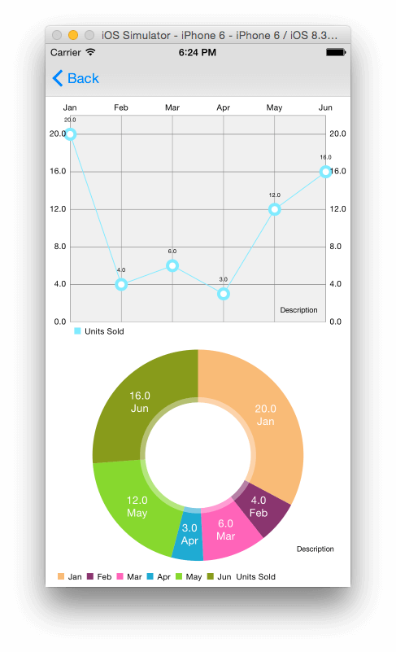

#### Conclusion

We’ve only looked at a few chart types that can be created using the ios-charts library. We’ve also only touched the surface of the customization you can perform on a chart. If you want to know what else the library is capable of, you can look through the code of the ChartsDemo project that comes with the library download and also have a look at the [project’s Wiki](https://github.com/PhilJay/MPAndroidChart/wiki). The link to the Wiki page leads to the MPAndroidChart project documentation. At the time of writing, there is no documentation for the iOS version of the library, but since the API is about 95% the same as on Android, the Android documentation can still come in handy when searching for help.

You can [download the completed project here](https://www.dropbox.com/s/9dq1onn6ndjvf1o/iOSChartsDemo.zip?dl=0).

[The original repository](https://github.com/PhilJay/MPAndroidChart)

