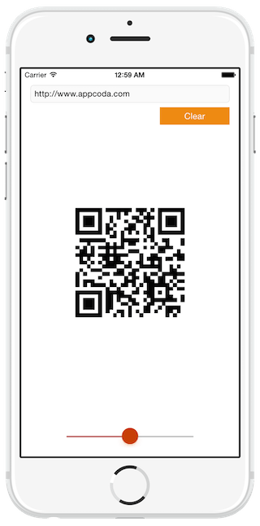

Building a QR Code Generator with Core Image Filters 使用Core Image Filters创建一个二维码生成器
===

[原文](http://www.appcoda.com/qr-code-generator-tutorial/)

One of the first tutorials I contributed here at Appcoda was a guide about how to create a QR code reader in iOS. At that time of course, the code of that [tutorial](http://www.appcoda.com/qr-code-ios-programming-tutorial/) was written in Objective-C, as Swift wasn’t still existing. Later in time, my friend Simon wrote [a new one](http://www.appcoda.com/qr-code-reader-swift/), this time made entirely in Swift for all the fans of this new language. By the time that the first post regarding this topic was published here, QR codes had already started to be used more and more for advertising and marketing reasons, and many developers were dropped in the battle for making their own QR code readers. Today QR codes exist almost everywhere; in magazines and newspapers, in television, in printed in T-shirts, in advertising labels, in websites, etc. The list is long. On the other hand, the QR code reading applications existing in the AppStore are also endless. So, as you understand, QR codes consist of an interesting part for both advertisers and developers (and not only), as it’s something new and easily manageable.

With this tutorial I’m returning back to the discussion about QR Codes after a long time and many tutorials in between since that first QR code-related tutorial, but this time with a completely different goal. My intension is not to talk once again about QR Code readers; after all, we have already such tutorials here (see the links above). This time my goal is to show you how to make a QR code generator. And trust me, as you’ll see, it’s as easy as making a QR code reader (even easier). But first, let me tell you a few things you should know about.

Prior to iOS 7, making a QR code generator was a real trouble. Not many resources existed back then, and most developers had to avoid creating their custom code; the easiest thing to do was to pick among 2-3 different existing libraries and fit it to their applications. But thankfully, all that is now history. By introducing iOS 7 time ago, Apple also turned any task related to QR codes (reading and generating) into a piece of cake. For reading QR codes, the __AVFoundation__ framework is now the tool every developer needs. For generating, the only thing coders have to do is to use the Core Image framework, and more specifically the Core Image filters.

To make it perfectly clear, since iOS 7 a QR code is generated as a CIImage object (CoreImage image) simply by using a special filter named __CIQRCodeGenerator__. All it takes is to provide the data that you want to convert into a QR code image, and iOS will manage and do the heavy work. The returning image can be handled in anyway you want, as long as you don’t damage it and make the code unreadable.

In the following few parts of this tutorial you’ll find out how to create QR codes in a really fast and easy fashion, and you’ll see some techniques for better results. By finishing this post you’ll be able to generate QR code in iOS, scalable to any size you want. As you’re about to see later, after having created a QR code you must handle it a bit so it looks clear to the desired output size. Notice that the way I will propose to do that is not the only one; it’s just what I prefer, and of course there are other ways to do what you’ll see next.

在此教程接下来的几个部分，你将知道如何使用一种快速、简单、时尚的方式来创建二维码。通过完成这个教程，你将能够在iOS中生成各种尺寸的二维码。就像你之后能看到的，再创建一个二维码后，你必须简单的处理一下，以便期望输出到各种尺寸时，它能够看起来清晰。注意，我提出的这种生成二维码的方式，并不是唯一的生成二维码的方式，它仅仅是我所倾向的，并且理所当然的你将看到更多实现方式。

So, after having said all the above, it’s about time to finally meet some really interesting things.

#### Demo App Overview 演示App概览

As you probably suspect, the demo application of this tutorial isn’t going to be complicated at all. The following screenshot gives you a taste of what we’re about to do here:

就像你推测的一样，此教程的演示应用并没有完成。下面的截图展示给你我们将会做什么：



Unlike to many other tutorial apps, this time we’ll create our demo app from scratch, as it’s quite easy to do so. Our interface is parted from the following subviews:

不像许多其他的教程应用，我们将从“草稿”应用中创建我们的示例，它十分容易去做。我们的界面包括下面的子视图：

* A __textfield__, where we’ll type in any text or URL string we want to convert to a QR code.
* A __button__ that will have double role; both to generate and remove a QR code.
* An __image view__ which we’ll use to display the QR code.
* A __slider__ to scale up and down the final result.

Remember that the produced QR code is a CoreImage image (__CIImage__), so we’ll convert it at some point into a UIImage object. Besides that, we’ll do some process before we set it to the image view, but I’m leaving the details for later.

So, if you feel ready, launch Xcode and let’s get started with our new app. You’re two steps away before you create your first QR code.

#### Creating the UI

The first step here is to create the actual project, so when you launch Xcode make sure to select the respective option. In the first step of the guide, select the Single View Application template. Proceed and set the QRCodeGen as the name of the app, and also make sure that the selected language is the Swift. Once you’ve done so, find a place to your disk to save the project, and you’re good to go.

The second step which is the actual content of this part, involves the setup of the user interface (UI). So, in the Project Navigator, click to the Main.storyboard file and let the Interface Builder appear. The next screenshot illustrates how the ViewController scene should look like after having added all the necessary subviews:


Begin by getting a UITextField object from the Object Library and placing it to the default view. Set its frame as follows:

X = 16
Y = 28
Width = 568
Height = 30 (you can’t change that)

No more configuration is needed for the textfield needs right now. We’ll set its constraints later, along with those of the rest subviews we’ll add.

Now, add to the scene a UIButton. Set the next attributes:

Title = “Generate”
Text color = White
Background color (Hex) = #F39C12
Also, set its frame:

X = 464
Y = 66
Width = 120
Height = 30

Next, grab a UIImageView object and add it to the view. We’ll specify only its frame:

X = 200
Y = 200
Width = 200
Height = 200

Finally, add a UISlider object. Set the following attributes:

Minimum value = 0
Maximum value = 2
Current value = 1
Min Track Tint (Hex) = #C0392B
Thumb Tint (Hex) = #D35400
Hidden = true (check it)

Its frame:

X = 189
Y = 550
Width = 223
Height = 31 (it can’t be changed)

Now let’s specify the constraints. We’ll specifically set some of them, and we’ll let Xcode create the missing ones for us. Begin with the image view by selecting it first. Then click to the Pin button at the bottom-right side, and check the Width and Height constraints. We want the image view to always have the same size.


Next, and by still having the image view selected, click to the Align button and then to the Horizontal Center in container and Vertical Center in Container constraint options.


The image view constraints are ready, so now select the slider, and click to the Pin button. Similarly to the image view, in this case set the Width and Height constraints as well. Next, click to the Align button and select only the Horizontal Center in Container option.

After having done the above, we’ll allow Xcode to add the missing constraints automatically. First select the ViewController scene object as shown in the next image:


Then click to the Resolve Auto Layout Issues button to the bottom-right side (it’s next to the Pin button), and then to the Add Missing Constraints option to the bottom half of the menu (in the All Views in View Controller section).

Lastly, let’s declare and connect a few IBOutlet properties and IBAction methods. Initially, open the ViewController.swift file and add the next properties:

```
@IBOutlet weak var textField: UITextField!
 
@IBOutlet weak var imgQRCode: UIImageView!
 
@IBOutlet weak var btnAction: UIButton!
 
@IBOutlet weak var slider: UISlider!
```

By their names and their datatypes you can understand the subviews that each property matches to. So, return to Interface Builder and do the appropriate connections (I’m sure you know how, therefore I don’t provide any details).

We will also need two IBAction methods, so return to the ViewController.swift file and define the following:

```
@IBAction func performButtonAction(sender: AnyObject) {
 
}
 
 
@IBAction func changeImageViewScale(sender: AnyObject) {
 
}
```

One last time now in the Interface Builder, so you connect the above methods to the proper subviews. The first one must be connected to the Touch Up Inside event of the Generate button, while the second one must be connected to the Value Changed of the slider.

Once you get finished with that, you’re eventually ready to proceed. Our work in the UI is over, so let’s see how a QR code is generated.

#### Generating a QR Code

According to what we’ve done so far, you easily guess that we’re about to use the performButtonAction(_:) IBAction method to generate a new code. Before doing that though, let’s declare one new variable to the top of the class:

```
var qrcodeImage: CIImage!
```

In the above variable we’ll store the generated QR Code image. Don’t forget that we’ll use a Core Image filter to produce it, therefore it’s going to be a CoreImage image. Later we’ll convert it to a UIImage, but for now, it’s just what we need in the next steps.

Now, let’s head to the performButtonAction(_:) IBAction method. This one will play double role: It will generate a new QR code, but also it will remove an existing one both visually and in code. We’ll be able to distinguish each case simply by checking if the qrcodeImage property is nil or not inside that IBAction method’s body. Furthermore, by tapping the button once, we’ll just change its title from “Generate” to “Clear” (and the opposite when it’s tapped again).

Let’s see everything step by step, and let’s focus for the time being only in the QR code generation. Obviously, no QR code should be created if no text has been entered by the user, and we have to make sure about that. Right next you see a really simple way to avoid this situation, however in a real-world application you’d better be more user friendly:

```
@IBAction func performButtonAction(sender: AnyObject) {
    if qrcodeImage == nil {
        if textField.text == "" {
            return
        }
    }
}
```

That way we know that nothing will happen if the textfield remains empty.

Let’s see now how a QR code is generated. As I’ve said in the introduction, all it takes is to create a new CoreImage filter by using the CIQRCodeGenerator name, to specify a couple of parameters and then to get the output image, which of course is the QR code image. The two parameters needed to be specified are:

* inputMessage: It’s the initial data you want to convert into a QRCode image. Actually, this should always be a NSData object, so make sure every string or other object you use is converted to that datatype.
* inputCorrectionLevel: It represents how much error correction extra data should be added to the output QR code image. It gets any of the four (string) values: L, M, Q, H, where each value matches to some error resilience (7%, 15%, 25%, 30% respectively). The higher that value, the larger the output QR code image.

Here’s everything in code now:

```
@IBAction func performButtonAction(sender: AnyObject) {
    if qrcodeImage == nil {
        ...
 
        let data = textField.text.dataUsingEncoding(NSISOLatin1StringEncoding, allowLossyConversion: false)
 
        let filter = CIFilter(name: "CIQRCodeGenerator")
 
        filter.setValue(data, forKey: "inputMessage")
        filter.setValue("Q", forKey: "inputCorrectionLevel")
 
        qrcodeImage = filter.outputImage
    }
}
```

The above five lines are all you need in order to generate a QR code that will contain the data entered in the textfield. Note that Apple recommends to use the NSISOLatin1StringEncoding instead of the NSUTF8StringEncoding, however it works with the second too.

Now, let’s test the app and let’s see what happens. Before you run the application, add the following lines in the IBAction method:

```
@IBAction func performButtonAction(sender: AnyObject) {
    if qrcodeImage == nil {
        ...
 
        imgQRCode.image = UIImage(CIImage: qrcodeImage)
 
        textField.resignFirstResponder()
    }
}
```

All we do is to just convert the output CIImage to an UIImage object and then by calling the resignFirstResponder() method of the textfield we make the keyboard go away.

After having done the above addition, let’s run the application. You can do that in both the Simulator or in a real device. When the app has launched, go to the textfield and type any text you want, or just a URL string as you see in the next image. Then, hit the Generate button and the QR code image will be produced:


Congratulations, you just created your first QR code image!

Depending on the length of the string you’re converting and the input correction level you’re using, the generated QRCode’s density may vary. However, this is not the most important thing here. The really important is that the QR code image size is not equal to the size of the image view. It’s forced to get that size, because the content mode of the image view has the scale to fill value by default, and because of that it’s appeared blurry. And not just that; the less the represented data is, the more blurry it becomes. Of course, having such a final result is not something we desire, but fortunately there are ways to fix it. How? Well, please be a bit patient, as that’s something we’re going to see in the next part; right now we have to get finished with some remaining tasks here.

As I’ve already said, we want the Generate button to have double role. That means it should not only generate the QR code image (as it already does), but also to remove it from both the screen and the qrcodeImage property. So, let’s add the missing code to our IBAction method, and let’s make our lives easier by being able to re-create the QR code simply by using that button. Here we go:

```
@IBAction func performButtonAction(sender: AnyObject) {
    if qrcodeImage == nil {
        ...
 
        btnAction.setTitle("Clear", forState: UIControlState.Normal)        
        slider.hidden = false
    }
    else {
        imgQRCode.image = nil
        qrcodeImage = nil
        btnAction.setTitle("Generate", forState: UIControlState.Normal)
    }
}
```

In the first case where a new QR code is generated, we have a new line that changes the button’s title from “Generate” to “Clear”, and one more to make the slider visible (it wasn’t becoming visible so far). In the second case, an already existing QRCode image must be removed, so we take the proper actions. Note that at the end we change again the button’s title.

If you run the app once again now you’ll notice that you are able to create and remove as many QRCode images as you want. So, give that a try, and don’t worry about the blurry image; we’re about to fix it in a couple of minutes.

#### Fixing the Blur

What we have to succeed here is to turn the produced QR code blurry image to a clear one, and at the same time to perfectly fit it in the image view. However, we must be cautious because we shouldn’t alter the QR code image and make the code unreadable. The final result must stay untouched. There are a few ways to do that, but in here I’ll show you a really simple one. Of course, there are more options, like for example using the CoreGraphics library, but I leave that for you to lookup. Personally, I consider the way I’ll present you the fastest approach.

这里我们要做的事情是，将生成的不清晰的二维码图片转换成清晰的，然后再正确的时间将它呈现再图片视图中。然而，我们必须小心，因为我们将不会改变二维码图片从而让这个二维码不可用。最终的结果是不可预知的。有一些方法能够做到这点，但是在这里，我将展示给你一个非常简单的方法。当然，有更多的选择，就像例子中适用的CoreGraphics库，但是我将它留给你自己去探寻。我将呈现给你最快的方法。

So, the basic idea for scaling-up the QR code image without making it blurry, is to change its transform property. But, as it’s infeasible to scale up the image and add it at the same time to the image view, we’ll just create another CIImage which will be scaled-up and then we’ll assign it to the image view.

让放大的二维码图片不再模糊的基本方法，是通过改变它的转换属性。但是，它对于放大图片是不可用的，并且在添加到图片视图的同时添加它，我们将仅仅创建另一个CIImage对象，这个对象将被放大，然后我们将指派它给图片视图。

There’s one question that arises now. How much should the original QRCode image to be scaled? We know that the QRCode image size depends on the content and the input correction level value, so how can we achieve the best fine-tuning of it? Actually, it’s not that difficult to figure it out and to answer the above question. The desired scale factor is always equal to the ratio that results if we divide the image view’s width with the original QRCode image’s width, or the height respectively. In programming terms, the scale factors for the X and Y axises are:

```
let scaleX = imgQRCode.frame.size.width / qrcodeImage.extent().size.width
let scaleY = imgQRCode.frame.size.height / qrcodeImage.extent().size.height
```

The extend() method returns the frame of the image.

So, with all the above in mind, let’s go ahead and let’s create a custom method, named displayQRCodeImage(). I intentionally want to use a custom method instead of adding the new code to the IBAction method, because it’s easier to focus on what we’re doing only.

In the following implementation we perform three tasks:

* We specify the scale factor for each axis (what I showed to you right before).
* We create a new CIImage as a result of the transformation to the first one (scaled-up image).
* We convert the new image to a UIImage object and we assign it finally to the image view.

```
func displayQRCodeImage() {
 let scaleX = imgQRCode.frame.size.width / qrcodeImage.extent().size.width
 let scaleY = imgQRCode.frame.size.height / qrcodeImage.extent().size.height
 
 let transformedImage = qrcodeImage.imageByApplyingTransform(CGAffineTransformMakeScale(scaleX, scaleY))
 
imgQRCode.image = UIImage(CIImage: transformedImage)
 
 
}
```

What serves us the most in the above implementation is the imageByApplyingTransform(_:) method of the CIImage class. It’s the one that actually creates and returns a new image by applying the transformation we want to an existing one.

The contents of the method we just implemented (and to be honest, everything could have been written in just one line), is what we need to make our QRCode image clear and avoid the blurry results. Now, we have one last stop to do before we test the app as we must return to the performButtonAction(_:) IBAction method and call this one. Initially, locate the following line and totally delete it from the IBAction method:

```
imgQRCode.image = UIImage(CIImage: qrcodeImage)
```

Next, just call the new custom method:

```
@IBAction func performButtonAction(sender: AnyObject) {
    if qrcodeImage == nil {
        ...
 
        displayQRCodeImage()
    }
    ...
}
```

We are ready now to test the application once again. Run it, add some text, and then use the Generate button to create a new QRCode image. As you can see to the next screenshot, this time the output is much more clear, and has nothing to do with the blurry result we had up until now.


#### Not Just One Size

At this point you have all you need to know about generating a QRCode image. However, I won’t stop here, because there’s one last thing I’d like to demonstrate, and that I’ve been asked about a few times. What I’m actually talking about is how you can have various QRCode sizes dynamically, and not just one fixed size, the image view’s one.

In the previous part you saw how we managed to scale-up the initial QRCode image so it fits to the image view without get blurred. The basic idea there was to change the transformation of the image and produce a new, scaled-up image, something that eventually did the trick and we avoided the blurring. In this part we’ll be based on the same idea, but this time we won’t focus on the QRCode image. Instead, we’ll change the scaling of the image view, and by doing that, the QRCode will be “resized” accordingly.

We’ll make our demo application even more interesting by using the slider existing to the bottom side of the view. If you remember, during the UI setup we set the 0 as the minimum value of if, and the 2 as the maximum value. We set the default value to 1, which actually represents the current image view scale factor (by default any view is not scaled up or down, so the transformation scale factor is equal to 1). What we want to do is to scale down the image view by sliding to the left, and scale up when sliding to the right. When reaching the maximum value, the image view will be shown double-sized, meaning that the QRCode will look larger.

Previously we defined the following IBAction method:

```
@IBAction func changeImageViewScale(sender: AnyObject) {
 
}
```

This one is called every time the slider value gets changed, and it’s what we need to scale the image view. As the value of the slider matches to the image view’s scaling, we can use this value directly for our cause. As you see, it’s just a matter of one single line:

```
@IBAction func changeImageViewScale(sender: AnyObject) {
    imgQRCode.transform = CGAffineTransformMakeScale(CGFloat(slider.value), CGFloat(slider.value))
}
```

Note that the slider value is a Float number, while the CGAffineTransformMakeScale(…) function takes CGFloat arguments, therefore the casting is necessary.

If you run the app now, you can see that once you generate a QR code, then by moving the slider the image view is scaled up and down. This kind of functionality is useful in cases you want to display the QR code in various sizes, avoiding to damage at the same time the data it represents.


#### Final Touches

Everything now is working great, but there are a few things that are definitely still bothering us. The first one is the fact that the slider doesn’t become hidden once you remove the QR code, instead it stays always visible. The second one is that the textfield is editable even you’ve created a QR code, and that makes the keyboard appear even when you don’t need it. Furthermore, there’s no way to hide it instantly, because the button’s functionality gets changed.

Fortunately solving both of the above takes just two lines of code which must be written to the performButtonAction(_:) IBAction method. Initially, locate and delete the following line:

```
slider.hidden = false
```

Then, right before the above IBAction method reaches its end (after the else case), add the next two lines:

```
@IBAction func performButtonAction(sender: AnyObject) {
    ...
 
    textField.enabled = !textField.enabled
    slider.hidden = !slider.hidden
}
```

With those two lines, the textfield will become either editable or not and the slider will become hidden or visible when the button is tapped. And that small addition, makes our demo app totally perfect. You can try it once again, so you make sure that it works as expected.

#### Summary

Now that we’re at the end of this tutorial, I really hope that this simple application we built step by step here will help you create your own QR codes. As you’ve experienced through the making of it, no great effort is required, and nothing especially difficult is involved in the whole process. For better results (and actually for having results), make sure that you don’t provide huge data as the source of the QR code, because if you do so you might get nothing back. Anyway, the next time you’ll be asked to integrate QR code generation in your apps you’ll be able to do so, because now you know the way. Stay around, and until next time have fun by generating QRCodes!
