Introduction to React Native: Building iOS Apps with JavaScript
===

A few weeks ago Facebook open sourced React Native which is a framework that lets you build native iOS and Android (at the moment Android support is still under development) applications with JavaScript.

We’ve seen frameworks like Titanium and [PhoneGap](http://phonegap.com/) which offer developers an option of building mobile applications using web technologies. This is an advantage as they enable developers to use one set of skills for web and mobile development. Not only that, but the same code base could be used with little modification for multiple platforms – what became known as “Write once, run everywhere”. However these frameworks fall short when it comes to the performance of the apps that are built with them, so as much as they offer some attractive features, it has always been preferred to build native applications.


React Native is different from those types of frameworks. While a framework like PhoneGap works by wrapping web content in a WebView resulting in UI elements that don’t quite have a native feel to them, React native uses JavaScript components backed by native iOS or Android components so the app you build is fully native.

React Native与其他框架不同。当一个类似PhoneGap的框架通过打包web内容到一个WebView中，这实在不能说是一种原生的体验。React Native使用JavaScript组件到iOS与Android组件进行影射，所以你构建的是完全原生的。

React Native is not a “Write once, run everywhere” frameworks, as Facebook’s Tom Occhino says in the video linked to at the end of the article. As you will see in the tutorial, you build the UI using components that are specific to the platform, so you can’t take the same code and run it in Android. What React Native enables you to do is learn one set of skills and use it to build for multiple platforms, as Occhino goes further to say it is a “Learn once, write anywhere” framework. This tutorial will introduce you to React Native development by going through the process of building a simple app with the framework.

#### Getting Started

First, we’ll go through the process of installing React Native to your development machine.

Before we get started I should mention this: you can grab the React Native framework code [from Github](https://github.com/facebook/react-native). There are some example projects in there that you can run and learn from namely 2048 (the game), Movies (A movie browser app), SampleApp (a blank React Native app), TicTacToe (the game) and UIExplorer (an app that shows examples of all the react native components that you use to build your apps like ListView, TabBar, MapView, Slider, e.t.c.). These are great for learning how certain UI elements are built using React Native especially the UIExplorer app which has just about every UI element you might need. However, some of the apps are buggy, I have had them crash on me several times after trying to take certain actions. Still they are great to learn from and you can also [check the documentation](http://facebook.github.io/react-native/docs/getting-started.html) for further details.

Now for the installation. React native uses [Node.js](https://nodejs.org/) to build the JavaScript code. If you already have it installed on your computer, you can skip the next few steps, otherwise, proceed.

We’ll install Node.js using [Homebrew](http://brew.sh/) This isn’t the only way to install Node but I find that Homebrew is great as a package manager. With it you can easily install the latest as well as specific versions of a package, have different versions of a package, select which version to use, update and uninstall packages, e.t.c. To install Homebrew, go to [their website](http://brew.sh/) and follwow the instruction at the top of the page. I’d rather not copy and paste the download link here incase it ever changes.

After Homebrew is installed, install Node.js by pasting the following in a Terminal window.

```bash
brew install node
```

Next install [watchman](https://facebook.github.io/watchman/).

```bash
brew install watchman
```

Watchman is a file watcher from Facebook. React Native uses it to detect code changes so it can rebuild when they occur.

Next install the React Native CLI tool with the following.

```bash
npm install -g react-native-cli
```

npm is the Node Package Manager. You can think of it as RubyGems for Ruby, CocoaPods for iOS, Gradle/Maven for Java e.t.c. Basically it enables you to easily download and manage any dependancies your project needs.

In Terminal, navigate to the folder you’d like to save your project to and then run the following.

```bash
react-native init BookSearch
```

The above uses the CLI tool to construct a React Native project that is ready to build and run as-is. When the process is done, you will get a message on the Terminal window to open BookSearch.xcodeproj in Xcode and run the app as usual. Do this and the simulator will start with your app running. A terminal window will also be opened. When a React Native app launches, it loads the JavaScript application from the following URL.

```
http://localhost:8081/index.ios.bundle
```

The Terminal is opened to start the React Packager and a server to handle the above request. The React Packager is responsible for reading and building the JSX (we’ll look at this later) and Javascript code.

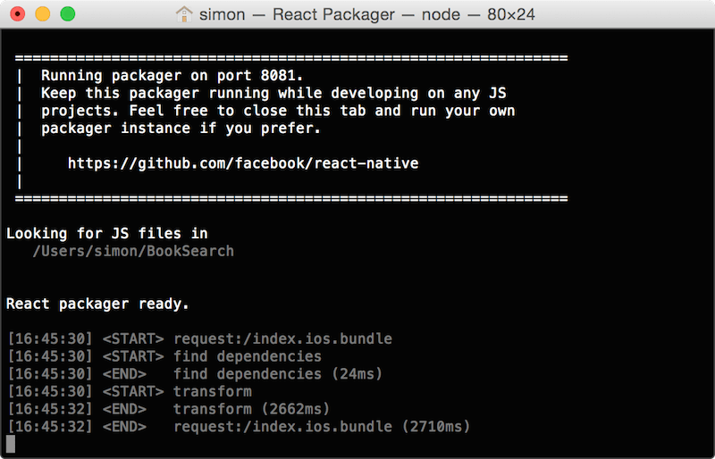

On running the app, you should see the following in the simulator. If you want to run on a device, [there are a few steps you should take to do so](http://facebook.github.io/react-native/docs/runningondevice.html#content).

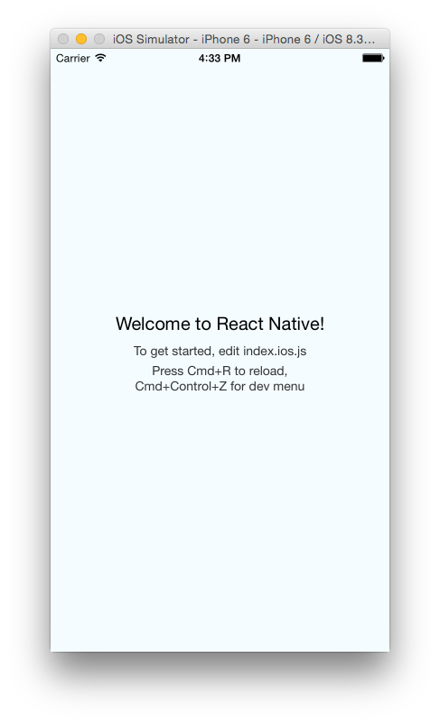

The welcome screen gives some crucial instructions which you should note: to edit the app’s UI you should edit the index.ios.js file that was generated when you created the project, if you make changes to the JavaScript code, reload the app with Command-R to see the changes and if you want more options, use Command-Control-Z to open the developer menu which offers such options as enabling live reloading and browser debugging.

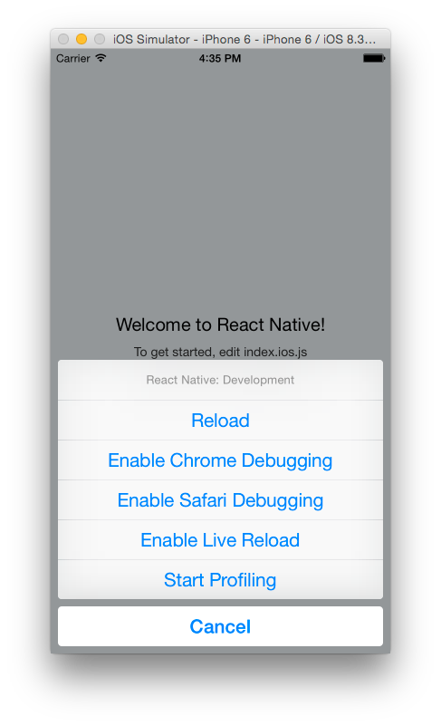

At any point while doing the tutorial should you encounter a red screen on the simulator, check the error message on the simulator. This will let you know whether the problem is with your code or with the server. I have encountered a problem with the server connection several times whereby I’ve gotten the error message “Could not connect to the server” on the simulator and on checking the Terminal got a “Process terminated” error message. When this happens, close the Terminal window, stop the app in Xcode and run it again. For other error that are due to syntax errors in code or network request timeouts (if your app is fetching data from the internet), a simple reloading after fixing the issue should do.

If you are pressing Command-R on your keyboard and nothing is happening, the hardware keyboard might not be connected to the simulator. To connect it select the option on the simulator menu by going to Hardware > Keyboard > Connect Hardware Keyboard.

If you’ve done the above and it still won’t reload, then you [might require a restart of your computer](http://www.supportmyidea.com/2015/03/26/react-native-cmdr-not-working/). I’ve encountered this once whereby it was working fine and then it stopped working. Restarting my computer fixed it.

We’ll now start building our app. Open the index.ios.js file. I recommend using an IDE suitable for web development. You can still use Xcode but you’ll find that it’s not very suitable for this as it won’t do much when it comes to code formatting, autocompletion or syntax error highlighting. For suitable JavaScript IDEs you can [read through this post and make your decision](http://stackoverflow.com/questions/5652972/ide-and-debugger-for-node-js). I used RubyMine, but really any IDE that has support for JavaScript will do. If you can get [one that supports JSX](http://www.reddit.com/r/reactjs/comments/30a0cn/what_ide_have_you_been_using_with_reactjs_jsx/) that will be even better.

When you open the index.ios.js file you will see the code that builds the UI you saw on the running app. You will see the following code blocks.

```javascript
'use strict';
```

The above enables Strict Mode, which adds improved error handling to the React Native JavaScript code.

上面的代码激活Strict模式，这将改善React Native JavaScript代码的错误处理。

```javascript
var React = require('react-native');
```

The above loads the react-native module and assigns it to the variable React. You have to load external modules into your file before you can call any functions in the modules. Think of it as importing libraries in Swift and Objective-C.

上面的代码加载`react-native`模块并指派化给React变量。在你调用任何模块中的方法前，你应该加载额外的模块到你的文件中。将它看成是在Swift以及Object-C中引入库文件。

```javascript
var {
  AppRegistry,
  StyleSheet,
  Text,
  View,
} = React;
```

The above is a destructuring assignment which enables you to assign multiple object properties to a single variable. This makes them scoped references in the file. The above is optional, but if you left it out, then every time you use a component in your code, you would have to use its full qualified name for example ‘React.AppRegistry’ instead of ‘AppRegistry’ or ‘React.StyleSheet’ instead of ‘StyleSheet’, e.t.c.

```javascript
var BookSearch = React.createClass({
  render: function() {
    return (
      <View style={styles.container}>
        <Text style={styles.welcome}>
          Welcome to React Native!
        </Text>
        <Text style={styles.instructions}>
          To get started, edit index.ios.js
        </Text>
        <Text style={styles.instructions}>
          Press Cmd+R to reload,{'\n'}
          Cmd+Control+Z for dev menu
        </Text>
      </View>
    );
  }
});
```

The above creates a class that has only one function render(). Whatever is defined in render is what will be output to the screen. The above uses JSX (JavaScript syntax extension) to construct the app’s UI. If you’ve used XML (or even HTML) before, then JSX will look familiar to you. It has the same balanced use of opening and closing tags and use of attributes to set values on tags. You don’t have to use JSX with React Native, you can just use plain JavaScript, but JSX is recommended for its simplicity in defining tree structures. If you have a lot of code for your UI, it will be much easier to read through the large JSX tree structure.

```javascript
var styles = StyleSheet.create({
  container: {
    flex: 1,
    justifyContent: 'center',
    alignItems: 'center',
    backgroundColor: '#F5FCFF',
  },
  welcome: {
    fontSize: 20,
    textAlign: 'center',
    margin: 10,
  },
  instructions: {
    textAlign: 'center',
    color: '#333333',
    marginBottom: 5,
  },
});
```

Above are the styles that are applied to the view’s content. If you’ve done web development and used CSS (Cascading Style Sheets) before then this should be familiar. React Native uses CSS to style the app’s UI. If you look at the JSX code you will see where each style is used, for example style={styles.container} sets the style defined for container for the outer view that encloses the other UI components.

```
AppRegistry.registerComponent('BookSearch', () => BookSearch);
```

The above defines the entry point to the application. This is where the JavaScript code start executing.

上面的代码定义应用程序的入口。这里是JavaScript代码开始执行的地方。

That’s the basic structure of a React Native UI. Every view we define will follow the same basic structure.

In the tutorial, we’ll create an app that lets you browse through books and see details about the books like the author, title and a short description of the book. You will also be able to search for a book by the book title and/or author. Below is what the app will look like. We’ll use the Google books API for the data.

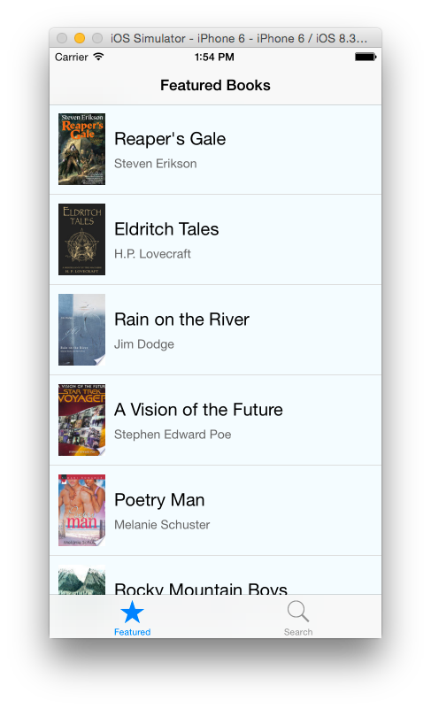

#### Adding a Tab Bar

The app will have a tab bar with two items on it – Featured and Search. We’ll add this first.

While you can have all your code in the index.ios.js file, this is not recommended as things will soon get messy as the app’s code grows. We’ll create our classes in different files, for better management.

Create two JavaScript files in the root directory of your project (the same location as the index.ios.js file). Name the files Search.js and Featured.js. Open Featured.js and add the following code.

```javascript
'use strict';
 
var React = require('react-native');
 
var {
    StyleSheet,
    View,
    Text,
    Component
   } = React;
 
var styles = StyleSheet.create({
    description: {
        fontSize: 20,
        backgroundColor: 'white'
    },
    container: {
        flex: 1,
        justifyContent: 'center',
        alignItems: 'center'
    }
});
 
class Featured extends Component {
    render() {
        return (
        <View style={styles.container}>
            <Text style={styles.description}>
              Featured Tab
            </Text>
        </View>
        );
    }
}
 
module.exports = Featured;
```

You should be familiar with the above code; it’s very similar to the code we looked at earlier. We set the Strict Mode, load the react-native module, create the view styles and render UI output with the render() function. The last line of the code exports the Featured class thus making it available for use by other files. Notice we declare the class and function a little differently from the example in index.ios.js. JavaScript has different ways to declare classes and functions. Feel free to chose the style you prefer. For the rest of the tutorial, we’ll use the style we used above.

In the stylesheet definition, we see basic CSS properties. We set the font size and background color for the text and center content in the outer view. But you might not be familiar with the flex: 1 styling. This is flexbox, a recent addition to the CSS specification. flex: 1 here makes the element marked container to take up the rest of the space on screen not occupied by sibling elements, otherwise it will just take up enough space to fit its content. We’ll look more into flex later on. To learn more about Flexbox styling, [you can read this guide](https://css-tricks.com/snippets/css/a-guide-to-flexbox/).

In Search.js add the following.

```javascript
'use strict';
 
var React = require('react-native');
 
var {
    StyleSheet,
    View,
    Text,
    Component
   } = React;
 
var styles = StyleSheet.create({
    description: {
        fontSize: 20,
        backgroundColor: 'white'
    },
    container: {
        flex: 1,
        justifyContent: 'center',
        alignItems: 'center'
    }
});
 
class Search extends Component {
    render() {
        return (
        <View style={styles.container}>
            <Text style={styles.description}>
              Search Tab
            </Text>
        </View>
        );
    }
}
 
module.exports = Search;
```

The above is similar to the code in Featured.js except for the text in the Text component.

In index.ios.js delete everything and paste in the following.

```javascript
'use strict';
 
var React = require('react-native');
var Featured = require('./Featured');
var Search = require('./Search');
 
var {
    AppRegistry,
    TabBarIOS,
    Component
   } = React;
 
class BookSearch extends Component {
 
    constructor(props) {
        super(props);
        this.state = {
            selectedTab: 'featured'
        };
    }
 
    render() {
        return (
            <TabBarIOS selectedTab={this.state.selectedTab}>
                <TabBarIOS.Item
                    selected={this.state.selectedTab === 'featured'}
                    icon={{uri:'featured'}}
                    onPress={() => {
                        this.setState({
                            selectedTab: 'featured'
                        });
                    }}>
                    <Featured/>
                </TabBarIOS.Item>
                <TabBarIOS.Item
                    selected={this.state.selectedTab === 'search'}
                    icon={{uri:'search'}}
                    onPress={() => {
                        this.setState({
                            selectedTab: 'search'
                        });
                    }}>
                    <Search/>
                </TabBarIOS.Item>
            </TabBarIOS>
        );
    }
}
 
AppRegistry.registerComponent('BookSearch', () => BookSearch);
```

Here we require the two modules we exported in the files we created and assign them to variables. Inside the class, we specify a constructor which we use to set a state for the class. Components have a state variable which we use here. We create a property named selectedTab and set its value to ‘featured’. We’ll use ‘featured’ to determine which tab should be active. We’ve set the default to the Featured tab.

In the render() function we use the TabBarIOS component to create a tab bar. Remember to add components you use to the destructuring assignment otherwise use its full qualified name e.g. React.TabBarIOS.

We create two tab bar items. For each item we set its selected state and define a function that will be called when the item is pressed. For the Featured tab, selected is set to true if the selectedTab state we defined earlier has a value of ‘featured’ otherwise it will be set to false. Same things for the Search tab except we check if selectedTab is equal to ‘search’. Whichever item has selected set to true will be the active tab. We use system icons for the tab bar items.

Notice we use our custom components in tags just like any other component e.g. . Since we required the corresponding module and assigned it to a variable, you can use the variable to bring in the component to the file. This results in the code that is in the render() function of the component’s class to be included as if it was part of the file. By the way, I use the same name for the variables as their respective class names but it’s not a requirement, you can use any name you prefer.

When a tab bar item is pressed, the callback function defined in the component’s onPress attribute is called. The function sets a value for the selectedTab property which will eventually determine the active tab.

Bring up the simulator and press Command-R to reload the app. You should see the following.

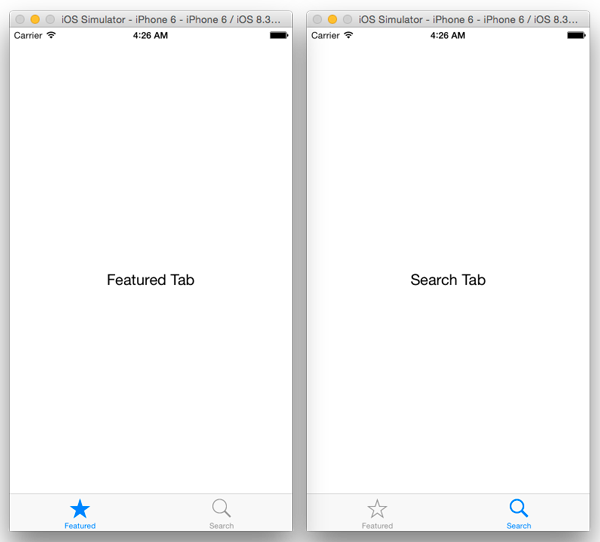

#### Adding a Navigation Bar

Next we’ll add a navigation bar to the app. Add two more files to the project. These will be the root views in the navigation stack of their respective tabs. Name the files BookList.js and SearchBooks.js.

In BookList.js add the following code.

```javascript
'use strict';
 
var React = require('react-native');
 
var {
    StyleSheet,
    View,
    Component
   } = React;
 
var styles = StyleSheet.create({
 
});
 
class BookList extends Component {
    render() {
        return (
            <View>
        </View>             
        );
    }
}
 
module.exports = BookList;
```

In SearchBooks.js add the following.

```javascript
'use strict';
 
var React = require('react-native');
 
var {
    StyleSheet,
    View,
    Component
   } = React;
 
var styles = StyleSheet.create({
 
});
 
class SearchBooks extends Component {
    render() {
        return (
            <View>
        </View>             
        );
    }
}
 
module.exports = SearchBooks;
```

In both files, we’ve created a module with a blank view and exported the module.

Modify Featured.js as shown.

```javascript
'use strict';
 
var React = require('react-native');
var BookList = require('./BookList');
 
var {
    StyleSheet,
    NavigatorIOS,
    Component
   } = React;
 
var styles = StyleSheet.create({
    container: {
        flex: 1
    }
});
 
class Featured extends Component {
    render() {
        return (
            <NavigatorIOS
                style={styles.container}
                initialRoute={{
            title: 'Featured Books',
            component: BookList
            }}/>            
        );
    }
}
 
module.exports = Featured;
```

The above uses the NavigatorIOS component to construct a navigation controller. We set its initial route to the BookList component (which will be its root view) and set a title that will appear on the navigation bar.

Next modify Search.js as shown below.

```javascript
'use strict';
 
var React = require('react-native');
var SearchBooks = require('./SearchBooks');
 
var {
    StyleSheet,
    NavigatorIOS,
    Component
   } = React;
 
var styles = StyleSheet.create({
    container: {
        flex: 1
    }
});
 
class Search extends Component {
    render() {
        return (
            <NavigatorIOS
                style={styles.container}
                initialRoute={{
            title: 'Search Books',
            component: SearchBooks
        }}/>            
        );
    }
}
 
module.exports = Search;
```

Just as in Featured.js, the above created a navigation controller, sets its initial route and sets a title for it.

Reload the app and you should have the following.

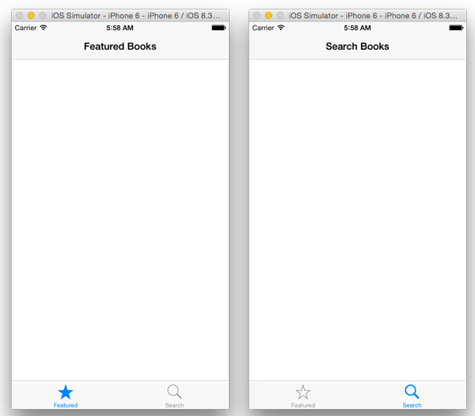

#### Fetching and Displaying Data

Now we’ll start adding data to our views. At first we’ll construct the view with fake data and then later on use real data from an API.

In BookList.js add the following at the top of the file with the other variable declarations.

```javascript
var FAKE_BOOK_DATA = [
    {volumeInfo: {title: 'The Catcher in the Rye', authors: "J. D. Salinger", imageLinks: {thumbnail: 'http://books.google.com/books/content?id=PCDengEACAAJ&printsec=frontcover&img=1&zoom=1&source=gbs_api'}}}
];
```

Modify the destructuring assignment as shown to include more components that we’ll use.

```javascript
var {
    Image,
    StyleSheet,
    Text,
    View,
    Component,
   } = React;
```

Add the following styles.

```javascript
var styles = StyleSheet.create({
    container: {
        flex: 1,
        flexDirection: 'row',
        justifyContent: 'center',
        alignItems: 'center',
        backgroundColor: '#F5FCFF',
        padding: 10
    },
    thumbnail: {
        width: 53,
        height: 81,
        marginRight: 10
    },
    rightContainer: {
        flex: 1
    },
    title: {
        fontSize: 20,
        marginBottom: 8
    },
    author: {
        color: '#656565'
    }
});
```

Then modify the class as shown.

```javascript
class BookList extends Component {
    render() {
    var book = FAKE_BOOK_DATA[0];
        return (
            <View style={styles.container}>
                <Image source={{uri: book.volumeInfo.imageLinks.thumbnail}}
                            style={styles.thumbnail} />
                <View style={styles.rightContainer}>
                    <Text style={styles.title}>{book.volumeInfo.title}</Text>
                    <Text style={styles.author}>{book.volumeInfo.authors}</Text>
                </View>
            </View>
        );
    }
}
```

Reload the app and you should have the following.

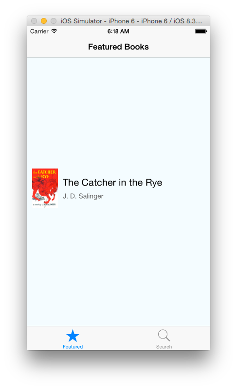

In the above code, we created a JSON object that is similar to the object we’ll get from the API call. We created properties and values for the object for a single book. In the class file, we use the fake data to only get the first element and use this to populate our view. We use the Image component to load an image onto the view. Note that we set its width and height in the stylesheet. If you don’t specify the image size in the stylesheet, it will not appear in the view.

We specify a styling of flexDirection: ‘row’ for container. This will make the children of the element with that style to be laid out horizontally rather than vertically which is the default. Note how we wrap components inside other components. In the above there is the main container view with two children – an Image and a View. The View has has two children of its own – two Text components.

The Image component is laid out first and then the View (rightContainer) is placed horizontally next to it. We specify a style of flex: 1 for the rightContainer. This makes that view occupy the rest of the space not occupied by the image. If you want to see the effects of the flex styling then add the following to rightContainer.

```javascript
backgroundColor: 'red'
```

Reload the app and you will see the space occupied by the component with rightContainer styling. It takes up the entire space not occupied by its sibling. It doesn’t stretch to the end of the screen because the outer container has some padding set on it and the image has a margin set to its right.

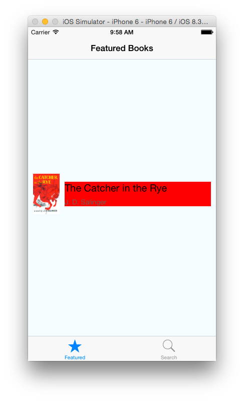

Remove flex: 1 from rightContainer and reload the app. Now the component only occupies enough space to fit its content.

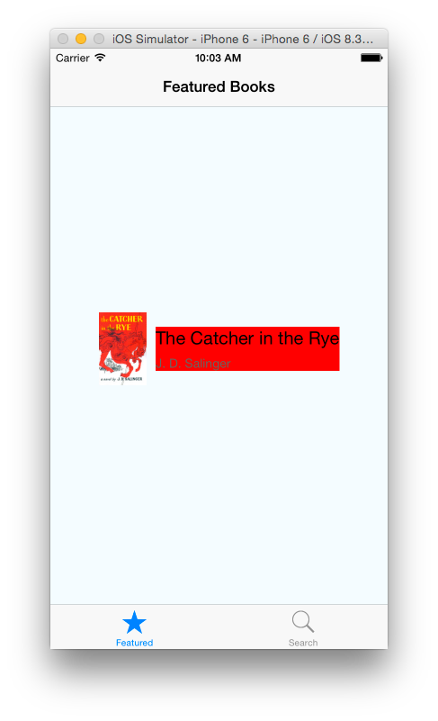

If you put a style of flex: 2 for both thumbnail and rightContainer they will occupy the same amount of space as their widths will have a ratio of 2:2 (or 1:1). You can specify whatever value you want, it is the ratio that will be taken into account.

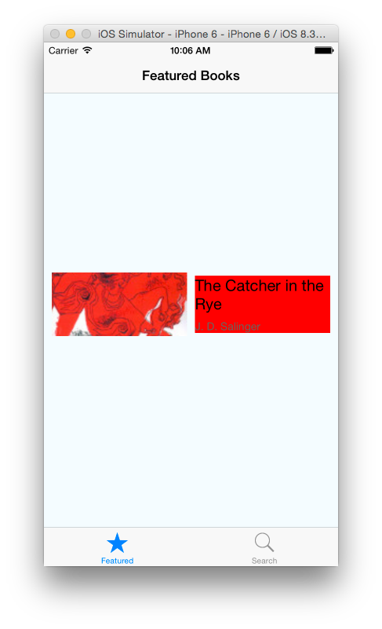

You can try out different ratios to get the styling you like. For the tutorial, we’ll continue with what we had before the step to add a red background to rightContainer.

#### Adding a ListView

React Native has a component called ListView which displays scrollable rows of data – basically a table view in iOS terms.

To get started, modify the destructuring statement as shown to include more components that we’ll use.

```javascript
var {
    Image,
    StyleSheet,
    Text,
    View,
    Component,
    ListView,
    TouchableHighlight
   } = React;
```

Add the following style to the style sheet.

```javascript
separator: {
       height: 1,
       backgroundColor: '#dddddd'
   }
```

Add the following constructor to the BookList class.

```javascript
constructor(props) {
       super(props);
       this.state = {
           dataSource: new ListView.DataSource({
               rowHasChanged: (row1, row2) => row1 !== row2
           })
       };
   }
```

Then add the following function.

```javascript
componentDidMount() {
    var books = FAKE_BOOK_DATA;
    this.setState({
        dataSource: this.state.dataSource.cloneWithRows(books)
    });
   }
```

In the constructor, we create a ListView.DataSource object and assign it to the dataSource property. The DataSource is an interface that ListView uses to determine which rows have changed over the course of updates to the UI. We provide a function that compares the identity of a pair of rows and this is used to determine the changes in a list of data.

componentDidMount() is called when the component is loaded/mounted onto the UI view. When the function is called, we set the datasource property with data from our data object.

Modify the render() function as shown.

```javascript
render() {
    return (
        <ListView
            dataSource={this.state.dataSource}
            renderRow={this.renderBook.bind(this)}
            style={styles.listView}
            />
    );
}
```

Then add the following function to the BookList class.

```javascript
renderBook(book) {
       return (
            <TouchableHighlight>
                <View>
                    <View style={styles.container}>
                        <Image
                            source={{uri: book.volumeInfo.imageLinks.thumbnail}}
                            style={styles.thumbnail} />
                        <View style={styles.rightContainer}>
                            <Text style={styles.title}>{book.volumeInfo.title}</Text>
                            <Text style={styles.author}>{book.volumeInfo.authors}</Text>
                        </View>
                    </View>
                    <View style={styles.separator} />
                </View>
            </TouchableHighlight>
       );
   }
```

The above creates a ListView component in render(). Here it’s datasource attribute is set to the value of the dataSource property we defined earlier and the function renderBook() is called to render the rows of the ListView.

In renderBook() we use the TouchableHighlight component. This is a wrapper for making views respond properly to touches. On press down, the opacity of the wrapped view is decreased, which allows the underlay color to show through, darkening or tinting the view. With this, if you press down on a ListView row, you will see the highlight color, just as what we are used to when we select a table view cell. We add an empty View component at the bottom of the row with a styling of separator. With styling, this view will simply be a grey horizontal line that will act like a partition between each row.

Reload the app and you should see the table view with only one cell.

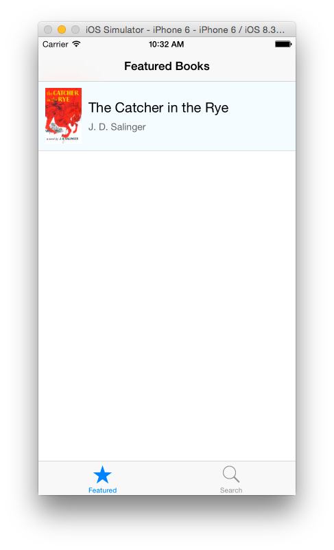

Now to load real data into the app.

Remove the FAKE_BOOK_DATA variable from the file and instead add the following. This is the URL we will load data from.

```javascript
var REQUEST_URL = 'https://www.googleapis.com/books/v1/volumes?q=subject:fiction';
```

Modify the destructuring statement.

```javascript
var {
    Image,
    StyleSheet,
    Text,
    View,
    Component,
    ListView,
    TouchableHighlight,
    ActivityIndicatorIOS
   } = React;
```

Add the following styles.

```javascript
listView: {
       backgroundColor: '#F5FCFF'
   },
   loading: {
       flex: 1,
       alignItems: 'center',
       justifyContent: 'center'
   }
```

Modify the constructor as shown. We add another property to the component’s state object. We’ll use this to determine whether the view is loading or not.

```javascript
constructor(props) {
       super(props);
       this.state = {
           isLoading: true,
           dataSource: new ListView.DataSource({
               rowHasChanged: (row1, row2) => row1 !== row2
           })
       };
   }
```

Modify the componentDidMount() function as shown and add the fetchData() function below. fetchData() makes the call to the Google books API and sets the dataSource property with the data it gets from the response. It also sets isLoading to true.

```javascript
componentDidMount() {
       this.fetchData();
   }
 
   fetchData() {
       fetch(REQUEST_URL)
       .then((response) => response.json())
       .then((responseData) => {
           this.setState({
               dataSource: this.state.dataSource.cloneWithRows(responseData.items),
               isLoading: false
           });
       })
       .done();
   }
```

Modify render() as shown and add the renderLoadingView() function shown below. We add a check to isLoading and if it’s set to true, we return the view that is returned by the renderLoadingView(). This will be a view that shows an activity indicator (a spinner) with the text ‘Loading books…’. When loading is done, you should see a list of books in a table.

```javascript
render() {
       if (this.state.isLoading) {
           return this.renderLoadingView();
       }
 
       return (
            <ListView
                dataSource={this.state.dataSource}
                renderRow={this.renderBook.bind(this)}
                style={styles.listView}
                />
        );
}  
    
renderLoadingView() {
    return (
        <View style={styles.loading}>
            <ActivityIndicatorIOS
                size='large'/>
            <Text>
                Loading books...
            </Text>
        </View>
    );
}
```

Reload the app and you should have something similar to what’s shown below.

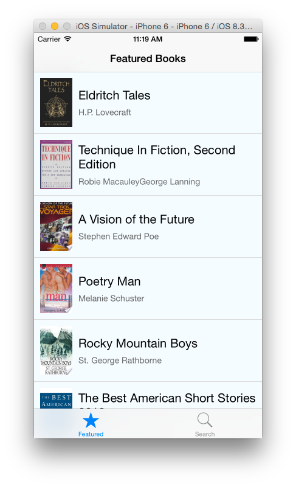

### Adding the Detail View

If you tap on a cell in the table, the cell will be highlighted but nothing will happen. We’ll add a detail view that will show us details of the book we select.

Add a file to the project and name it BookDetail.js. Paste the following in the file.

```javascript
'use strict';
 
var React = require('react-native');
 
var {
    StyleSheet,
    Text,
    View,
    Component,
    Image
   } = React;
 
var styles = StyleSheet.create({
    container: {
        marginTop: 75,
        alignItems: 'center'
    },
    image: {
        width: 107,
        height: 165,
        padding: 10
    },
    description: {
        padding: 10,
        fontSize: 15,
        color: '#656565'
    }
});
 
class BookDetail extends Component {
    render() {
        var book = this.props.book;
        var imageURI = (typeof book.volumeInfo.imageLinks !== 'undefined') ? book.volumeInfo.imageLinks.thumbnail : '';
        var description = (typeof book.volumeInfo.description !== 'undefined') ? book.volumeInfo.description : '';
        return (
            <View style={styles.container}>
                <Image style={styles.image} source={{uri: imageURI}} />
                <Text style={styles.description}>{description}</Text>
            </View>
        );
    }
}
 
module.exports = BookDetail;
```

Most of what is in the above code we’ve been through it so I won’t go over it all. What we haven’t seen is the use of the props property to extract data from. We will pass data into this class by setting its props property. In the above, we get this data and populate the view with the data.

Notice we set a top margin on container. If you don’t then the view will start from the top of the screen and this might result in some elements being hidden by the navigation bar.

In BookList.js add the following to the file.

```javascript
var BookDetail = require('./BookDetail');
```

Modify the TouchableHighlight in the render() function of the BookList class as shown.

```javascript
<TouchableHighlight onPress={() => this.showBookDetail(book)}  underlayColor='#dddddd'>
```

The above specifies a callback function that will be called when the row it pressed. Paste the below function into the class. This will push the BookDetail view onto the navigation stack and set the title seen on the navigation bar. It passes the book object that corresponds to that particular row to the BookDetail class.

```javascript
showBookDetail(book) {
       this.props.navigator.push({
           title: book.volumeInfo.title,
           component: BookDetail,
           passProps: {book}
       });
   }
```

Reload the app and you should now be able to see details of a selected book.


#### Searching

Now that we have completed the Master-Detail view of the Featured tab, we’ll work on the Search tab to enable the user to query the API for books of their choice.

Open SearchBooks.js and modify it as shown.

```javascript
'use strict';
 
var React = require('react-native');
var SearchResults = require('./SearchResults');
var {
    StyleSheet,
    View,
    Text,
    Component,
    TextInput,
    TouchableHighlight,
    ActivityIndicatorIOS
    } = React;
 
var styles = StyleSheet.create({
    container: {
        marginTop: 65,
        padding: 10
    },
    searchInput: {
        height: 36,
        marginTop: 10,
        marginBottom: 10,
        fontSize: 18,
        borderWidth: 1,
        flex: 1,
        borderRadius: 4,
        padding: 5
    },
    button: {
        height: 36,
        backgroundColor: '#f39c12',
        borderRadius: 8,
        justifyContent: 'center',
        marginTop: 15
    },
    buttonText: {
        fontSize: 18,
        color: 'white',
        alignSelf: 'center'
    },
    instructions: {
        fontSize: 18,
        alignSelf: 'center',
        marginBottom: 15
    },
    fieldLabel: {
        fontSize: 15,
        marginTop: 15
    },
    errorMessage: {
        fontSize: 15,
        alignSelf: 'center',
        marginTop: 15,
        color: 'red'
    }
});
 
class SearchBooks extends Component {
 
    constructor(props) {
        super(props);
        this.state = {
            bookAuthor: '',
            bookTitle: '',
            isLoading: false,
            errorMessage: ''
        };
    }
 
 
    render() {
        var spinner = this.state.isLoading ?
            ( <ActivityIndicatorIOS
                hidden='true'
                size='large'/> ) :
            ( <View/>);
        return (
            <View style={styles.container}>
                <Text style={styles.instructions}>Search by book title and/or author</Text>
                <View>
                    <Text style={styles.fieldLabel}>Book Title:</Text>
                    <TextInput style={styles.searchInput} onChange={this.bookTitleInput.bind(this)}/>
                </View>
                <View>
                    <Text style={styles.fieldLabel}>Author:</Text>
                    <TextInput style={styles.searchInput} onChange={this.bookAuthorInput.bind(this)}/>
                </View>
                <TouchableHighlight style={styles.button}
                                    underlayColor='#f1c40f'
                                    onPress={this.searchBooks.bind(this)}>
                    <Text style={styles.buttonText}>Search</Text>
                </TouchableHighlight>
                {spinner}
                <Text style={styles.errorMessage}>{this.state.errorMessage}</Text>
            </View>
        );
    }
 
    bookTitleInput(event) {
        this.setState({ bookTitle: event.nativeEvent.text });
    }
 
    bookAuthorInput(event) {
        this.setState({ bookAuthor: event.nativeEvent.text });
    }
 
    searchBooks() {
        this.fetchData();
    }
 
    fetchData() {
 
        this.setState({ isLoading: true });
 
        var baseURL = 'https://www.googleapis.com/books/v1/volumes?q=';
        if (this.state.bookAuthor !== '') {
            baseURL += encodeURIComponent('inauthor:' + this.state.bookAuthor);
        }
        if (this.state.bookTitle !== '') {
            baseURL += (this.state.bookAuthor === '') ? encodeURIComponent('intitle:' + this.state.bookTitle) : encodeURIComponent('+intitle:' + this.state.bookTitle);
        }
 
        console.log('URL: >>> ' + baseURL);
        fetch(baseURL)
            .then((response) => response.json())
            .then((responseData) => {
                this.setState({ isLoading: false});
                if (responseData.items) {
 
                    this.props.navigator.push({
                        title: 'Search Results',
                        component: SearchResults,
                        passProps: {books: responseData.items}
                    });
                } else {
                    this.setState({ errorMessage: 'No results found'});
                }
            })
            .catch(error =>
                this.setState({
                    isLoading: false,
                    errorMessage: error
                }))
            .done();
    }
 
}
 
module.exports = SearchBooks;
```

In the above, we set some properties in the constructor: bookAuthor, bookTitle, isLoading and errorMessage. We’ll see how these are used shortly.

In the render() method, we check if isLoading is true and create an activity indicator if it is, otherwise, we create an empty view. This will be used later. We then create the search form that will be used to insert queries. TextInput is used for input. We specify a callback function for each TextInput component that will be called when the value of the component changes i.e. when the user types in some text. When called, the callback functions bookTitleInput() and bookAuthorInput() will set the bookAuthor and bookTitle state properties with the data entered by the user. searchBooks() is called when the user presses the Search button. Note that React Native does not have a button component. Instead we use TouchableHighlight and wrap it around Text which we then style to look like a button. When the Search button is pressed, a URL is constructed depending on the data entered. A user can search by title, author or both title and author. If results are returned, SearchResults will be pushed on to the navigation stack otherwise an error message will be displayed. We also pass the response data to the SearchResults class.

Create a file named SearchResults.js and paste the following in.

```javascript
'use strict';
 
var React = require('react-native');
var BookDetail = require('./BookDetail');
var {
    StyleSheet,
    View,
    Text,
    Component,
    TouchableHighlight,
    Image,
    ListView
    } = React;
 
var styles = StyleSheet.create({
    container: {
        flex: 1,
        justifyContent: 'center',
        alignItems: 'center'
    },
    title: {
        fontSize: 20,
        marginBottom: 8
    },
    author: {
        color: '#656565'
    },
    separator: {
        height: 1,
        backgroundColor: '#dddddd'
    },
    listView: {
        backgroundColor: '#F5FCFF'
    },
    cellContainer: {
        flex: 1,
        flexDirection: 'row',
        justifyContent: 'center',
        alignItems: 'center',
        backgroundColor: '#F5FCFF',
        padding: 10
    },
    thumbnail: {
        width: 53,
        height: 81,
        marginRight: 10
    },
    rightContainer: {
        flex: 1
    }
});
 
class SearchResults extends Component {
 
    constructor(props) {
        super(props);
 
        var dataSource = new ListView.DataSource(
            {rowHasChanged: (row1, row2) => row1 !== row2});
        this.state = {
            dataSource: dataSource.cloneWithRows(this.props.books)
        };
    }
 
    render() {
 
        return (
            <ListView
                dataSource={this.state.dataSource}
                renderRow={this.renderBook.bind(this)}
                style={styles.listView}
                />
        );
    }
 
    renderBook(book) {
        var imageURI = (typeof book.volumeInfo.imageLinks !== 'undefined') ? book.volumeInfo.imageLinks.thumbnail : '';
 
        return (
            <TouchableHighlight onPress={() => this.showBookDetail(book)}
                                underlayColor='#dddddd'>
                <View>
                    <View style={styles.cellContainer}>
                        <Image
                            source={{uri: imageURI}}
                            style={styles.thumbnail} />
                        <View style={styles.rightContainer}>
                            <Text style={styles.title}>{book.volumeInfo.title}</Text>
                            <Text style={styles.author}>{book.volumeInfo.authors}</Text>
                        </View>
                    </View>
                    <View style={styles.separator} />
                </View>
            </TouchableHighlight>
        );
    }
 
    showBookDetail(book) {
 
        this.props.navigator.push({
            title: book.volumeInfo.title,
            component: BookDetail,
            passProps: {book}
        });
    }
 
}
 
module.exports = SearchResults;
```

We’ve gone through a lot of what we use in the code above so I won’t get into every detail. The above gets the data passed into the class via the props property and creates a ListView populated with the data.

One thing I noticed in the API is that when you search by author, some results will not be book data but data on the author themselves. This means that for some rows book.volumeInfo.imageLinks.thumbnail and book.volumeInfo.description will have a value of undefined. So we make a check for this and show an empty image view if there is no image. If we didn’t and the app tried to load an image that wasn’t there, it would crash.

We use the same BookDetail component we created earlier to show the details of each book. We should put the above check for missing data incase we try to load the BookDetail view with missing data. Open BookDetail.js and modify the render() function as shown. This checks if the data passed in has an image and description before populating the view with this data. If we try to view a book without a description or image, the respective area will be blank. You might want to put in an error message to the user, but we’ll leave it as it is here.

```javascript
render() {
    var book = this.props.book;
    var imageURI = (typeof book.volumeInfo.imageLinks !== 'undefined') ? book.volumeInfo.imageLinks.thumbnail : '';
    var description = (typeof book.volumeInfo.description !== 'undefined') ? book.volumeInfo.description : '';
    return (
        <View style={styles.container}>
            <Image style={styles.image} source={{uri: imageURI}} />
            <Text style={styles.description}>{description}</Text>
        </View>
    );
}
```

Reload the app and you should be able to search for a book.


#### Conclusion

Although it’s still a work-in-progress, React Native looks promising as another option for building mobile applications. It opens the door to web developers looking to dip their toes in the mobile development waters; even for mobile developers, it could offer a way to streamline their development workflow.

As the project grows, it will be interesting to see where it goes and the apps (iOS and Android – and perhaps other platforms as well) that will be built with React Native. In the meantime, if you need convincing on whether web technologies can be used to achieve truly native experiences, you can check out these apps that were built by react native: [Facebook Ads Manager](https://itunes.apple.com/app/id964397083) (completely written in React Native) and [Facebook Groups](https://itunes.apple.com/us/app/facebook-groups/id931735837) (a hybrid app created with React Native and Objective-C).

“Learn once, write anywhere”. This alone might make it worth learning how to use the framework.

You can download the completed project here.

To learn more about React Native, you could watch the following videos and also [read the documentation](http://facebook.github.io/react-native/docs/getting-started.html).

* [Introducing React Native](https://www.youtube.com/watch?v=KVZ-P-ZI6W4).
* [A Deep Dive into React Native](https://www.youtube.com/watch?v=7rDsRXj9-cU).
* [React Native and Relay: Bringing Modern Web Techniques to Mobile](https://www.youtube.com/watch?v=X6YbAKiLCLU).

For reference, you can [download the Xcode project here](https://github.com/appcoda/React-Native-Demo-App).

What do you think about this tutorial and React Native? Leave me comment and share your thought.