A Beginner’s Guide to UIScrollView
===

[原文](http://www.appcoda.com/uiscrollview-introduction/)

In iOS, scroll views are used to view content that won’t fit entirely on the screen. Scroll views have two main purposes:

* To let users drag the area of the content they want to display
* To let users zoom in to or out of the displayed content using the pinch gestures

* 让用户拖在内容的区域到他们想要现实的内容
* 让用户使用`pinch gestures`来缩放呈现内容

A common control used in iOS apps – UITableView – is a subclass of UIScrollView and provides a great way to view content that is larger than the screen.

在iOS应用中的一个通用控件——UITableViw——是`UIScrollView`的子类，并且提供一种很好的方式给大于屏幕范围的视图内容。

In this tutorial, we’ll look at various aspects of UIScrollView, specifically, creating a scroll view programmatically and in Interface Builder, scrolling and zooming, working with insets and nested scroll views.

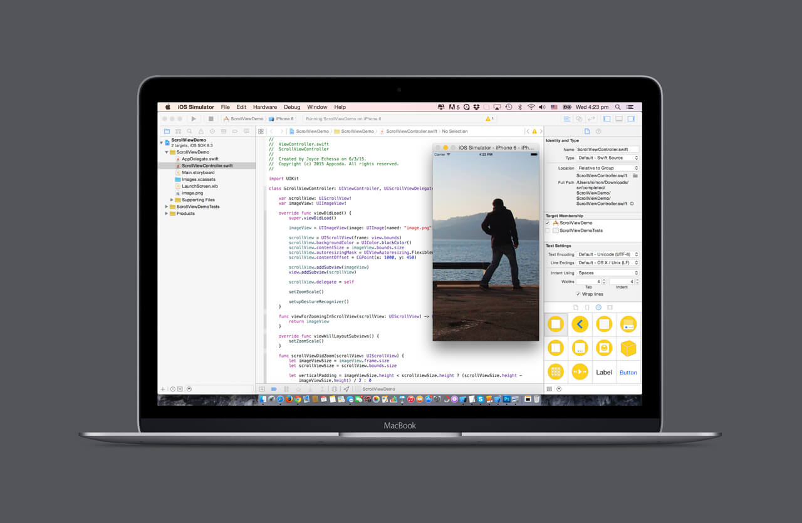

Before reading on, first [download the resource file](https://www.dropbox.com/s/qhdja7ixcfixu8e/UIScrollViewStarter.zip?dl=0) for the project which contains files we’ll use in the tutorial.

#### Creating Scroll Views Programmatically 编程创建`Scroll View`

Scroll views are created as any other view is, either programmatically or in Interface Builder. After that, only a small amount of additional configuration is required to achieve basic scrolling capabilities.

A scroll view is created and inserted into a controller or view hierarchy like any other view. There are only two additional steps required to complete the scroll view configuration:

* You must set the contentSize property to the size of the scrollable content. This specifies the size of the scrollable area.
* You must add a view or views that are displayed and scrolled by the scroll view. These view(s) provide the displayed content.

一个滚动视图像其他视图那样被创建以及插入到一个控制器或视图结构中。完成滚动视图的配置需要两个额外的步骤：

* 你必须为可滚动内容的尺寸设置`contentSize`属性。这将制定可滚动区域的尺寸。
* 你必须添加一个或多个视图用于滚动视图现实或滚动。这些视图提供呈现的内容。

You can optionally configure any visual cues your application requires like vertical and horizontal scroll indicators, drag bouncing, zoom bouncing, and directional constraint of scrolling.

We’ll start off by creating a scroll view in code. Open the ScrollViewDemo project from the project files you downloaded. It contains a simple project with a single view controller in the storyboard that has been linked to the ScrollViewController class created in the project. I have also included an image named image.png which we’ll be using (photo coutesy of [unsplash.com](https://unsplash.com/)).

Open ScrollViewController.swift and add the following properties.

```swift
var scrollView: UIScrollView!
var imageView: UIImageView!
```

Modify `viewDidLoad()` as shown.

```swift
override func viewDidLoad() {
    super.viewDidLoad()
        
    imageView = UIImageView(image: UIImage(named: "image.png"))
        
    scrollView = UIScrollView(frame: view.bounds)
    scrollView.backgroundColor = UIColor.blackColor()
    
    scrollView.contentSize = imageView.bounds.size
    scrollView.autoresizingMask = UIViewAutoresizing.FlexibleWidth | UIViewAutoresizing.FlexibleHeight
        
    scrollView.addSubview(imageView)
    view.addSubview(scrollView)
}
```

The above creates a scroll view and an image view. The image view is set as a subview of the scroll view. contentSize sets the size of the scrollable region. We set it equal to the size of the image view (2000 x 1500). We set the scroll view’s background color to black so that the image can have a black backdrop. We set the scroll view’s autoresizingMask to .FlexibleWidth and .FlexibleHeight so that it readjusts its size when the device is rotated. Run the app and you should be able to scroll through and see the different parts of the image.

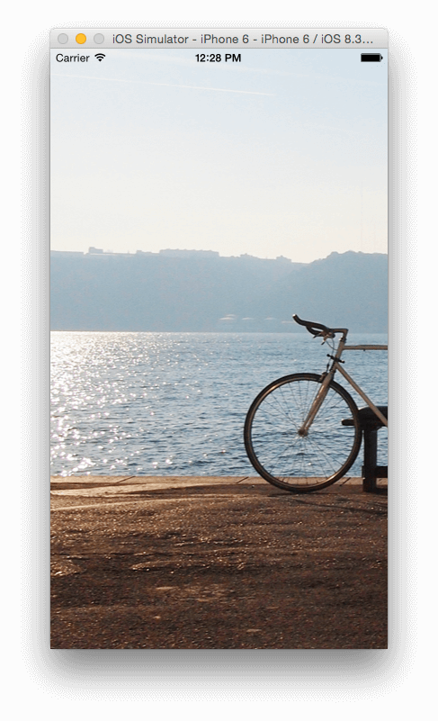

When you ran the app, you might have noticed that the part of the image that was originally shown was its top left corner.


This is because the scroll view’s bound origin is set to (0,0) which is at the top left corner. If you want to change the position of the content shown when the app launches, then you have to change the scroll views’s bound origin. Since setting this position is so common when working with scroll views, UIScrollView has a contentOffset property that you can change which will have the same effect as changing the bounds origin.

Paste the following statement after the line that sets the scroll view’s autoresizingMask.

```
scrollView.contentOffset = CGPoint(x: 1000, y: 450)
```

Run the app again and you’ll see that the scroll view has moved to show a different part of the photo. So you can determine what is presented to the user when the view is loaded.

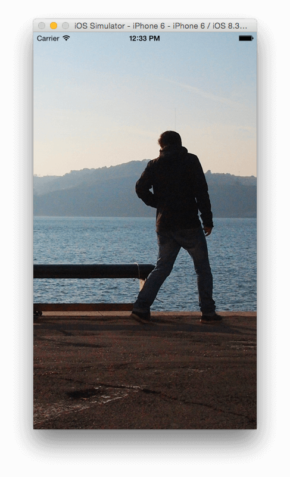

#### Zooming

We’ve added a scroll view which enables the user to scroll through a larger portion of content that’s too large for the screen. This is great, but it would be more useful if the user could zoom in and out of the view.

To support zooming, you must set a delegate for your scroll view. The delegate object must conform to the UIScrollViewDelegate protocol. That delegate class must implement the viewForZoomingInScrollView() method and return the view to zoom.

为了支持缩放，你必须设置一个委托（delegate）为你的滚动视图。委托对象必须确认实现`UIScrollViewDelegate`协议。这个代理类必须实现`viewForZoominginScrollView()`方法以及返回这个视图用于缩放。

You should also specify the amount the user can zoom in and out. You do this by setting values of the scroll view’s minimumZoomScale and maximumZoomScale properties. Both of these are set to 1.0 by default.

Modify the ScrollViewController class definition as shown.

```
class ScrollViewController: UIViewController, UIScrollViewDelegate {
```

Then add the following function to the class.

```
func viewForZoomingInScrollView(scrollView: UIScrollView) -> UIView? {
    return imageView
}
```

Then at the bottom of viewDidLoad() add the following.

```
scrollView.delegate = self  
scrollView.minimumZoomScale = 0.1
scrollView.maximumZoomScale = 4.0
scrollView.zoomScale = 1.0
```

In the above code we set the zoomScale to 1.0 and specify the zoom factor for the minimum and maximum zooming. On running the app, it will start off with the same scale factor as previously shown(zoomScale of 1.0). When you pinch the view, you will be able to scroll it up and down to its maximum and minimum scale factors. We set a large number (4.0) for the maximumZoomScale, thus you can scale up the image to 4 times its size, which isn’t so good as the resulting image when scaled up to a size larger than the original will be blurry. We’ll change this in the next step back to its default of 1.0.

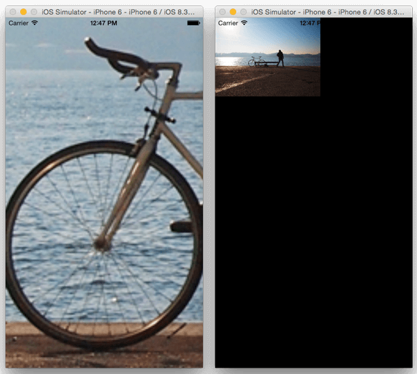

In the above, we set the minimumZoomScale to 0.1 which results in a pretty small image that leaves a lot of blank space on the screen. In landscape mode, the empty space next to the image is even larger. We want to make the image ‘Aspect Fit’ the scroll view so that it takes up as much space on the scroll view as it can while still showing the full image.

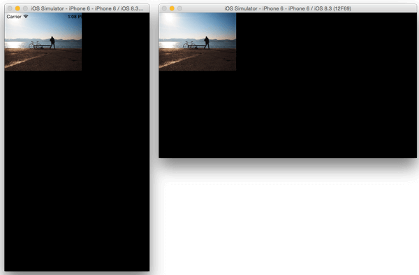

To do this we’ll calculate the mimimum scale factor by using the ratio of the scroll view and image view size.

First remove the following three statements from viewDidLoad().

```
scrollView.minimumZoomScale = 0.1
scrollView.maximumZoomScale = 4.0
scrollView.zoomScale = 1.0
```

Add the following function to the class. We get width and height ratios and pick the smaller of the two and set it as the minimum zoom scale. Notice I’ve remove the setting of the maximumZoomScale, so it will be set to its default of 1.0.

```
func setZoomScale() {
    let imageViewSize = imageView.bounds.size
    let scrollViewSize = scrollView.bounds.size
    let widthScale = scrollViewSize.width / imageViewSize.width
    let heightScale = scrollViewSize.height / imageViewSize.height
        
    scrollView.minimumZoomScale = min(widthScale, heightScale)
    scrollView.zoomScale = 1.0
}
```

Then call this at the end of viewDidLoad()

```
setZoomScale()
```

Also add the following so that the image scales right after the user tries to zoom in/out after a device orientation change.

```
override func viewWillLayoutSubviews() {
    setZoomScale()
}
```

Run the app and now when you zoom out the image will take up as much space on the screen while being fully visible.

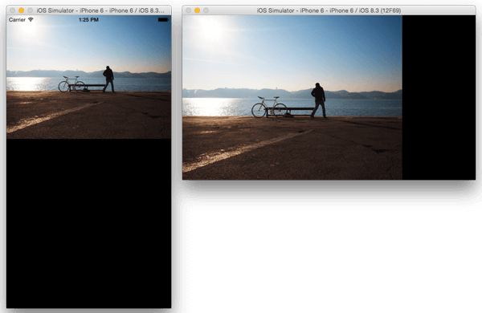

From the images above, you notice that the scroll view’s content – the image – is positioned from the top left corner of the screen. We want this to be centered on the screen instead.

Add the following function to the class.

```
func scrollViewDidZoom(scrollView: UIScrollView) {
    let imageViewSize = imageView.frame.size
    let scrollViewSize = scrollView.bounds.size
        
    let verticalPadding = imageViewSize.height < scrollViewSize.height ? (scrollViewSize.height - imageViewSize.height) / 2 : 0
    let horizontalPadding = imageViewSize.width < scrollViewSize.width ? (scrollViewSize.width - imageViewSize.width) / 2 : 0
        
    scrollView.contentInset = UIEdgeInsets(top: verticalPadding, left: horizontalPadding, bottom: verticalPadding, right: horizontalPadding)
}
```

This is called after every zoom action. It tells the delegate that the scroll view’s zoom factor changed. In the above code we calculate the padding/inset that will be applied on the sides of the image to center it. For the top and bottom values, we check if the image view’s height is smaller than the scroll view and if so set the padding to half the value of the difference between the two views, otherwise we set the value to 0. We do a similar thing for the horizontal padding. We then set the scroll view’s contentInset. This is the distance that the content view is inset from the enclosing scroll view.

Run the app and now the content should be centered when zoomed down to the minimum scale.

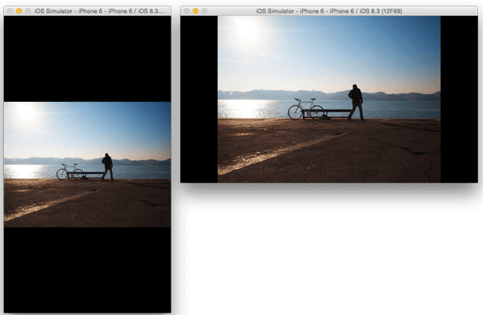

#### Zooming by Tapping

The basic UIScrollView class supports the pinch-in and pinch-out gestures with a little amount of additional code. But supporting a richer zooming experience using tap detection will rquire more work.

The iOS Human Interface Guidlines defines a double-tap to zoom in and out. This however assumes some constraints: that the view has a single level of zoom (such as in the Photos application where a double tap zooms the content up to the maximum zoom scale and another tap zooms it down to the mimimum), or that successive double-taps will zoom to the maximum amount and, once reached, the next double-tap zooms back to the full-screen view. But some applications require a more flexible behavior when dealing with tap-to-zoom functionality, an example of this is the Maps application. Maps supports double-tap to zoom in, with additional double-taps zooming in further. To zoom out in successive amounts, Maps uses a two-finger touch, with the fingers close together, to zoom out in stages

In order for your application to support tap to zoom functionality, you implement the required touch handling in the class for which the UIScrollView delegate method viewForZoomingInScrollView() returns. That class will be responsible for tracking the number of fingers on the screen and the tap count. When it detects a single tap, a double tap, or a two-finger touch, it will respond accordingly. In the case of the double tap and two-finger touch, it should programmatically zoom the scroll view by the appropriate factor.

For our app, we’ll implement the double-tap to zoom up to maximum if it’s currently at the minimum zoom scale, otherwise the double-tap will zoom it down to the minimum, this is similar to what you get on the Photos app.

Add the following two functions to the class.

```
func setupGestureRecognizer() {
    let doubleTap = UITapGestureRecognizer(target: self, action: "handleDoubleTap:")
    doubleTap.numberOfTapsRequired = 2
    scrollView.addGestureRecognizer(doubleTap)
}
    
func handleDoubleTap(recognizer: UITapGestureRecognizer) {
        
    if (scrollView.zoomScale > scrollView.minimumZoomScale) {
        scrollView.setZoomScale(scrollView.minimumZoomScale, animated: true)
    } else {
        scrollView.setZoomScale(scrollView.maximumZoomScale, animated: true)
    }
}
```

Then at the bottom of viewDidLoad() make the following call.

```
setupGestureRecognizer()
```

In the above code, we add a gesture recognizer to the scrollview, that recognizes when a user double taps on it. We then handle this by either zooming in or out depending on the current zoom level.

Run the app and you should be able to zoom in and out by double tapping.

#### Creating Scroll Views in Interface Builder

Implementing the scroll view similar to what we’ve done in Interface Builder is simpler than in code. These are the quick steps to get what we just built in code using storyboards.

In Main.storyboard, drag another view controller onto the canvas. Set it as the initial view controller by either dragging the Storyboard Entry Point arrow from the other view controller, or by selecting the new view controller and checking the Is Initial View Controller checkbox in the Attributes Inspector.

Add a Scroll View to the view controller’s view and pin all its edges so that it fills the screen.

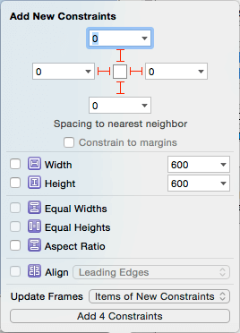

Then add an Image View to the Scroll View and pin all its edges to the scroll view.

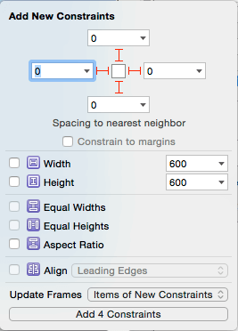

Remember that a scroll view needs to know its content size. When you set the image of the image view, its size will be used as the content size of the scroll view.

In Attributes Inspector, select image.png as the Image of the Image View. Resolve any Auto Layout issues by updating the frames. Run the app and you should have the same scrolling view we had in just a few set up steps and without writing a line of code. You can take a look at the Attributes Inspector, on selecting the Scroll View, to see what attributes you can set on it here. You can, for instance, set its minimum and maximum zoom scale.

For zooming, you’ll still need to implement the viewForZoomingInScrollView() delegate method as we did previously. We aren’t going to cover that here as it will just be a repetition of the last section. This means that if you need more features for your scroll view, you’ll still need to get into code.

#### Nested Scroll Views

It is possible to nest a scroll view inside another scroll view. This nesting can either be same directional or cross directional. For the code files for this part of the tutorial, use the NestedScrollViews starter project provided.

#### Same Directional Scrolling

Same-directional scrolling occurs when a UIScrollView that is a subview of a UIScrollView both scroll in the same direction. You can use this to add a section in your main scroll view’s view that contains additional separate data. You can also use same directional scroll views to achieve some UI effects like the parallax effect. In our demo app, we’ll use same directional scrolling and set different scrolling speeds for the two scroll views. This will result in a parallax effect of the views.

Open the storyboard file of the NestedScrollViews project, you should see a view controller with two sibling scroll views inside the main view. The scroll views have IDs of Background and Foreground. The Background scroll view has an image view with all its edges pinned to the scroll view with no padding. The image has been set to image.png. Both scroll views are pinned to the View with no padding.

In the Foreground scroll view, there are some labels added to it and a container view. The labels are only there so that we have a populated scroll view when we run the app. The container view will be used in the next section where we’ll look at cross directional scrolling. Incase you are wondering about the long size of the view controller, this is a setting you can set by selecting the view controller, going to the Size Inspector, changing its Simulated Size to Freeform and setting a size for this. In our case, I increased the height to 1,200. This is only to help you visually when you are working on your views and need more space on the view controller. It won’t affect the running app. It comes in handy when you are laying out elements that will likely be out of view when you first run the app, like the elements at the lower half of our scroll view.

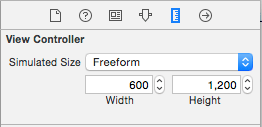

Since we already have the UI set up, creating the parallax effect will be quick. First run the app and note that the Foreground scrolls, but the Background remains stationary.

We’ll first create outlets for the two scroll views. Open the Assistant Editor and create an outlet for the Background scroll view named background and another for Foreground named foreground. You should have the following in ViewController.swift.

```
@IBOutlet weak var background: UIScrollView!
@IBOutlet weak var foreground: UIScrollView!
```

We’ll need to know when the foreground view is scrolled, so we can calculate the amount the background should scroll by and use this value to scroll it. We’ll use a UIScrollViewDelegate method for this.

Change the class declaration of ViewController as shown.

```
class ViewController: UIViewController, UIScrollViewDelegate {
```

Add the following to the bottom of viewDidLoad(). We only care about the foreground, so we wont set the background’s delegate.

```
foreground.delegate = self
```

Add the following function to the class.

```
func scrollViewDidScroll(scrollView: UIScrollView) {
        
    let foregroundHeight = foreground.contentSize.height - CGRectGetHeight(foreground.bounds)
    let percentageScroll = foreground.contentOffset.y / foregroundHeight
    let backgroundHeight = background.contentSize.height - CGRectGetHeight(background.bounds)
        
    background.contentOffset = CGPoint(x: 0, y: backgroundHeight * percentageScroll)
}
```

In the above code, we get the height of the foreground and calculate by how much the foreground has been scrolled. We then take this value and multiply it with the background’s height and use this in setting the background’s contentOffset which will result with the background moving a little bit faster than the foreground, each time the foreground is scrolled. Run the app and you’ll see the parallax effect created by this.


#### Cross Directional Scrolling

Cross-directional scrolling occurs when a scroll view that is a subview of another scroll view scrolls at a 90 degree angle. We’ll create this next.

In the NestedScrollViews project, you’ll notice a container view in the Foreground scroll view. This is where our horizontal scroll view will go.

Add a view controller to the Interface Builder canvas. Control-drag from the container view to the added view controller and select embed segue. With this view controller selected, go to the Size Inspector and change its Simulated Size to Freeform and set its height to 128. 128 is the size of our container view, so we set this as the size of the simulated view so we can better see how the scroll view will eventually look like. The view controller will look as shown.

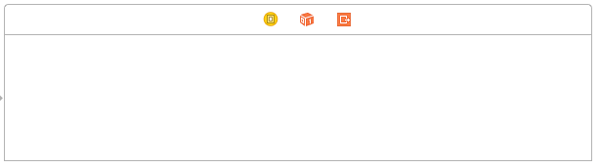

Drag a scroll view to this view controller and pin its edges as shown.

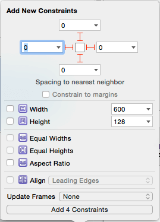

Then add a view to the scroll view and set its size in the Size Inspector to 70×70. Place it to the left of the scroll view. Duplicate it to create other similar views and spread them out on the scroll view. You don’t have to be accurate about the spacing. Below you can see what I have at this point. I changed the Background Color of the views to light gray so that they are more distinct.

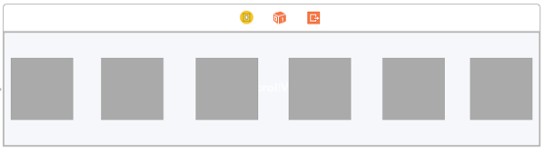

Select the leftmost view and pin it to the top and left. Also add constraints for the height and width.

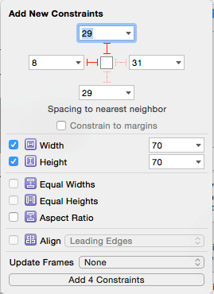

Select the view on the furthest right side and pin its top and right, and add constraints to its width and height.

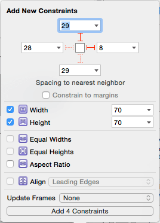

In the Document Outline. Select the Scroll View and go to Editor > Resolve Auto Layout Issues > All Views > Add Missing Constraints. This will add constraints to the other views. Run the app and you should be able to scroll vertically like before, but on the container view, you will be able to scroll through the content horizontally. In the example below, I set the Background Color of the view controller’s view to Clear Color.

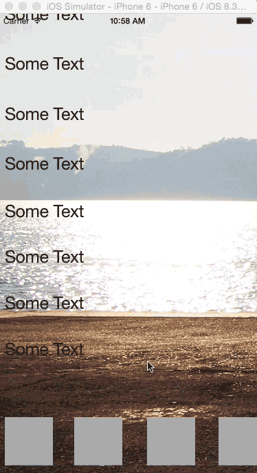

That brings us to the end of this tutorial. We didn’t cover everything about scroll views, but I hope the article helps you when you’re getting started with scroll views. For more on the topic, you can read more in the [Scroll View Programming Guide](https://developer.apple.com/library/prerelease/ios/documentation/WindowsViews/Conceptual/UIScrollView_pg/Introduction/Introduction.html#//apple_ref/doc/uid/TP40008179-CH1-SW1).

For reference, you can [download both completed project files here](https://www.dropbox.com/s/91buj9d9gmphoen/UIScrollViewFinal.zip?dl=0).