Building an RSS Reader Using UISplitViewController and UIPopoverViewController
===

Just a few weeks ago Apple introduced the new iPhone devices, the iPhone 6 and iPhone 6 Plus. As we all saw, the screen sizes are bigger than all the older iPhone screens, meaning that any new applications must be build in that way so they work on all devices. Even more, if we consider the iPad screens, then the number of screen sizes that any application should adapt to becomes even greater. From a first point of view, that may seem a big hassle for developers, however that’s not true at all.

In iOS 8, Apple introduces the so-called adaptive user interface or adaptive layout. With that new philosophy, application interfaces can be adjusted and configured pretty fast for any kind of display. With adaptive UI, some existing concepts have become deprecated, such as various delegate methods regarding the device orientation. On the other hand, new concepts are provided for easier and more general handling of the interface, and developers just need to get used to working with them. Anyway, in this tutorial I’m not going to discuss in depth about the adaptive UI, but as we are going to be in align with it, there are a few things that we will see in a bit more detail later on.

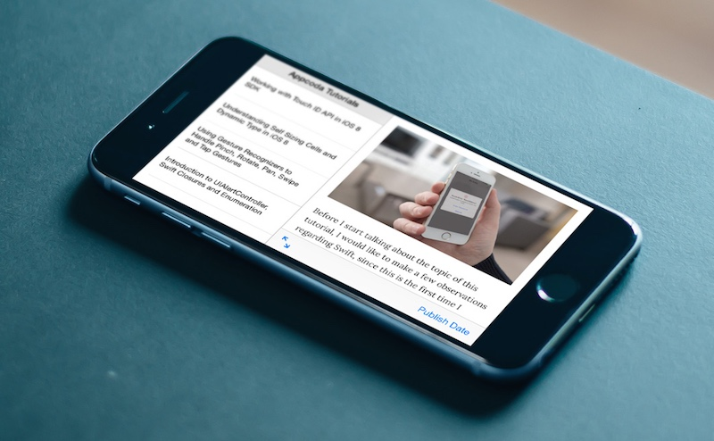

Further than all the above, it’s well known that iOS 8 not only contains new features, but great improvements to existing ones as well. Of course, view controllers could not just stay out of those improvements, and that’s more or less what we are going to talk about. Specifically, we are going to focus on two special view controllers, the UISplitViewController and the UIPopoverViewController.

Up to the seventh version of the iOS (iOS 7), both of these two view controllers could be integrated only in iPad applications. Now, the new iOS SDK allows us to use them in iPhone applications too, and that’s what exactly we are going to do here. My goal is to show you how you can add a split view controller and a popover view controller to an iPhone app, and how they can be displayed in all the available screen sizes. It might look a bit difficult or weird at the beginning how all that stuff works, but once you get the idea then you’ll be able to use them in every app you want.

Besides all that, the code we will write is going to be in Swift. Right exactly as we did in my last tutorial, we will meet here also how various techniques can be implemented using Swift, and I believe that apart from the view controllers that we’ll examine, you’ll get extra benefits from the rest of our work as well.

Lastly, as a piece of advice I would like to prompt you to watch the WWDC 2014 Session videos #214 and #216 regarding the new adaptive layout concepts, the split view controller and the popover view controller, if you haven’t still done so. Please take the time and watch them, as you will be able to understand a lot easier what we will discuss here afterwards. With no more delay, let’s get started!

#### Demo App Overview

In a couple of older tutorials of mine, I used the NSXMLParser class of the iOS SDK for downloading and parsing data from the web. Here, we are going to use this class once again, but this time we will see how the related XML parsing code can be written in Swift (something that I consider quite useful for many developers who want to deal with XML in Swift). The source of the data that we will download and parse is going to be from our own RSS feed, the RSS feed of Appcoda.

For the sample application of the tutorial, we will create a simple project for iPhone devices only. This application will contain just a split view controller, which we will configure programmatically so it properly works on iPhone. As you all know, a split view controller is composed by two other view controllers (children view controllers), a primary and a secondary view controller. Our primary view controller will have a table view (actually is going to be a table view controller), in which we will list all the tutorial titles.

The second view controller will contain a web view and a toolbar. When a topic is tapped on the primary view controller, the whole tutorial will be loaded and displayed in the web view (we’ll provide it with the proper link). In the toolbar will exist two bar button items (plus a flexible space bar button item): The first one will toggle the display mode of the split view, meaning that it will make visible or not the primary view controller. In iOS 8, the UISplitViewController class provides a method that returns a bar button item that can be used to hide the primary view controller. In order to make it visible again, we will replace that default button item with a custom one of ours. Besides all that, we’ll implement the app in such way, so these two button items to be displayed only in the proper device orientation. Of course, the custom button item that will make the tutorial list visible cannot and won’t be appeared at the same time with the predefined button item of the SDK that we’ll use in order to hide the primary VC. Lastly, the second button item of the toolbar will display in a popover view controller the publish date of the displayed tutorial.

If all these seem confusing, then the next screenshots will make things clear:

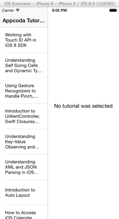

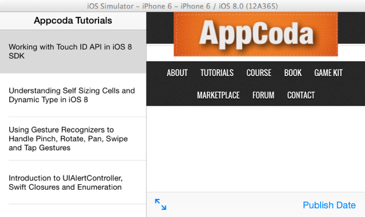


#### Creating the App and Adding Some Files

Let’s get started by creating a new Xcode project and by choosing the Single View Application template for it. You can set the SplitAndPopover value as the name for the app (that’s the one I used here), and make sure that the specified programming language is the Swift, while the selected device is the iPhone.

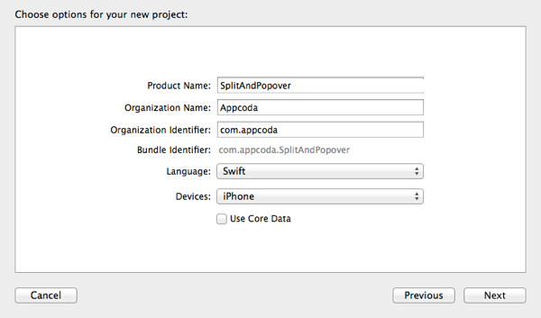

Get finished with the project creation by selecting a directory to save it in.

Now, before doing anything else, let’s create the following classes:

1. A UITableViewController that we’ll use as the primary view controller (of the split view controller which we’ll add next to the project).
2. A UIViewController that we’ll use as the secondary view controller of the split view controller.
3. A UIViewController class that we will use as a custom container view controller. There’s a specific section dedicated to that, so it’s okay if you’re not sure what’s this about.
4. A NSObject class in which we’ll implement the XML data parsing functionality.

In the last section of the tutorial we’ll create one more class regarding the popover controller, but for the time being we’ll focus on the above only. I’m just telling in advance that I want the above classes (files) to be created all together, so we can use them at once, starting from the next part of the tutorial.

For creating each one of the above, here’s in short what you should do. Note that the next procedure should be done four times in total:

1. Go to the File > New > File… menu in Xcode.
2. Create a Cocoa Touch Class.
3. Set the proper Subclass of each class.
4. Set the proper Class name.
5. Create the each class.

The next figures illustrate each case:

The table view controller class for the primary view controller of the split VC, named TopicsTableViewController.

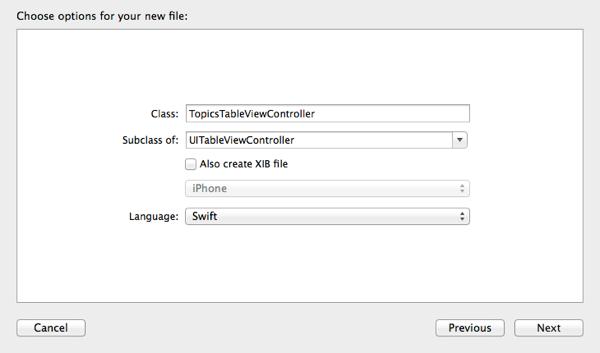

The view controller for the second view controller of the split VC, named TutorialViewController.


The container view controller class, named ContainerViewController.


The NSObject class, named XMLParser.

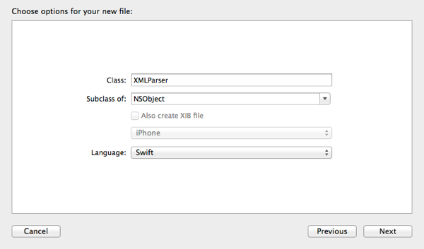

#### Designing the UI

Now that all the class files we’ll need are ready, let’s setup the interface of the app. Open the Main.storyboard file, and wait until the Interface Builder appears. The first step, is to add a Split View Controller from the Object Library to the canvas, so just locate it and drag it there.

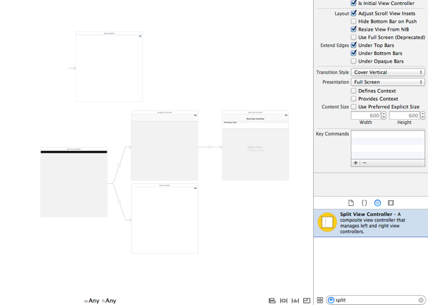

Once you do so, grab the arrow pointing to the default View Controller scene, and move it at the left side of the split view controller scene:

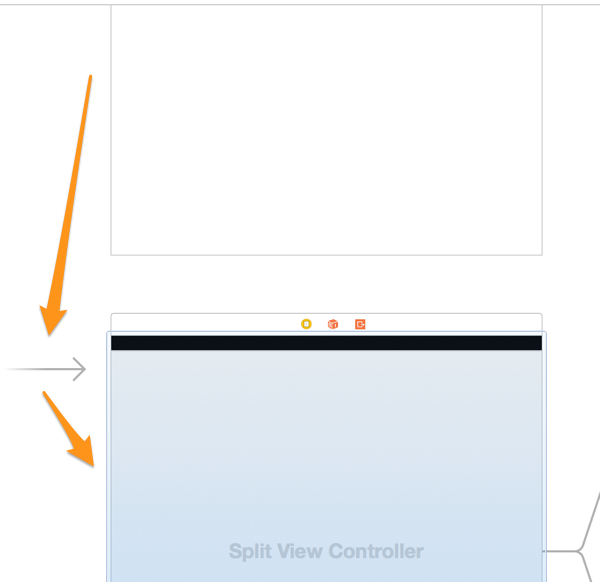

Then, you can delete the View Controller scene, and also you can delete the ViewController.swift file from the Project Navigator.

Let’s setup now each view controller as needed. Select the Table View Controller scene (the one that the navigation controller points to), and set a custom class name by opening the Utilities pane and then the Identity Inspector. In the Custom Class section set the TopicsTableViewController value in the Class field. Also, replace navigation item title it with the Appcoda Tutorials value.

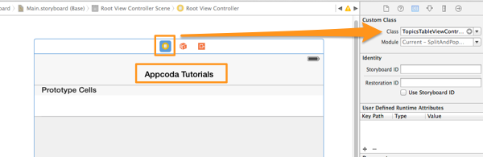

Then, select the table view cell prototype, and select the Basic style in the Attributes Inspector. Also, set the idCell as its identifier value. Next, open the Size Inspector, and set the Row Height to 80.

By setting the basic style to the table view cell, a label is appeared on it. Select that label, set the font size to 14pt, and the its Lines to 3.

Here’s how this scene should look like now:

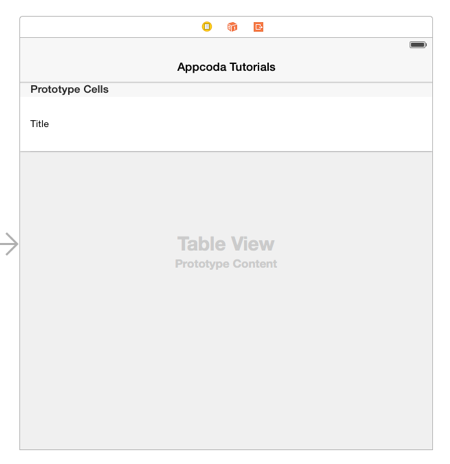

Let’s continue by configuring the second view controller of the split VC. Begin as before, and set its custom class to the TutorialViewController value. Don’t rush to move forward however, as in this case we must specify a Storyboard ID value that we’ll need it later in code. For this one, specify the idTutorialViewController value.

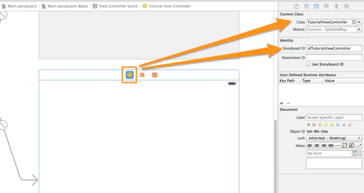

We’ll add some subviews now. At first, get a UILabel from the Object Library, and add it to the scene. Set the No tutorial was selected string as its text. Make sure then to move the label at the center of the scene. Click on the Align button at the bottom-right side of the Interface Builder, and check both the Horizontal center in container and Vertical center in container constraints.

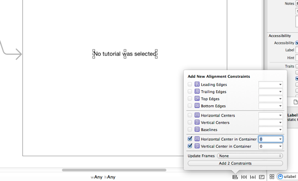

Next, drag and drop a UIToolbar object from the object library. Place it at the bottom side of the scene, and rename the existing button item to Publish Date. Also, get a flexible space bar button item and add it to the left of the existing button item in the toolbar. We’ll set the constraints for the toolbar in a while.

Now, grab a UIWebView object from the library, and add it to the scene. Make sure to cover the whole space, except for the toolbar. The web view should overlay the label.

Let’s setup the constraints for the toolbar and the web view now. Select the toolbar, and then click on the Pin toolbar at the bottom-right side of the IB. Enable the trailing, leading, top, bottom constrains, as well as the Height constraint by checking the respective checkbox. Add these five constraints.

Then, select the web view, and click once again to the Pin button. Enable the trailing, leading, top and bottom constraints, and add them too. Here’s how the Tutorial View Controller should look like:

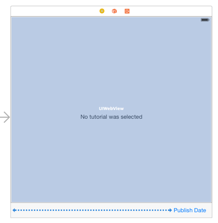

Finally, we need to create three IBOutlet properties for the web view, the toolbar and the bar button item of the toolbar. Also, we’ll need an IBAction method for the bar button item. Open the TutorialViewController.swift file, and add the following IBOutlet properties:

```swift
class TutorialViewController: UIViewController {
 
    @IBOutlet weak var webview: UIWebView!
 
    @IBOutlet weak var toolbar: UIToolbar!
 
    @IBOutlet weak var pubDateButtonItem: UIBarButtonItem!
    ...
}
```

Also, add the next IBAction method:

```swift
@IBAction func showPublishDate(sender: AnyObject) {
}
```

We are going to work with this method at the last part of the tutorial, when we’ll deal with the popover controller.

Now, head back to the Interface Builder and do the proper connections. Select the Tutorial View Controller scene, and then in the Utilities pane go to the Connections Inspector. Select each IBOutlet property, and connect it to the appropriate subview. Don’t forget to connect the IBAction method to the bar button item too.

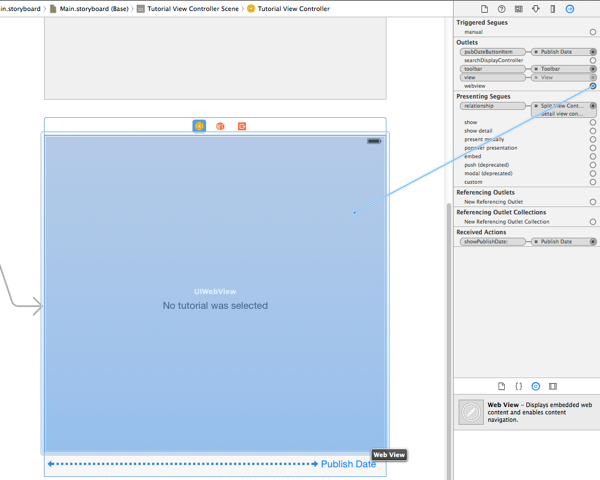

The most of our work in the Interface Builder is now over. Quite later we’ll return, and we’ll add a new scene for the popover controller, but until then we are just perfect. Let’s keep going by writing some code!

#### Getting and Parsing XML Data

One of the first things that we are going to deal with in this tutorial is to download and parse the sample data of the demo application we are developing. As I said to the app overview section, the source of our data will be the RSS feed of the Appcoda website (this website), and it’s our duty to parse that feed and extract only the piece of data we need.

As you (probably) know, three steps are involved when using the NSXMLParser class to parse XML data:

1. Initialize a NSXMLParser object
2. Specify the source URL and start parsing
3. Use the NSXMLParser delegate methods to handle the parsed data

Let’s see everything step by step. Initially, open the XMLParser.swift file, and adopt the NSXMLParserDelegate protocol. It’s necessary to do that in order to handle the data later. Here it is:

```
class XMLParser: NSObject, NSXMLParserDelegate
```

I remind you that any protocol that is adopted by a class, must be declared after the parent class (in this case the NSXMLParserDelegate protocol is declared after the NSObject parent class).

Now, let’s implement a new function that will be used to perform three things: We’ll initialize a parser object, we’ll set the XMLParser class (self) as its delegate, and finally we’ll start parsing. Translating all that into code gives us the next code segment:

```swift
func startParsingWithContentsOfURL(rssURL: NSURL) {
        let parser = NSXMLParser(contentsOfURL: rssURL)
        parser.delegate = self
        parser.parse()
}
```

Notice that the data source URL is passed as a parameter to the function.

Right now, the first two steps out of the three I listed before have been implemented. However, that was the “easy” part. The important and a bit more difficult part is coming, where we must implement all the required delegate methods of the NSXMLParserDelegate protocol, and to apply the proper logic so we can extract just the data we need out of the bunch that will be parsed.

Before we see a sample of the returned XML data, let’s declare (and initialize if needed) some properties. Preferably, go to the top of the class, and add the next properties:

```
class XMLParser: NSObject, NSXMLParserDelegate {
 
    var arrParsedData = [Dictionary<String, String>]()
 
    var currentDataDictionary = Dictionary<String, String>()
 
    var currentElement = ""
 
    var foundCharacters = ""
 
    ...
 
}
```

Here’s what each property exists for:

* arrParsedData: This is an array that will contain just the parsed data we care about. Note that each object of this array is going to be a Dictionary of which both the key and the value will be String objects. We’ll see an example of the dictionary contents in a while.
* currentDataDictionary: This dictionary object will be used to temporarily store the parsed data of interest. After we have all the needed data of a parsed tutorial, we’ll add it to the previously described array.
currentElement: This is a String object in which the name of the currently parsed element will be stored. We’ll need it to determine if every found element is of interest or not.
* foundCharacters: This String object will store the value of a node (an element) that we care about. When the end of the element is found, then its contents will be added to the currentDataDictionary dictionary and it will become empty again.

Now that you are aware of the purpose of the above properties, let’s see a sample of the XML data. The following extract displays all the returned data for one tutorial only:

```swift
<item>
        <title>Understanding Self Sizing Cells and Dynamic Type in iOS 8</title>
        <link>http://feedproxy.google.com/~r/appcoda/~3/NBLtJtdCP7Q/</link>
        <comments>http://www.appcoda.com/self-sizing-cells/#comments</comments>
        <pubDate>Thu, 04 Sep 2014 17:09:31 +0000</pubDate>
        <dc:creator><![CDATA[Simon Ng]]></dc:creator>
                <category><![CDATA[Beginner]]></category>
        <category><![CDATA[Course]]></category>
        <category><![CDATA[Swift]]></category>
        <category><![CDATA[Tutorials]]></category>
        <category><![CDATA[dynamic type]]></category>
        <category><![CDATA[self sizing cell]]></category>
        <category><![CDATA[swift]]></category>
        <category><![CDATA[UITableView]]></category>
 
        <guid isPermaLink="false">http://www.appcoda.com/?p=4013</guid>
 
        <wfw:commentRss>http://www.appcoda.com/self-sizing-cells/feed/</wfw:commentRss>
        <slash:comments>9</slash:comments>
        <description>In iOS 8, Apple introduces a new feature for UITableView known as Self Sizing Cells. To me, this is seriously one of the most exciting features for the new SDK. Prior to iOS 8, if you want to display dynamic content in table view with variable height, you would need to calculate the row height [&amp;amp;#8230;]
 
This article, Understanding Self Sizing Cells and Dynamic Type in iOS 8, was originally published at AppCoda.&amp;lt;br/&amp;gt;
&amp;lt;br/&amp;gt;
[[ This is a content summary only. Visit my website for full links, other content, and more! ]]&amp;lt;img src="http://feeds.feedburner.com/~r/appcoda/~4/NBLtJtdCP7Q" height="1" width="1"/&amp;gt;</description><feedburner:origLink>http://www.appcoda.com/self-sizing-cells/</feedburner:origLink></item>
```

The nodes we are interested in, are:

1. title
2. link
3. pubDate

Using the values of the above XML sample, here’s what the currentDataDictionary would contain after having parsed the data of the specific tutorial:

```
[link: http://feedproxy.google.com/~r/appcoda/~3/NBLtJtdCP7Q/, pubDate: Thu, 04 Sep 2014 17:09:31 +0000, title: Understanding Self Sizing Cells and Dynamic Type in iOS 8]
```

With all the above in mind, we can now proceed to the implementation of all the needed delegate methods. Let’s begin with the case where a new element is found. The only action we should take, is to assign the name of the element to the currentlElement property:

```swift
func parser(parser: NSXMLParser, didStartElement elementName: String!, namespaceURI: String!, qualifiedName qName: String!, attributes attributeDict: [NSObject : AnyObject]) {
 
        currentElement = elementName
}
```

Now, we must store the contents (the real value) of each node to the foundCharacters property in real time as they’re parsed, as long as the current element is any of interest:

```swift
func parser(parser: NSXMLParser, foundCharacters string: String!) {
        if (currentElement == "title" && currentElement != "Appcoda") || currentElement == "link" || currentElement == "pubDate"{
            foundCharacters += string
        }        
}
```

If you look closely, you’ll find out that in the first condition we don’t just check if the current element is the title, but also if its value is other than the “Appcoda” string. I do that on purpose, as the returned XML data contains an element named “title” at the beginning of the XML that is not related to any tutorial topic, and it just has the “Appcoda” value. Anyway, that’s an action related to the specific data we parse.

Summarizing up to this point, we have managed to temporarily store each parsed element name, and based on that to keep or not the node’s value. Next, we must add the foundCharacters value to the currentDataDictionary once the element closing is found. Moreover, when all the required data has been added to the dictionary, we need to add this dictionary to the arrParsedData array. Let’s see all that in code:

```swift
func parser(parser: NSXMLParser, didEndElement elementName: String!, namespaceURI: String!, qualifiedName qName: String!) {
        if !foundCharacters.isEmpty {
 
            if elementName == "link"{
                foundCharacters = (foundCharacters as NSString).substringFromIndex(3)
            }
 
            currentDataDictionary[currentElement] = foundCharacters
 
            foundCharacters = ""
 
            if currentElement == "pubDate" {
                arrParsedData.append(currentDataDictionary)
            }
        }
}
```

We know if there is data to be stored to the dictionary simply by checking if the foundCharacters string is empty or not. Notice that there’s one more “tweak” here:

```swift
foundCharacters = (foundCharacters as NSString).substringFromIndex(3)
```

I do this also on purpose, because the characters “\n\t\t” are added to the beginning of the string when parsing the link element. The above command actually gets a substring from the foundCharacters string, starting at index 3.

You see that after having added the found value to the dictionary, we empty the foundCharacters string again. The pubDate element is the last one of interest for each tutorial topic (in the order the data is parsed), so when that happens we are able to add the dictionary to the array.

Our next move regards the action that we should take when the parsing is finished. In that case, we only need to inform the caller class that this has happened, and an easy way to do it is to use the delegation pattern (for more information about it, you could also check my previous tutorial, where I explain the steps involved in the delegation pattern in Swift in a bit more detail). So, let’s work on that.

First of all, we need to create a new protocol. Go to the top of the file, before the XMLParser class implementation. In there, add the following code segment:

```swift
@objc protocol XMLParserDelegate{
    func parsingWasFinished()
}
```

We declared just one delegate method, named parsingWasFinished. No parameters are needed, and it’s a void function.

Next, let’s declare a delegate property. Go to the body of the XMLParser class where you declared and initialized all the previous properties, and add the next one:

```swift
class XMLParser: NSObject, NSXMLParserDelegate {
 
    ...
 
    var delegate : XMLParserDelegate?
 
    ...
 
}
```

Finally, we only have to call our delegate method that will inform the caller class about the end of the parsing. Here it is:

```swift
func parserDidEndDocument(parser: NSXMLParser) {
        delegate?.parsingWasFinished()
}
```

Our class is almost ready now. What we haven’t done yet, is to implement the delegate methods that will handle any errors that may occur. To keep things simple, we’ll just log these error messages:

```swift
func parser(parser: NSXMLParser, parseErrorOccurred parseError: NSError!) {
        println(parseError.description)
    }
 
 
    func parser(parser: NSXMLParser, validationErrorOccurred validationError: NSError!) {
        println(validationError.description)
    }
}
```

Notice that we didn’t implement the parserDidStartDocument method, simply because we didn’t need to do something in it.

#### Using the Parsed Data

The mechanism to download and parse data for our demo application is ready, and it would be a good idea to use that data before we move to any other important aspect of the tutorial. As you saw previously, all the data of interest is stored to the arrParsedData array, and that data we are going to populate in the TopicsTableViewController class for starters. So, open the respective file in Xcode (the * TopicsTableViewController.swift* file), and as a first step adopt the XMLParserDelegate protocol (the one we implemented) by declaring it to the class header:

```swift
class TopicsTableViewController: UITableViewController, XMLParserDelegate {
```

By doing the above, we’ll be able to implement the parsingWasFinished delegate method, and knowing that way when the parsing is over so we can reload the table view. Actually, as we are speaking about that, why don’t we implement it now?

```swift
func parsingWasFinished() {
        self.tableView.reloadData()
}
```

Now, declare at some point (preferably at the beginning of the class) the next property:

```swift
class TopicsTableViewController: UITableViewController, XMLParserDelegate {
 
    var xmlParser : XMLParser!
 
}
```

Using the above, we’ll manage to start the parsing process in the XMLParser class, and to access the arrParsedData array later to get all the data we want. Now, we must initialize it, specify the feed URL and parse. All that will take place in the viewDidLoad method as follows:

```swift
override func viewDidLoad() {
        super.viewDidLoad()
 
        let url = NSURL(string: "http://feeds.feedburner.com/appcoda")
        xmlParser = XMLParser()
        xmlParser.delegate = self
        xmlParser.startParsingWithContentsOfURL(url)
 
}
```

Here, you can see how easy it is to put in action our custom – made class. Now, we need to populate the downloaded data, and that’s something that is triggered by the parsingWasFinished delegate method that we have already implemented. However, there is still some little work ahead of us, as we need to implement some tableview methods. As you may have noticed, several such methods already exist to the class, they are just commented out. So, we will uncomment the proper ones and we’ll add any necessary code. Let’s get started by defining the number of the tableview’s sections:

```swift
override func numberOfSectionsInTableView(tableView: UITableView) -> Int {
        return 1
}
```

Next, let’s specify the number of the rows in this section, which will be no other than the total elements in the arrParsedData array:

```swift
override func tableView(tableView: UITableView, numberOfRowsInSection section: Int) -> Int {
 
        return xmlParser.arrParsedData.count
 
}
```

One important task we also need to do, is to specify the contents of each displayed cell. If you remember, in the cell prototype existing in the Interface Builder, we set its identifier value to idCell. Now we are about to use this identifier for dequeueing each cell, and then use the arrParsedData array to get the data. I say no more, as everything is too easy:

```swift
override func tableView(tableView: UITableView, cellForRowAtIndexPath indexPath: NSIndexPath) -> UITableViewCell {
        let cell = tableView.dequeueReusableCellWithIdentifier("idCell", forIndexPath: indexPath) as UITableViewCell
 
        let currentDictionary = xmlParser.arrParsedData[indexPath.row] as Dictionary<String, String>
 
        cell.textLabel?.text = currentDictionary["title"]
 
        return cell
}
```

And one last easy thing:

```swift
override func tableView(tableView: UITableView, heightForRowAtIndexPath indexPath: NSIndexPath) -> CGFloat {
        return 80
}
```

All the above is the minimum required implementation we needed to do for showing the tutorial topics in the primary view controller of the split VC.

Now, in order to display the proper tutorial in the integrated web view of the second view controller, we must pass the link of the selected tutorial to the TutorialViewController instance. To do so, we must begin by declaring a property to which we’ll assign that link. Open the TutorialViewController.swift file, and at the beginning of the class write:

```swift
class TutorialViewController: UIViewController {
 
    var tutorialURL : NSURL!
 
    ...
 
}
```

Next, return to the TopicsTableViewController.swift file, locate this commented method: override func tableView(tableView: UITableView, didSelectRowAtIndexPath indexPath: NSIndexPath) and uncomment it. In it, we’ll get the link matching to the selected row, then we’ll instantiate an object of the TutorialViewController class and we will pass the link value. Finally, we’ll display the second view controller not by performing a segue, but by using a new method in iOS 8 that displays contents to a detail view controller, just like here. Let’s see the implementation:

```swift
override func tableView(tableView: UITableView, didSelectRowAtIndexPath indexPath: NSIndexPath) {
        let dictionary = xmlParser.arrParsedData[indexPath.row] as Dictionary<String, String>
        let tutorialLink = dictionary["link"]
 
        let tutorialViewController = UIStoryboard(name: "Main", bundle: nil).instantiateViewControllerWithIdentifier("idTutorialViewController") as TutorialViewController
 
        tutorialViewController.tutorialURL = NSURL(string: tutorialLink!)
 
        showDetailViewController(tutorialViewController, sender: self)
 
}
```

In the above code segment you can see what the view controller identifier we set in the Interface Builder is useful for.

Now, open the TutorialViewController.swift file. Upon the application launch we want the web view and the toolbar to be hidden, so go to the viewDidLoad method and add the next two commands:

```swift
override func viewDidLoad() {
        super.viewDidLoad()
 
        // Do any additional setup after loading the view.
 
        webview.hidden = true
        toolbar.hidden = true
 
}
```

After that, we’ll override the viewDidLoad method, where we’ll load and display the web view contents, if a tutorial URL value has been set:

```swift
override func viewDidAppear(animated: Bool) {
        super.viewDidAppear(animated)
 
        if tutorialURL != nil {
            let request : NSURLRequest = NSURLRequest(URL: tutorialURL)
            webview.loadRequest(request)
 
            if webview.hidden {
                webview.hidden = false
                toolbar.hidden = false
            }
 
    }
}
```

As you see, once we start loading the URL contents we make the web view and the toolbar visible again (if they’re hidden).

All of the above consist of the code we need in both the TopicsTableViewController and the TutorialViewController classes in order to list all the parsed tutorial data and to display the proper one, after having selected a topic. With that mechanism ready and working, let’s focus on the split view controller and other new technologies in iOS 8.

#### Size Classes and Trait Collections

Before we begin the actual work with the split view controller and the rest of the stuff we are about to see, it’s necessary to talk about two new important concepts regarding the adaptive layout. These are the Size Classes and the Trait Collections, and without having the minimum required knowledge about them at least, it’s not possible to carry on. Of course, I recommend you to find more information in the Apple documentation or the respective WWDC videos in addition to what you’ll read here. However, if you are aware of these meanings and you feel comfortable with them, then you may skip this section, otherwise please be patient enough and keep reading.

So, let’s get started with the size classes. A Size Class is something new in iOS 8, and it actually describes the screen size of a device. For every axis (horizontal and vertical) there are two size classes: A Regular and a Compact. A regular size class in both orientations has to do with iPad devices, while the compact size classes always refer to iPhone devices. Speaking completely unofficially and un-technically, one could say that the regular size class indicates that there is “enough room” in a given orientation for specific content, while the compact one signals the exact opposite thing. Of course, that “enough room” phrase is relative and always depends on the content you want to display, and that’s something that you will definitely find out by the end of this tutorial. So, considering that there are two size classes on each axis, there are four size classes in total:

1. Horizontal regular
2. Horizontal compact
3. Vertical regular
4. Vertical compact

The combination of the above size classes gives us the screen sizes in various orientations:

1. Regular (H) x Regular (V) = iPad in all orientations
2. Compact (H) x Regular (V) = iPhone in Portrait orientation
3. Regular (H) x Compact (V) = iPhone 6 Plus in Landscape orientation
4. Compact (H) x Compact (V) = iPhone in Landscape orientation (excl. IPhone 6 Plus)

You can see the size classes in action, if you simply go to Xcode, and open the Interface Builder by clicking on the Main.storyboard file. At the bottom of the main window area, there’s a button writing wAny hAny. If you click on it, a new small window will appear, where you can specify any desired size class combination. At the same time, Xcode informs you about the target device of the currently set combination. The Any value means that the interface configuration will work to any device, no matter of the screen size. An extra benefit from this is that no different .storyboard files are needed for each device type when creating universal applications.

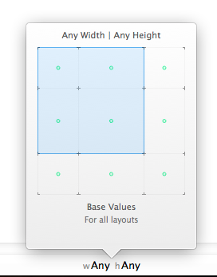

So, as you can understand, we are no longer talking about 3.5 or 4 inch screens or anything else like that when designing the interface, we’re just talking about size classes. If, for example, you want to describe an iPhone screen, then you simply use the proper size class combination, depending on the orientation.

Let’s say a few things about the trait collections now, but first let’s define what a trait is. Well, a trait is actually a property that describes a certain aspect of a screen. That means that a trait collection is a set of properties describing a specific device, and it contains the exact following traits:

Horizontal size class
Vertical size class
Device idiom
Display scale
As you notice, the size classes are considered to be traits. Looking at a simple example, the next trait collection:

Compact horizontal size class
Regular vertical size class
Device idiom: iPhone
Display scale: 2.0
… describes an iPhone in portrait orientation.

The discussion about traits doesn’t stop here, on the contrary there is a lot more study one should do about it. However, the traits and trait collections are important for us in this tutorial just for one reason: Every view controller inherits the trait collection from its parent, and that inheritance is moving towards up in the hierarchy until the window object of the app. Our goal in the sample app we’re creating is to manage to override the inherited trait collection and to modify the size classes in order to properly display the split view controller when the device orientation gets changed. The new SDK provides some really useful methods do to so, and once you get the meaning of the trait collections you’ll see that overriding them is a super-easy task and in many cases the appropriate way to implement your app.

#### A Custom Container View Controller

Designing a user interface it’s not a simple thing, as that’s the main way for users to communicate with your application. If the user interface is poorly designed the users will probably never use your app more than a few times, no matter if the features it incorporates are the best ones existing out there. And when saying about UI design, I don’t only mean the graphics or the colors of it, but the structural elements that compose the app. So, making the correct decisions and choosing the proper view controllers and subviews in the development stage is vital for the life of the application once it goes live. Speaking more specifically now, it’s quite often for all of us to use special view controllers that work as containers for other, normal view controllers. Typical examples of them provided by the iOS SDK could be the navigation or tab bar view controllers.

There is a whole theory behind container view controllers that you should really read at some point here. Besides those pre-made and provided by the SDK container view controllers, developers can also create their own custom container VCs, for which you can also read in the previous given link. There are specific steps that should be followed every time that you implement one, and we’ll see them here pretty soon, but first, allow me to tell you why we need to create a custom container view controller in this application.

As you’ll see yourself while we’re moving forward in this sample project, we won’t be able to properly display the split view controller unless we override the trait collection of its parent view controller. However, the parent of the split view controller is the application window itself (remember the design in the Interface Builder), and we can’t override its trait collections. So, we need a custom container view controller that will work as an intermediate between the window and the split view controller. The split view controller will be embedded to the container, and the container VC will become the root view controller of the window. At the end, the trait collection of that container VC is the one that we’ll override.

Our work with the custom container view controller won’t be limited in this part of the tutorial only. Our initial implementation will take place here, however we’ll do new additions and modifications later on, when we’ll dive in the details of the split view controller.

Open the ContainerViewController.swift file, and right at the beginning of the class write this:

```swift
class ContainerViewController: UIViewController {
 
    var viewController : UISplitViewController!
 
}
```

In this property we will assign later the split view controller that we have already added in the Interface Builder.

Next, we will implement a function which we will use to assign the split view controller to this viewController object. We can’t just do that directly, because when working with container view controllers there are specific steps that should be followed. These steps are described in detail in the official documentation by Apple (the link I gave you above), but they’re simple enough to be understood. Let’s see that function and then we’ll discuss a bit about it.

```swift
func setEmbeddedViewController(splitViewController: UISplitViewController!){
        if splitViewController != nil{
            viewController = splitViewController
 
            self.addChildViewController(viewController)
            self.view.addSubview(viewController.view)
            viewController.didMoveToParentViewController(self)
        }
}
```

As you see, the split view controller is passed as a parameter object to the above method. If it’s other than nil, then we assign it to the viewController object, and we perform the standard steps I talked about:

```swift
self.addChildViewController(viewController)
```

At first, the new view controller (the split VC) is added as a child view controller to the container. Next, with this command:

```swift
self.view.addSubview(viewController.view)
```

the split view controller’s view is set as the container’s view. That’s important to do, otherwise nothing is going to appear. Finally, this one:

```swift
viewController.didMoveToParentViewController(self)
```

indicates that the whole process is complete and the new view controller has been embedded to the container view controller.

For the time being our work in this class is over. You might wonder why we declared and used the viewController object, as we didn’t really need it anywhere. I should say in advance that we’ll use it later, and that’s the reason of its existence. Right next, we’ll see how this class can become handy through code, and how it will become the root view controller of the window of our application.

#### The Split View Controller

The split view controller has already been added to the app through the Interface Builder, but until now we haven’t been able to use it, because we were performing all the preliminary steps for getting the data, configuring the custom container view and implementing the display of the parsed data. Now that all these are ready, we can start “playing around” with the split view controller, and see step by step various ways to set its appearance.

The first thing we have to do, is to embed it to the custom container view. As we have no other view controller higher in the VC hierarchy than the container VC, we’ll do this job to the application delegate class. So, open the AppDelegate.swift file, and for starters, declare a property for the split view controller at the top of the class, and also adopt the UISplitViewControllerDelegate protocol:

```swift
class AppDelegate: UIResponder, UIApplicationDelegate, UISplitViewControllerDelegate {
 
    var window: UIWindow?
 
    var splitViewController : UISplitViewController?
 
    ...
 
}
```

Our next step is to get a split view controller instance from the storyboard and assign it to the above property, and to add it as a child view controller to the custom container view controller. That’s one of the most important tasks we have to do regarding the split VC, but along with it we’ll also do two more things: We’ll set the AppDelegate instance as the delegate of the split VC, and we’ll set the preferred display mode property, so as to set a value other than the predefined one. Let’s see all these in code:

```swift
func application(application: UIApplication, didFinishLaunchingWithOptions launchOptions: [NSObject: AnyObject]?) -> Bool {
        // Override point for customization after application launch.
 
        splitViewController = UIStoryboard(name: "Main", bundle: nil).instantiateViewControllerWithIdentifier("idSplitViewController") as? UISplitViewController
        splitViewController?.delegate = self
 
        splitViewController?.preferredDisplayMode = UISplitViewControllerDisplayMode.AllVisible
 
        let containerViewController : ContainerViewController = ContainerViewController()
        containerViewController.setEmbeddedViewController(splitViewController)
 
        window?.rootViewController = containerViewController        
 
 
        return true
}
```

Notice that at the end we set the container view controller as the root view controller of the window. In the above implementation you can also see that the preferredDisplayMode property of the view controller was set to AllVisible value, which means that both the primary and the secondary view controllers will be visible at the same time. Below are shown all the possible values for that property:

1. AllVisible
2. Automatic: If no other specific value is set, this option is used by default. With it, iOS decides the proper way to display the primary and hidden VCs.
3. PrimaryHidden: The primary view controller is hidden.
4. PrimaryOverlay: The primary view controller is placed above the secondary view controller and hides a part of it.

In your applications, choose any option that best suits to your design or logic. For now, and for demo reasons mostly, we set this value to AllVisible.

If your try to run the app for first time, then here’s what you’ll get in both portrait and landscape orientation:

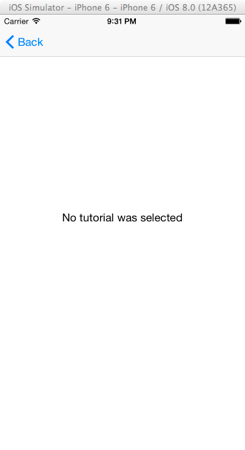

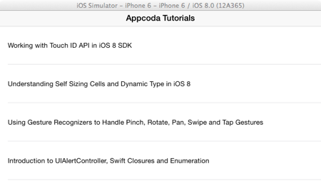

Playing a bit with the app, you notice that our XML data parsing works great! The data was downloaded and parsed perfectly, and it’s being properly displayed. Moreover, you see that the split view controller works as a navigation controller, where you can tap on the Back button to go back to the primary view controller, and to tap on any downloaded tutorial topic to display it to the web view of the secondary view controller once again. However, there’s a problem here. In the running app we are not seeing what we were expecting to see, and of course, if we wanted to have a navigation controller we would be using one. Actually, the navigation controller is displayed automatically by the iOS when the two children view controllers of the split VC are not appeared simultaneously (when the primary view controller is collapsed), and it gets disappeared when they are.

So, why doesn’t the split view controller display both of its view controllers, even though we set the preferred display mode to AllVisible? Well, the answer exists to the size classes and the trait collections story. To be specific, the split view controller doesn’t work as we expect, simply because the system doesn’t allow it to do so when it is displayed in compact horizontal size class, and that’s the value of the specific trait in iPhone devices. To overcome this, we must override the trait collection of the parent view controller of the split VC, which is our custom container.

In action now, open the ContainerViewController.swift file, and go to the setEmbeddedViewController method. In there, add one more line as shown right next:

```swift
func setEmbeddedViewController(splitViewController: UISplitViewController!){
        if splitViewController != nil{
            ...
 
            self.setOverrideTraitCollection(UITraitCollection(horizontalSizeClass: UIUserInterfaceSizeClass.Regular), forChildViewController: viewController)
        }
}
```

The setOverrideTraitCollection method is a quite important one, and if you’re going to work with trait collections, then make it a friend of yours. As it’s shown in the above snippet, we override the horizontal size class trait specifically, and we set the Regular as its new value. This addition, in combination with the AllVisible display mode, will result to the desired outcome. If we run the app again, here’s what we get:


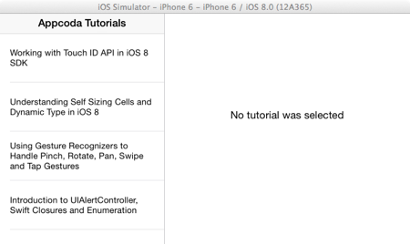

I believe that is now clear why we used a custom container view controller, and how handy it can be in cases such like this, where we needed to override its trait collection.

Managing the Split View Display
As you saw, embedding the split view controller to the container view controller, and then overriding the trait collection of the latter wasn’t too hard eventually, and results to the split view controller appearance as shown to the above screenshots. However, in portrait orientation splitting the children view controllers might not be so useful, and that might not be a problem to an iPhone 6 Plus device, but what about the older ones with smaller screen sizes?

So, it’s obvious that we should manage the split view in a more refined way, by making it show both of the children view controllers when being in landscape mode. In portrait, we’ll let it use the default behavior, the navigation controller. All that will be achieved by performing a few additions and modifications to the current code.

If you remember, we managed to display the split view when we overrode the trait collection of the container view controller. This fact leads us to think that, if we were able to override the trait collection conditionally only when the device is in landscape orientation, then we could achieve our goal. However, that also means that we would need to control in some way the transition between orientations, and then act appropriately.

Fortunately, iOS 8 provides a brand new method through the UIKit framework, named viewWillTransitionToSize. This method is called when the size of the currently presented view controller is about to change, and it is the best shot we have in order to control an upcoming orientation change.

Now, let’s give a thought to the logic that we’ll apply to that method for a minute. We want to display the split view only when the device is in landscape mode, in other words when the width of the presented view controller is greater than the height of it. If we just had one screen size to all iPhone devices, this would be even easier to check, as we would only need to determine if the screen width is greater than 320.0 points or not. However, Apple now supports multiple screen sizes in iPhone, so we can’t use that approach. Anyway, in the case of the landscape orientation, we will override the trait collection of the container view controller as before, so as we get the desired splitting. In portrait mode though, we’ll use the setOverrideTraitCollection method once again, but this time we won’t override any trait at all; we will just set the nil value to the trait collection parameter, and force that way the container view controller to use the trait collection inherited by the app window, something that will lead to the initial split view behavior (no splitting at all).

Make sure that you have opened the ContainerViewController.swift file. In it, add the following method:

```swift
override func viewWillTransitionToSize(size: CGSize, withTransitionCoordinator coordinator: UIViewControllerTransitionCoordinator) {
 
        if size.width > size.height{
            self.setOverrideTraitCollection(UITraitCollection(horizontalSizeClass: UIUserInterfaceSizeClass.Regular), forChildViewController: viewController)
        }
        else{
            self.setOverrideTraitCollection(nil, forChildViewController: viewController)
        }
 
        super.viewWillTransitionToSize(size, withTransitionCoordinator: coordinator)
}
```

Notice that at the end we call the viewWillTransitionToSize method of the super class. For informative reasons only, instead of checking whether the width is greater than the height, we could have also written this:

```swift
if self.traitCollection.verticalSizeClass == UIUserInterfaceSizeClass.Regular {...}
```

With the above line, we check if the current vertical size class has the regular value. If that’s true, then the iPhone is currently is in portrait orientation, and is going to transit to landscape mode, so eventually we need to override the trait collection. However, since the size is given as an argument to the method, why not to use it in first place?

Besides that new addition, a small modification is also required in order to fully control the split view display. Go to the setEmbeddedViewController method and locate the following line:


```swift
self.setOverrideTraitCollection(UITraitCollection(horizontalSizeClass: UIUserInterfaceSizeClass.Regular), forChildViewController: viewController)
```

Either delete it, or comment it out, and you’re ready.

Now, if you run the app once again, you’ll notice that the split view is appeared only when being in landscape orientation, while in portrait the default navigation controller is appeared.

Before we move to the next part of the tutorial, there’s one last thing I would like to talk about. You notice when running the app that the secondary view controller (the TutorialViewController) is the one appeared by default when launching. You can change that if you want, if you return true in the following delegate method of the split view controller:

```swift
func splitViewController(splitViewController: UISplitViewController, collapseSecondaryViewController secondaryViewController: UIViewController!, ontoPrimaryViewController primaryViewController: UIViewController!) -> Bool {
 
        return true
}
```

By default, it returns false, but if you change that you can make the primary view controller the one that will be displayed first after having launched the app. So, if you want add the above method in the AppDelegate.swift file, and test the application once again.

#### Changing the Display Mode

Now that we have made our split view controller to properly be shown in each orientation, let’s see how we can hide and show on demand the primary view controller. In iOS 8, the UIKit framework provides a brand new convenient method named displayModeButtonItem. This method returns a bar button item which can be added as an item to the toolbar, and when it is used, it changes the display mode of the split view. This button item is not always visible to the toolbar. The truth is that the system decides whether it should be shown or not, depending on the device type, orientation and size class values, as well as the current display mode value. In our case, we want to use it in order to hide the primary view controller when we tap on it. However, even though it sounds quite simple, it’s a bit more complex in real. That’s because once we manage to change the display mode of the split view, that button item will disappear, so we must create a new, custom bar button item for making the primary view controller visible again.

The implementation we’ll see right next will make these two bar button items fully working in all orientations. In case you’ve read the split VC documentation or you have watched the WWDC session videos and you’re aware of the collapsed property, note that what we’ll do here doesn’t change that property, but the display mode of the split view controller.

Let’s get started by opening the TutorialViewController.swift file, where we’ll declare and initialize a new bar button property. This is going to be the custom button item that will appear when the system’s display mode button item is not visible. Its job will be to turn the primary view controller on, so we’ll title it “Tutorials”. At first, declare the next property right after any other existing properties:

```swift
class TutorialViewController: UIViewController {
 
    ...
 
    var tutorialsButtonItem : UIBarButtonItem!
 
 
}
```

Then, let’s initialize it in the viewDidLoad method:

```swift
override func viewDidLoad() {
        ...
 
        tutorialsButtonItem = UIBarButtonItem(title: "Tutorials", style: UIBarButtonItemStyle.Plain, target: self, action: "showTutorialsViewController")
 
    }
```

In the above snippet you can see how to create a UIBarButtonItem programmatically in Swift. Notice that in the action parameter, the showTutorialsViewController is the method that will be called when this button item gets tapped, and contrary to the Objective C language, we can omit the Selector keyword here. What this custom method will do is fairly easy (it will just set the AllVisible value to the preferred display mode of the split view controller), so let’s implement it now.

```swift
func showTutorialsViewController(){
        splitViewController?.preferredDisplayMode = UISplitViewControllerDisplayMode.AllVisible
}
```

Now, our next task is to go the viewDidAppear method, and specify if the display mode button item should be appeared or not when the view is shown. As you’ll see right next, we just insert that button item in the toolbar’s items:

```swift
override func viewDidAppear(animated: Bool) {
        super.viewDidAppear(animated)
 
        if tutorialURL != nil {
            ...
 
            if self.traitCollection.verticalSizeClass == UIUserInterfaceSizeClass.Compact{
                toolbar.items?.insert(self.splitViewController!.displayModeButtonItem(), atIndex: 0)
            }
        }        
    }
```

In simple words, the above segment orders the display mode button item to be displayed in landscape orientation. When this button item is tapped, the system calls another new delegate method of the split view controller to specify what the new display mode of the split view should be. This method is named targetDisplayModeForActionInSplitViewController, and by implementing it we can control the new value of the new display mode property. To do that, open the AppDelegate.swift file, and add the following method:

```swift
func targetDisplayModeForActionInSplitViewController(svc: UISplitViewController) -> UISplitViewControllerDisplayMode {
        return UISplitViewControllerDisplayMode.PrimaryHidden
    }
```

All the above are going to perfectly work, but we have a couple of things yet to consider about. First of all, what should happen after the display mode has changed? It’s our job to take care of this and display the custom bar button item that will replace the system’s one. The good news here is that the UISplitViewControllerDelegate protocol gives us one more nice delegate method, which informs us about the new display mode that is about to be applied. Using it, we can send a notification to the TutorialsViewController class, let it know that the display mode is about to change, and ultimately to show the “Tutorials” button item (or the system’s button item if needed again).

So, while being in the AppDelegate.swift file, add the next method:

```swift
func splitViewController(svc: UISplitViewController, willChangeToDisplayMode displayMode: UISplitViewControllerDisplayMode) {
        NSNotificationCenter.defaultCenter().postNotificationName("PrimaryVCDisplayModeChangeNotification", object: NSNumber.numberWithInteger(displayMode.toRaw()))
}
```

In the one line existing in the body of the method, you can see how we can post a notification in Swift. Notice that we set the display mode that’s about to be applied as the object of the notification, converted to a NSNumber object. The display mode value is an enum value, so by using the toRaw method we access the actual integer value of it.

Go back to the TutorialViewController.swift file now, and then straight ahead to the viewDidLoad method. We must make the class observing for the notification we just posted. Here it is:

```swift
override func viewDidLoad() {
        ...
 
        NSNotificationCenter.defaultCenter().addObserver(self, selector: Selector("handleFirstViewControllerDisplayModeChangeWithNotification:"), name: "PrimaryVCDisplayModeChangeNotification", object: nil)
 
    }
```

In the above line, I intentionally used this time the Selector keyword to specify the method that should be called after a notification has received, just to show this option too. As you can see, observing for notifications is easy in Swift too.

Before we implement the action method of the above observer, it would be a good idea to remove the observer as well when it’s no more needed. As you know, the viewDidUnload is deprecated, and the dealloc method doesn’t exist in Swift. So, where should we remove the observer? Well, Apple introduces a new method called deinit, and as its name suggests, it’s used as a deinitializer (the opposite of the initializer). So, somewhere inside the class, write the following:

```swift
deinit{
        NSNotificationCenter.defaultCenter().removeObserver(self)
}
```

Now that we’ve done this, let’s implement the handleFirstViewControllerDisplayModeChangeWithNotification:

```swift
func handleFirstViewControllerDisplayModeChangeWithNotification(notification: NSNotification){
    let displayModeObject = notification.object as? NSNumber
    let nextDisplayMode = displayModeObject?.integerValue
 
    if toolbar.items?.count == 3{
        toolbar.items?.removeAtIndex(0)
    }
 
    if nextDisplayMode == UISplitViewControllerDisplayMode.PrimaryHidden.toRaw() {
        toolbar.items?.insert(tutorialsButtonItem, atIndex: 0)
    }
    else{
        toolbar.items?.insert(splitViewController!.displayModeButtonItem(), atIndex: 0)
    }
}
```

Our first move in the above method is to get the next display mode value from the notification object. After that, we check how many items currently exist to the toolbar. If you recall, in the Interface Builder we had added two items, the Publish Date button item and the flexible space item. The third item (if exists) is either the system’s display mode button item, or our custom button item which we (will) add programmatically. When any of these two exists to the toolbar, then we remove it so we can insert the new one. Finally, we check what is going to be the next value of the display mode property: If the primary view controller is going to be hidden, then we insert the tutorialsButtonItems at the left side of the toolbar (that’s why it is inserted at index 0). Otherwise, we insert the default display mode button item, and that’s all!

Note this: In Swift we can insert or remove items from a toolbar (UIToolbar) in the way shown above. That’s allowed because the items of the toolbar are stored in a Swift array (Array). In Objective C however, we can’t do that because the items of the toolbar are stored to a NSArray array, which is immutable and therefore cannot be modified directly.

The above can’t be tested yet, because we haven’t considered the orientation changes. So, we must find a way to control these changes, and then add or remove the proper button item to the toolbar appropriately.

Up to this point we met a lot of new methods (delegate and not) existing in iOS 8. Now, we’re about to see a one more that will help us do what I just described. This method is called traitCollectionDidChange and it must be overridden. This method contains just one parameter, the previous trait collection of the view controller in which is implemented, after a change has occurred. As we have already seen, any trait collection changes happen to the container view controller, but it’s not necessary in this case to implement that method there. We’ll do it in the view controller we are currently in, the TutorialViewController, because it inherits the trait collection of the container view controller.

The logic we’ll use is simple: We will check the vertical size class, and if it previously had the compact value, meaning that it was in landscape orientation and now in portrait, any extra button item must be removed (either the display mode button item, or the custom one, the tutorialsButtonItem). Otherwise, the device orientation changed from portrait to landscape, and just like we previously did, we should add the proper button item depending on the current display mode value. Here it is:

```swift
override func traitCollectionDidChange(previousTraitCollection: UITraitCollection) {
        if previousTraitCollection.verticalSizeClass == UIUserInterfaceSizeClass.Compact{
            let firstItem = toolbar.items?[0] as? UIBarButtonItem
            if firstItem?.title == "Tutorials"{
                toolbar.items?.removeAtIndex(0)
            }
        }
        else if previousTraitCollection.verticalSizeClass == UIUserInterfaceSizeClass.Regular{
            if toolbar.items?.count == 3{
                toolbar.items?.removeAtIndex(0)
            }
 
            if splitViewController?.displayMode == UISplitViewControllerDisplayMode.PrimaryHidden {
                toolbar.items?.insert(tutorialsButtonItem, atIndex: 0)
            }
            else{
                toolbar.items?.insert(self.splitViewController!.displayModeButtonItem(), atIndex: 0)
            }
        }
    }
```

In the if case, the device is in portrait orientation, so we must remove the extra button item. If you wonder about this:


```swift
if firstItem?.title == "Tutorials"
```

then I should tell that we can only remove from the toolbar only our custom button item. The system’s display mode button item is automatically removed, and if you try to do so the app will crash. Regarding the else case, I don’t think that there’s anything further to be discussed, as we said everything a bit earlier.

Now feel free to run and test the app. Play around with the orientation changes and toggle the display mode of the split view controller as many times as you want. Everything regarding its appearance and its behavior is now ready!

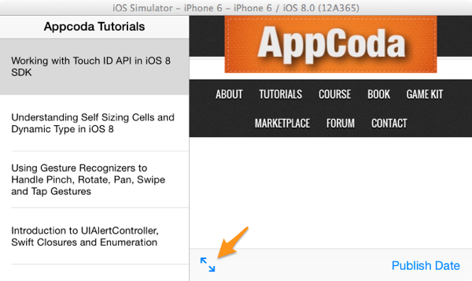

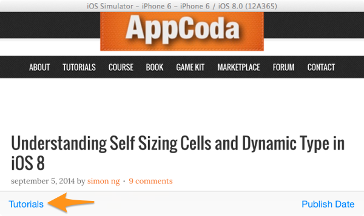

#### The Popover Controller

Up to iOS 7, an UIPopoverController could be used only in iPad devices. However, that’s a fact that belongs to the past since iOS 8, as thanks to the adaptive layout and the new features the UIKit framework supports, popover controllers can now be displayed in iPhone devices too. We have already talked about the adaptive layout, so I would like to mention a couple of words about a new great advancement regarding the UIKit framework, which has to do with the way modal (presented) view controllers are managed. iOS 8 introduces a new class named UIPresentationController, and an instance of this class handles a presented view controller throughout its lifetime. The interesting thing about a presentation controller is that it’s created on the fly by UIKit, once the view controller has been presented. As you understand, a whole new programming stuff such as new methods, properties and protocols have been integrated and provided to developers for usage. Presentation controllers can be used to control and specify various aspects of a view controller, like its style, transition, special properties and a lot more. Keep talking about this new concept would be beyond the scope of this tutorial as there’s a huge discussion regarding it, but I prompt you to read at least this documentation for getting a better taste of it. Also, I recommend again to go through the WWDC videos and watch any related material you find about that topic.

So, focusing on our mission again, a presentation controller is the tool we’ll use to “transform” a simple view controller into a popover controller. Doing so it’ s quite simple as you’ll see right next, but we’ll see everything in details after we have done some preliminary work. Before we begin, I remind you that in the popover controller we’re going to display the publish date of the selected tutorial topic. The next screenshot illustrates that:

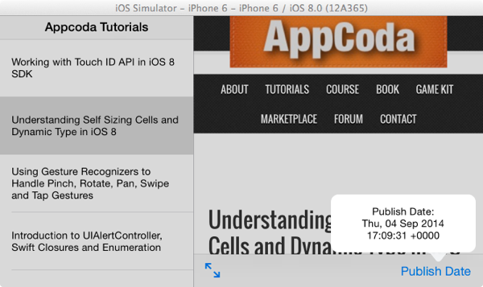

As you assume, we’re going to need a new view controller that we’ll use as a popover. So, let’s create one by adding a new class to the project. Go to the File > New > File… menu on Xcode, and create a new Cocoa Touch Class. Make sure that the new class is a subclass of the UIViewController, and name it PopoverViewController.

Once you have the new class ready, open the Main.storyboard file to show the Interface Builder. There, drag and drop to the canvas a new view controller object, and set the PopoverViewController as its class name. Also, set the idPopoverViewController value to the Storyboard ID field:

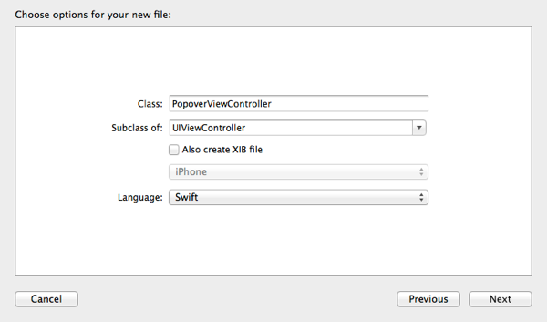

Then, add a UILabel object as a subview to it, and set the following attributes:

* Frame: X=16, Y=20, Width=568, Height=80
* Alignment: Center
* Font Size: 14pt
* Lines: 3

Also, click on the Pin button at the bottom-right side of the Interface Builder to set some constraints to the label. Enable the top, leading and trailing space constraints, and check the Height constraint checkbox as well.

Lastly, go to the last step required for this view controller. We need an IBOutlet property connected to the label, so we can access it and set the publish date that’s about to be displayed. In the PopoverViewController.swift file, add the next line somewhere at the top of the class:

```swift
@IBOutlet weak var lblMessage: UILabel!
```

Then, return to Interface Builder, and connect this property to the label.
Note that we don’t make any connection between the PopoverViewController view controller and any other VC using a segue, as we’ll present it programmatically.

Now that the new view controller is ready, we must take care of the data that we’ll provide it with. This data is the publish date of the selected tutorial, but even though we have parsed it, we still haven’t passed it to the TutorialViewController class so it can be used. So, for starters open the TutorialViewController.swift file, and declare the following property:

```
var publishDate : String!
```

Next, open the TopicsTableViewController.swift file, and update the tableView(tableView:, didSelectRowAtIndexPath:) method so it passes the publish date to the previous class along with the tutorial URL. Right next I give you the whole implementation of this method, where you can find the required extra code:

```
override func tableView(tableView: UITableView, didSelectRowAtIndexPath indexPath: NSIndexPath) {
        let dictionary = xmlParser.arrParsedData[indexPath.row] as Dictionary<String, String>
        let tutorialLink = dictionary["link"]
        let publishDate = dictionary["pubDate"]
 
        let tutorialViewController = UIStoryboard(name: "Main", bundle: nil).instantiateViewControllerWithIdentifier("idTutorialViewController") as TutorialViewController
 
        tutorialViewController.tutorialURL = NSURL(string: tutorialLink!)
        tutorialViewController.publishDate = publishDate
 
        showDetailViewController(tutorialViewController, sender: self)
 
    }
```

Entering into the most important part of the work now, open the TutorialViewController.swift file, and in the class header adopt the UIPopoverPresentationControllerDelegate protocol, as we’re going to implement a delegate method later:

```
class TutorialViewController: UIViewController, UIPopoverPresentationControllerDelegate { ... }
```

The popover controller will appear when the bar button item at the right side of the toolbar gets tapped. That means that we’ll work in the showPublishDate method, where initially we’ll perform four steps:

1. We’ll get an instance of the PopoverViewController from the storyboard.
2. We’ll set its presentation style to Popover.
3. Each view controller contains a property regarding the presentation controller. Using it, we’ll make the TutorialViewController class the delegate of this presentation controller.
4. We’ll present the view controller.

Here we go:

```
@IBAction func showPublishDate(sender: AnyObject) {
        var popoverViewController = UIStoryboard(name: "Main", bundle: nil).instantiateViewControllerWithIdentifier("idPopoverViewController") as? PopoverViewController
 
        popoverViewController?.modalPresentationStyle = UIModalPresentationStyle.Popover
 
        popoverViewController?.popoverPresentationController?.delegate = self
 
        self.presentViewController(popoverViewController!, animated: true, completion: nil)
 
    }
```
	
As you see, we set no text to the popover label yet, and also we didn’t set any other properties regarding the popover appearance (such as the arrow direction). All that is our next step, but I separated the whole implementation in such way, because I want to highlight an important fact: The view controller should be presented first in order for the UIKit to create the presentation controller. All the properties we need to access belong to the presentation controller, which doesn’t exist until the last line of the above snippet to be executed.

Now that we know how the presentation controller works, and we also know that it will be created as we ask from the UIKit to present the popoverViewController view controller, we can specify any other properties we desire. So, here what’s next:

We’ll “tell” the presentation controller which is the bar button item that the popover should point to (in other words, which is the anchor of the popover).
We’ll specify the arrow direction of the popover.
That’s important: We’ll specify the content size of the popover. If we skip doing that, then the popover will have an unexpectedly big size.
Finally, we’ll set the proper text to the label of the popover.
All the above we’ll take place in the above IBAction method as complementary steps.

```
@IBAction func showPublishDate(sender: AnyObject) {
        ...
 
        popoverViewController?.popoverPresentationController?.barButtonItem = pubDateButtonItem
        popoverViewController?.popoverPresentationController?.permittedArrowDirections = .Any
        popoverViewController?.preferredContentSize = CGSizeMake(200.0, 80.0)
 
        popoverViewController?.lblMessage.text = "Publish Date:\n\(publishDate)"
    }
```

In the above code I access the presentation controller of the popoverViewController object directly, but alternatively we could have it assigned to a local variable. Note that in this case we’re accessing the popover presentation controller property of the view controller, which is a subclass of the presentation controller class.

If you go through the code we just wrote, you’ll see that everything seems quite straightforward, however that’s not all we need in order to display the popover controller. At some point above, we made our class the delegate of the presentation controller with this command:

```
popoverViewController?.popoverPresentationController?.delegate = self
```

We did that on purpose, as we’re about to implement the following delegate method:

```
func adaptivePresentationStyleForPresentationController(controller: UIPresentationController) -> UIModalPresentationStyle {
        return UIModalPresentationStyle.None
    }
```

By returning None in this method, we allow the presentation controller to adapt in the layout we ask and display the view controller as a popover. There are other values that can be returned too (there are various enumerations), however we can’t use any of them if we want to keep the normal popover controller appearance.

We are ready now! Run the app, and after having selected a tutorial topic, tap on the Publish Date button item to let the popover controller get presented. Test it in both orientations and watch it appearing now in iPhone too!

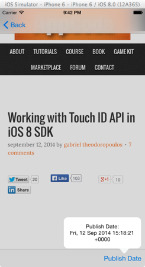


As I said before, note that there are other display styles beyond the popover as well, however none of them makes the view controller appear as a normal popover controller. Instead, they make it appear in fullscreen mode, or over any other existing content on the screen. I’m not going into details about all that, I leave you to do your research and play around with all that stuff if you want.

#### Summary

The greatest conclusion that comes out of this tutorial, is that with the adaptive layout the user interface design can now be done on a device-independent basis. Trait collections and size classes provide a brand new way to work with any kind of device, and things seem to be easier than they used to be in the past. Moreover, through this tutorial we saw how view controllers that were initially meant to be used only in iPad can now be integrated in iPhone applications too. New technologies and features, such as the presentation controllers, allow all that to become true, and surely there are still more to explore. Anyway, beyond the implementation of the split view controller and the popover controller, the two concepts that were our main goal here, we also met and learnt how other interesting stuff work in Swift, such as the XML data parsing, posting and receiving notifications, etc. I’m closing by simply saying that I hope you found this post useful and interesting, and of course, use the comments area for sharing your thoughts. Your feedback is always welcome and helpful!

For your reference, you can download the complete Xcode project from [here](https://www.dropbox.com/s/vjee4586nf7znnx/SplitAndPopover.zip?dl=0).