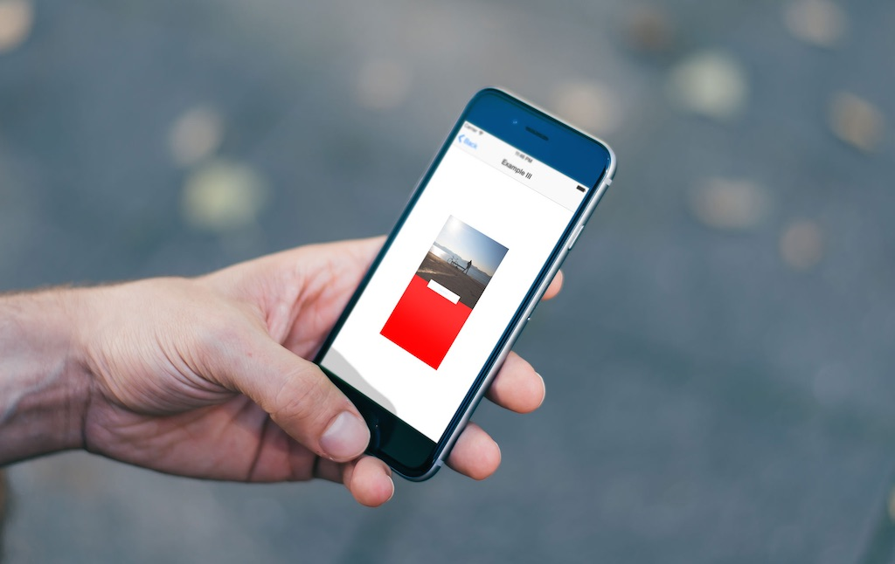

使用Swift创建简单的视图动画
===

[原文](http://www.appcoda.com/view-animation-in-swift/)

随着iOS7的发布，动画与运动效果变成了Apple和第三方开发者进行app设计的中心。iOS7介绍了一种app扁平化、最小化设计，这导致在一些app中有相似的UI。为了区分他们的app与其他人的app，开发者引入了一些类似动画和运动效果的特性来使得他们的app脱引而出。

动画不只是用于设置你的app部分，他们可以改善你应用程序的用户体验整体。对于怎样使用动画来改善用户体验（UX）的示例，你应该查看Apple是怎样在他们的app中使用动画的。例如，在Photos应用中，当你从一个集合中选择一个照片，这个照片从被选择的那个扩大出来，当关闭这个照片时，这个照片缩小回被选择时的状态。这个添加给这个应用的导航，它让你明确的知道你在那里，如果在浏览很多的图片的时候。



Facebook的Paper应用同样引入了漂亮的动画来添加这个应用的整体用户体验。你通过轻抛选择一个文章来阅读。这个动作实际上是这篇文章从它的Thumbnail版本扩大而来，当做相反的动作时（向下抛这篇文章），将会缩小它会到它的Thumbnail状态。这里，动画被用于表达app如何工作， 以及第一次使用这个应用的用户可以猜到它的使用并在不需要一个教程时指出它的导航。

不仅仅进行动画添加应用的用户体验，他们还是你保有用户的闪光点，另用户不会因为用户体验而从App Store中重新下载一个同样功能的应用。

有很多种方法在你的应用中包含动画，他们中的一些通过使用`UIKit Dynamics`、层动画（`Layer Animation`）、视图控制器切换（`View Controller Transitions`）或通过使用类似__Facebook Pop__或[`JNWSpringAnimation`](https://github.com/jwilling/JNWSpringAnimation)框架等第三方库来实现。

在这篇教程中，我们将关注简单视图动画。你可以[下载起始项目](https://www.dropbox.com/s/z672xr52mbwqbyr/ViewAnimationsStarter.zip?dl=0)，这个项目是带有一个教程列表的表单视图的`Single View Application`。

此教程使用一个视图动画的API概览来开始，然后使用一些呈现API在一个应用中如何使用的示例来结束。

#### 基本的视图动画

在你的视图上创建动画是指改变视图的属性以及让`UIKit`自动的催动他们。我们改变的属性被使用`Animatable`进行标记。

下面的列表展示可动属性。

* center —— 中心
* alpha —— 透明度
* frame —— 边框
* bounds —— 约束
* transform —— 切换
* backgroundColor —— 背景色
* contentStretch —— 内容缩放

你讲发现所有的动画都是引入了上面属性的一种或多种变化。

对于简单的视图动画，`UIKit`提供了下面可以被用于在屏幕上催动视图的API。

* `UIView.animateWithDuration(_:, animations:)`
* `UIView.animateWithDuration(_:, animations:, completion:)`
* `UIView.animateWithDuration(_:, delay:, options:, animations:, completion:)`

第一个使用两个参数 - 一个用于描述动画持续时间（秒）的值以及一个用于指定改变属性用的闭包。`UIKit`将获取视图的方向状态以及创建一个你在闭包中指定的从这个状态到终止状态的平滑的过渡。

另外两个API与第一个类似，但是他们使用额外的参数，用于给动画添加更多的配置。第二个使用一个`完成`时的闭包，你可以使用这个闭包来指定当第一个动画完成时要作的第二个动画或者你可以做一些这个UI的清理（从视图结构树中移除已经运动到其他场景的视图）。

第三个API使用两个附加的参数 - `delay`指定动画开始前的延迟时间，`options`（一个`UIViewAnimationOptions`常量）制定你想要怎样执行动画。下面展示了可用的选项。

#### 弹性动画

弹性动画（Spring Animations）尝试模型化真实的弹动行为，这方面，当一个视图从一个点移动到另一个，在放置到位置前它将跳动/震荡朝向终点。

下面是我们用于弹性动画的方法块。

* UIView.animateWithDuration(_:, delay:, usingSpringWithDamping:, initialSpringVelocity:, options:, animations:, completion:)

上面的方法除了两个新的参数外与我们在之前看到的API类似 - `usingSpringWithDamping`以及`initialSpringVelocity`。阻尼（Damping）是一个从0到1的值，它决定朝向动画终点的视图弹性有多少。越靠近1，弹性越小。`initialSpringVelocity`就像名字说的，决定动画的初始速率。这将决定动画开始时有多强烈。如果你想要开始的活泼，设置一个更大的值，如果你想要一个柔和的动画，你可以设置值为0.

#### 关键帧动画

关键帧动画（Keyframe Animation）让你可以设置一个动画的不同阶段。你可以组织不同的动画在一起，以便共享一些公用的属性，但是仍然可以分别控制他们。

代替一个仅仅是沿着一条路径移动的动画，`UIKit`将执行不同的动画阶段。

关键帧动画API如下所示。

* UIView.animateKeyframesWithDuration(_:, delay:, options:, animations:)
* UIView.addKeyframeWithRelativeStartTime(_:, relativeDuration:)

上面两个方法被一起使用，第二个方法在嵌套在第一个动画的闭包中。

第一个函数设置动画的全部配置项目，如需要多少时间，延迟以及它的选项。之后你定义一个或多个第二个方法在动画比保重来设置动画的不同阶段。每一帧的相对起始时间和相对持续时间为0至1，表示动画总时间内的百分比时间。

#### 视图切换

视图切换（View Transition）被用于添加一个新的视图到你的视图组织结构当中或从属兔组织结构当中移除一个视图时。 

用于创建视图切换的API有：

* UIView.transitionWithView(_:, duration:, options:, animations:, completion:)
* UIView.transitionFromView(_:, toView:, duration:, options:, completion:)

使用第一个来介绍一个视图到视图组织结构中。这个方法采用我们在其他动画方法中同样的参数。

第二个用于从视图结构中取得一个视图，然后放置一个新的视图在它的位置。

### 示例

We’ll now look at a few examples that use some of the above API calls to animate views in the given starter project.

#### Example I

If you run the project, you’ll see a table view that lists the examples we’ll work through. Select Example I in the list and you should see a Login screen of an app with the username and password fields and login button.

We want these to be animated onto the screen when the app starts.

To get started we’ll hide the views from sight when the view first appears. Before Auto Layout, this would have been a simple matter of changing the specific view’s position in code, but since we set auto layout constraints on the views in the storyboard file, we’ll have to change the constraints in code, which will change the view’s position.

First, we need to get a reference of the constraints that we will change. Open the storyboard file. Locate the following constraints in the Example I Scene.


Open the Assistant Editor, and make sure it is the ExampleIViewController.swift that appears next to the storyboard on the split screen. Drag from the Center X Alignment – View – Username constraint to the ExampleIViewController class. Create an outlet named centerAlignUsername. Do the same for the Center X Alignment – View – Password and set its name to centerAlignPassword. Also create an outlet for the login button named loginButton and an action for the same button and name it login. Make sure you set the Type of the action to UIButton. You should have the following in code.

```swift
@IBOutlet weak var centerAlignUsername: NSLayoutConstraint!
@IBOutlet weak var centerAlignPassword: NSLayoutConstraint!
@IBOutlet weak var loginButton: UIButton!
    
@IBAction func login(sender: UIButton) {
        
}
```

In the ExampleIViewController.swift add the following method which is called before the view is presented on screen.

```swift
override func viewWillAppear(animated: Bool) {
    super.viewWillAppear(animated)
    centerAlignUsername.constant -= view.bounds.width
    centerAlignPassword.constant -= view.bounds.width
    loginButton.alpha = 0.0
}
```

This moves the username and password fields just out of view and sets the alpha value of the button to 0 which makes it invisible.

Add the following method which is called right when the view appears.

```swift
override func viewDidAppear(animated: Bool) {
    super.viewDidAppear(animated)
        
    UIView.animateWithDuration(0.5, delay: 0.0, options: UIViewAnimationOptions.CurveEaseOut, animations: {
        self.centerAlignUsername.constant += self.view.bounds.width
        self.centerAlignPassword.constant += self.view.bounds.width
        self.loginButton.alpha = 1
        self.view.layoutIfNeeded()
    }, completion: nil)
            
}
```

Here we use the UIView.animateWithDuration() method that we saw earlier. We include the UIViewAnimationOptions.CurveEaseOut option which makes the animation start fast then slow down at the end. You can experiment with different options here. Command-click on UIViewAnimationOptions to see all the options available.

The animation lasts for 0.5 seconds and starts immediately. You have liberty over the duration, but you shouldn’t set such a large number as to annoy your users when animations on your app seem to take too long. Normally, the duration is set between 0.5 and 0.7 seconds, but as I said, this isn’t set in stone and you have liberty to set it to whatever feels right to you.

The animation does the exact opposite of what we did in viewWillAppear(). layoutIfNeeded() is used to lay out the views immediately they are changed. If you don’t include it, you will not see them get animated onto the screen, instead they will just be shown in their final position. Run the app, and you should see the following.


The above looks more interesting than a static presentation, but the views getting animated at the same time, doesn’t create that great an effect. Modify the method as shown below.

```swift
override func viewDidAppear(animated: Bool) {
    super.viewDidAppear(animated)
        
    UIView.animateWithDuration(0.5, delay: 0.0, options: UIViewAnimationOptions.CurveEaseOut, animations: {
        self.centerAlignUsername.constant += self.view.bounds.width
        self.view.layoutIfNeeded()
    }, completion: nil)
        
    UIView.animateWithDuration(0.5, delay: 0.3, options: .CurveEaseOut, animations: {
        self.centerAlignPassword.constant += self.view.bounds.width
        self.view.layoutIfNeeded()
    }, completion: nil)
        
    UIView.animateWithDuration(0.5, delay: 0.4, options: .CurveEaseOut, animations: {
        self.loginButton.alpha = 1
    }, completion: nil)
        
}
```

Run the app and the resulting animation has the views animating on screen at different times. Looking at the code, you can see that after the first animation block, we set a delay on subsequent ones.


In login screens, when login fails, there is usually an animation that indicates to the user that login has failed. This is sometimes done as a shake of the text fields or the login button, and a message that lets the user know that login has failed. We’ll add such an effect on the login button using springs. Modify the login() function as shown.

```swift
@IBAction func login(sender: UIButton) {
        
    let bounds = self.loginButton.bounds
    UIView.animateWithDuration(1.0, delay: 0.0, usingSpringWithDamping: 0.2, initialSpringVelocity: 10, options: nil, animations: {
        self.loginButton.bounds = CGRect(x: bounds.origin.x - 20, y: bounds.origin.y, width: bounds.size.width + 60, height: bounds.size.height)
        self.loginButton.enabled = false
    }, completion: nil)
        
}
```

The above changes the size of the login button when pressed and animates the action with a spring animation which will cause the button’s width to expand and bounce a little at the end before settling.


Play around with the damping value. If you set it to 1, the button will expand, with no bouncing at the end. You can also use the same method on the username and password fields. Instead of having them come onto the screen and just stop in place at the end, have them be spring-like and bounce a little before settling down.

#### Example II

In your app, you might need to replace the background image of a view automatically when some action happens. You could do it in a way where an image immediately replaces another on the view, or you could slowly fade it in to create a nice transition. We’ll create this effect here. Open ExampleIIViewController.swift and add the following.

```swift
override func viewWillAppear(animated: Bool) {
        
    let firstImageView = UIImageView(image: UIImage(named: "bg01.png"))
    firstImageView.frame = view.frame
    view.addSubview(firstImageView)
        
    imageFadeIn(firstImageView)
        
}
    
func imageFadeIn(imageView: UIImageView) {
        
    let secondImageView = UIImageView(image: UIImage(named: "bg02.png"))
    secondImageView.frame = view.frame
    secondImageView.alpha = 0.0
        
    view.insertSubview(secondImageView, aboveSubview: imageView)
        
    UIView.animateWithDuration(2.0, delay: 2.0, options: .CurveEaseOut, animations: {
        secondImageView.alpha = 1.0
        }, completion: {_ in
            imageView.image = secondImageView.image
            secondImageView.removeFromSuperview()
    })
        
}
```

Here we create an image view and add it to the main view. We then call imageFadeIn() which creates a second view with a different image. We add this view above the first image view and set its alpha to 0. In the animation block, we animate its alpha value, making it visible. We then use a completion closure to set the image view’s image to the second image and we remove the second image view from the view hierarchy since it is no longer needed. I’ve added a long delay so that the animation doesn’t happen right at the moment we select Example II from the table view. The duration is also a bit long so we can see what’s going on in the demo.

#### Example III

Next we’ll look at keyframe animations. Open ExampleIIIViewController.swift and add the following variable and functions to the file. I’ve commented the code to explain each step.

```swift
var alertView: UIView!
    
func createView() {
        
    // Create a red view
    let alertWidth: CGFloat = view.bounds.width
    let alertHeight: CGFloat = view.bounds.height
    let alertViewFrame: CGRect = CGRectMake(0, 0, alertWidth, alertHeight)
    alertView = UIView(frame: alertViewFrame)
    alertView.backgroundColor = UIColor.redColor()
        
    // Create an image view and add it to this view
    let imageView = UIImageView(frame: CGRectMake(0, 0, alertWidth, alertHeight/2))
    imageView.image = UIImage(named: "bike_traveler.png")
    alertView.addSubview(imageView)
        
    // Create a button and set a listener on it for when it is tapped. Then the button is added to the alert view
    let button = UIButton.buttonWithType(UIButtonType.System) as UIButton
    button.setTitle("Dismiss", forState: UIControlState.Normal)
    button.backgroundColor = UIColor.whiteColor()
    let buttonWidth: CGFloat = alertWidth/2
    let buttonHeight: CGFloat = 40
    button.frame = CGRectMake(alertView.center.x - buttonWidth/2, alertView.center.y - buttonHeight/2, buttonWidth, buttonHeight)
        
    button.addTarget(self, action: Selector("dismissAlert"), forControlEvents: UIControlEvents.TouchUpInside)
        
    alertView.addSubview(button)
    view.addSubview(alertView)
}
    
func dismissAlert() {
        
}
```

In viewDidLoad() call the createView() function. Add the following to the bottom of viewDidLoad().

```
createView()
```

On running the app and selecting Example III from the table view, you should see a red view with an image view at the top and a button in the middle.


We want to have the view(which I’ll refer to as the alertView from now onwards) to shrink in size and fall downwards out of view.

When we created the button, we added a listener to it. When the button is tapped, dismissAlert() is called. Modify the function as shown.

```swift
func dismissAlert() {
        
    let bounds = alertView.bounds
    let smallFrame = CGRectInset(alertView.frame, alertView.frame.size.width / 4, alertView.frame.size.height / 4)
    let finalFrame = CGRectOffset(smallFrame, 0, bounds.size.height)
        
    UIView.animateKeyframesWithDuration(4, delay: 0, options: .CalculationModeCubic, animations: {
            
        UIView.addKeyframeWithRelativeStartTime(0.0, relativeDuration: 0.5) {
            self.alertView.frame = smallFrame
        }
            
        UIView.addKeyframeWithRelativeStartTime(0.5, relativeDuration: 0.5) {
            self.alertView.frame = finalFrame
        }
    }, completion: nil)
        
}
```

In the above code, we create frames that represent what we want for the two stages of animating the view. smallFrame shrinks to half the size of alertView, maintaining the center point and finalFrame has a position at the bottom of the screen, out of view.

We use a Keyframe animation with two keyframes. The first sets alertView’s frame to smallFrame and the second to finalFrame. The result will be that the alertView will shrink to half its size and then fall out of view. Notice I have put such a large number for the duration – 4 seconds. You can change this, I just wanted the animation running in slow-motion for the demo. Run the app and select Example III.


The animation isn’t quite what we expected. You can see the red alertView animate as expected, but the scale of its children doesn’t change. Changing the parent’s frame, doesn’t automatically change its children’s frames.

We’ll use a feature introduced in iOS 7 called UIView snapshots to fix the animation. This allows you to take a snapshot of a UIView together with its hierarchy and render it into a new UIView.

In dismissAlert() add the following right before the Keyframe animation code.

```swift
let snapshot = alertView.snapshotViewAfterScreenUpdates(false)
snapshot.frame = alertView.frame
view.addSubview(snapshot)
alertView.removeFromSuperview()
```

Here, we create a snapshot view and add it to the main view. We then remove the alertView from view, as the snapshot will replace it.

Replace the Keyframe animation with the following.

```swift
UIView.animateKeyframesWithDuration(4, delay: 0, options: .CalculationModeCubic, animations: {
    UIView.addKeyframeWithRelativeStartTime(0.0, relativeDuration: 0.5) {
        snapshot.frame = smallFrame
    }
    UIView.addKeyframeWithRelativeStartTime(0.5, relativeDuration: 0.5) {
        snapshot.frame = finalFrame
    }
}, completion: nil)
```

Run the application and on tapping Dismiss, the view(snapshot, really) should animate as expected.

#### Example IV

We’ve looked at how you can animate simple views. In this example we’ll look at how you can animate a table view.

If you select Example IV from the table view, you will find another table view with a list of items in it. When the table view is presented, the list items are already positioned onto the table. We want to animate them onto the view to create a more interesting effect.


Open ExampleIVViewController.swift and add the following methods.

```swift
override func viewWillAppear(animated: Bool) {
    animateTable()
}
    
func animateTable() {
    tableView.reloadData()
        
    let cells = tableView.visibleCells()
    let tableHeight: CGFloat = tableView.bounds.size.height
        
    for i in cells {
        let cell: UITableViewCell = i as UITableViewCell
        cell.transform = CGAffineTransformMakeTranslation(0, tableHeight)
    }
        
    var index = 0
        
    for a in cells {
        let cell: UITableViewCell = a as UITableViewCell
        UIView.animateWithDuration(1.5, delay: 0.05 * Double(index), usingSpringWithDamping: 0.8, initialSpringVelocity: 0, options: nil, animations: {
            cell.transform = CGAffineTransformMakeTranslation(0, 0);
        }, completion: nil)
            
        index += 1
    }
}
```

Here, when the view appears, the animateTable() function is called. We reload the table view data and loop through the cells that are currently visible on the screen and move each of them to the bottom of the screen. We then iterate over all the cells that we moved to the bottom of the screen and animate them back to position with a spring animation.

Run the app and you should see the following.


#### Conclusion

We have looked at various APIs that you can use to add animations to your app’s views. This is not an exhaustive guide on animation in iOS but by using the simple APIs we have looked at, you can create various animations in your apps. To dive further into iOS animations, you could look at UIKit Dynamics, layer animations, view controller transitions and even motion effects. You could also look at third party libraries like [Facebook Pop](http://www.appcoda.com/facebook-pop-framework-intro/) and JNWSpringAnimation framework which could help you build intricate animations more easily.

You can [download the completed project here](https://www.dropbox.com/s/d2mfpegh647ie4n/ViewAnimationsFinal.zip?dl=0).

As always, leave me comment and share your thought about the tutorial.
