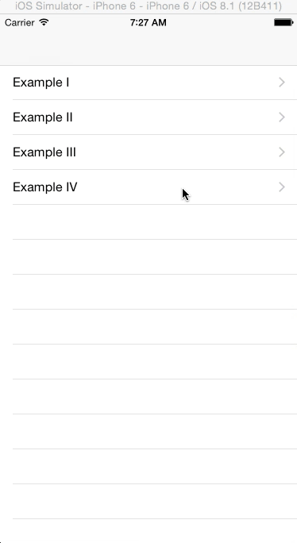

使用Swift创建简单的视图动画
===

[原文](http://www.appcoda.com/view-animation-in-swift/)

随着iOS7的发布，动画与运动效果变成了Apple和第三方开发者进行app设计的中心。iOS7介绍了一种app扁平化、最小化设计，这导致在一些app中有相似的UI。为了区分他们的app与其他人的app，开发者引入了一些类似动画和运动效果的特性来使得他们的app脱引而出。

动画不只是用于设置你的app部分，他们可以改善你应用程序的用户体验整体。对于怎样使用动画来改善用户体验（UX）的示例，你应该查看Apple是怎样在他们的app中使用动画的。例如，在Photos应用中，当你从一个集合中选择一个照片，这个照片从被选择的那个扩大出来，当关闭这个照片时，这个照片缩小回被选择时的状态。这个添加给这个应用的导航，它让你明确的知道你在那里，如果在浏览很多的图片的时候。


Facebook的Paper应用同样引入了漂亮的动画来添加这个应用的整体用户体验。你通过轻抛选择一个文章来阅读。这个动作实际上是这篇文章从它的Thumbnail版本扩大而来，当做相反的动作时（向下抛这篇文章），将会缩小它会到它的Thumbnail状态。这里，动画被用于表达app如何工作， 以及第一次使用这个应用的用户可以猜到它的使用并在不需要一个教程时指出它的导航。

不仅仅进行动画添加应用的用户体验，他们还是你保有用户的闪光点，另用户不会因为用户体验而从App Store中重新下载一个同样功能的应用。

有很多种方法在你的应用中包含动画，他们中的一些通过使用`UIKit Dynamics`、层动画（`Layer Animation`）、视图控制器切换（`View Controller Transitions`）或通过使用类似__Facebook Pop__或[`JNWSpringAnimation`](https://github.com/jwilling/JNWSpringAnimation)框架等第三方库来实现。

在这篇教程中，我们将关注简单视图动画。你可以[下载起始项目](https://www.dropbox.com/s/z672xr52mbwqbyr/ViewAnimationsStarter.zip?dl=0)，这个项目是带有一个教程列表的表单视图的`Single View Application`。

此教程使用一个视图动画的API概览来开始，然后使用一些呈现API在一个应用中如何使用的示例来结束。

#### 基本的视图动画

在你的视图上创建动画是指改变视图的属性以及让`UIKit`自动的催动他们。我们改变的属性被使用`Animatable`进行标记。

下面的列表展示可动属性。

* center —— 中心
* alpha —— 透明度
* frame —— 边框
* bounds —— 约束
* transform —— 切换
* backgroundColor —— 背景色
* contentStretch —— 内容缩放

你将发现所有的动画都是引入了上面属性的一种或多种变化。

对于简单的视图动画，`UIKit`提供了下面可以被用于在屏幕上催动视图的API。

* `UIView.animateWithDuration(_:, animations:)`
* `UIView.animateWithDuration(_:, animations:, completion:)`
* `UIView.animateWithDuration(_:, delay:, options:, animations:, completion:)`

第一个使用两个参数 - 一个用于描述动画持续时间（秒）的值以及一个用于指定改变属性用的闭包。`UIKit`将获取视图的方向状态以及创建一个你在闭包中指定的从这个状态到终止状态的平滑的过渡。

另外两个API与第一个类似，但是他们使用额外的参数，用于给动画添加更多的配置。第二个使用一个`完成`时的闭包，你可以使用这个闭包来指定当第一个动画完成时要作的第二个动画或者你可以做一些这个UI的清理（从视图结构树中移除已经运动到其他场景的视图）。

第三个API使用两个附加的参数 - `delay`指定动画开始前的延迟时间，`options`（一个`UIViewAnimationOptions`常量）制定你想要怎样执行动画。下面展示了可用的选项。

#### 弹性动画

弹性动画（Spring Animations）尝试模型化真实的弹动行为，这方面，当一个视图从一个点移动到另一个，在放置到位置前它将跳动/震荡朝向终点。

下面是我们用于弹性动画的方法块。

* UIView.animateWithDuration(_:, delay:, usingSpringWithDamping:, initialSpringVelocity:, options:, animations:, completion:)

上面的方法除了两个新的参数外与我们在之前看到的API类似 - `usingSpringWithDamping`以及`initialSpringVelocity`。阻尼（Damping）是一个从0到1的值，它决定朝向动画终点的视图弹性有多少。越靠近1，弹性越小。`initialSpringVelocity`就像名字说的，决定动画的初始速率。这将决定动画开始时有多强烈。如果你想要开始的活泼，设置一个更大的值，如果你想要一个柔和的动画，你可以设置值为0.

#### 关键帧动画

关键帧动画（Keyframe Animation）让你可以设置一个动画的不同阶段。你可以组织不同的动画在一起，以便共享一些公用的属性，但是仍然可以分别控制他们。

代替一个仅仅是沿着一条路径移动的动画，`UIKit`将执行不同的动画阶段。

关键帧动画API如下所示。

* UIView.animateKeyframesWithDuration(_:, delay:, options:, animations:)
* UIView.addKeyframeWithRelativeStartTime(_:, relativeDuration:)

上面两个方法被一起使用，第二个方法在嵌套在第一个动画的闭包中。

第一个函数设置动画的全部配置项目，如需要多少时间，延迟以及它的选项。之后你定义一个或多个第二个方法在动画比保重来设置动画的不同阶段。每一帧的相对起始时间和相对持续时间为0至1，表示动画总时间内的百分比时间。

#### 视图切换

视图切换（View Transition）被用于添加一个新的视图到你的视图组织结构当中或从属兔组织结构当中移除一个视图时。 

用于创建视图切换的API有：

* UIView.transitionWithView(_:, duration:, options:, animations:, completion:)
* UIView.transitionFromView(_:, toView:, duration:, options:, completion:)

使用第一个来介绍一个视图到视图组织结构中。这个方法采用我们在其他动画方法中同样的参数。

第二个用于从视图结构中取得一个视图，然后放置一个新的视图在它的位置。

### 示例

我们现在查看几个示例，这些示例使用上面API的一部分，来在已经给出的起始项目中催动视图。

#### 示例 I

如果你运行这个项目，你讲看到一个表格视图，这个视图罗列我们将使用的示例。在清单中选择Example I，然后你讲看到一个app的登录界面，这个界面包含用户名、密码以及登录按钮。

我们想要实现在app启动的时候这些元素可以以动画的形式进入到屏幕中。

开始，当视图第一次出现时，我们将会隐藏视图。在有`Auto Layout`之前，在代码中修改特定视图的位置将会有一些小麻烦，但是自从我们可以在故事版中设置视图的自动布局约束，我们将可以在代码中修改约束，来改变视图的位置。

首先，我们需要取得将要改变的约束的参考。打开故事板文件。在Example I场景中定位下面约束。


打开Assistant Editor，然后确认它是`ExampleViewController.swift`，接下来在出现在分屏上的故事版。从__Center X Alignment – View – Username__约束拖拽到`ExampleViewController`类。创建一个教`centerAlignUsername`的outlet。对__Center X Alignment – View – Password__做同样的事情，并设置它的名字为`centerAlignPassword`。同事，为登陆按钮创建一个名为`loginButton`的outlet，以及为这个按钮创建一个名为`login`的动作（action)。确认你设置动作的类型为`UIButton`。你讲得到如下的代码。

```swift
@IBOutlet weak var centerAlignUsername: NSLayoutConstraint!
@IBOutlet weak var centerAlignPassword: NSLayoutConstraint!
@IBOutlet weak var loginButton: UIButton!
    
@IBAction func login(sender: UIButton) {
        
}
```

在`ExampleIViewController.swift`中，添加下面的方法，在试图在屏幕上呈现之前，这个方法将被调用。

```swift
override func viewWillAppear(animated: Bool) {
    super.viewWillAppear(animated)
    centerAlignUsername.constant -= view.bounds.width
    centerAlignPassword.constant -= view.bounds.width
    loginButton.alpha = 0.0
}
```

这个方法移动__username__以及__password__字段到视图外以及设置按钮的透明度为0使其不可见。

添加下面的方法，这个方法在视图出现的时候被调用。

```swift
override func viewDidAppear(animated: Bool) {
    super.viewDidAppear(animated)
        
    UIView.animateWithDuration(0.5, delay: 0.0, options: UIViewAnimationOptions.CurveEaseOut, animations: {
        self.centerAlignUsername.constant += self.view.bounds.width
        self.centerAlignPassword.constant += self.view.bounds.width
        self.loginButton.alpha = 1
        self.view.layoutIfNeeded()
    }, completion: nil)
            
}
```

这里我们使用我们之前看到的`UIView.animateWithDuration()`方法。我们包含`UIViewAnimationOptions.CurveEaseOut`选项，这个选项使得动画开始的时候快，结束的时候慢。你可以实验不同的选项。使用__Command + 单击__`UIViewAnimationOptions`来查看所有可用的选项。

动画持续0.5秒，并立即开始。你有自由的时间，但你不应该设置这样一个大的数目，在你的用户在你的应用程序动画时使用这么长的时间来惹恼你的用户。一般来说，持续时间是0.5到0.7秒，但正如我所说，这不是一成不变的，你有自由设定它的任何感觉对你。

动画与我们在viewwillappear()所做的正好相反。layoutifneeded()被用于布局视图。如果你不包括它，你就不会看到屏幕上的动画，相反，他们将只会显示在他们的最后位置。运行该应用程序，你应该看到以下。


上面的效果看起来比一个静态的呈现更加的有意思，但是视图在同一时间进行动画，没有达到很棒的效果。像下面那样修改函数。

```swift
override func viewDidAppear(animated: Bool) {
    super.viewDidAppear(animated)
        
    UIView.animateWithDuration(0.5, delay: 0.0, options: UIViewAnimationOptions.CurveEaseOut, animations: {
        self.centerAlignUsername.constant += self.view.bounds.width
        self.view.layoutIfNeeded()
    }, completion: nil)
        
    UIView.animateWithDuration(0.5, delay: 0.3, options: .CurveEaseOut, animations: {
        self.centerAlignPassword.constant += self.view.bounds.width
        self.view.layoutIfNeeded()
    }, completion: nil)
        
    UIView.animateWithDuration(0.5, delay: 0.4, options: .CurveEaseOut, animations: {
        self.loginButton.alpha = 1
    }, completion: nil)
        
}
```

运行应用，然后视图将会在不同的时间执行动画。查看代码，你讲看到在第一个动画代码块之后，我们设置了延迟。


在登录屏幕，当登录失败时，通常会有一个动画显示用户登录失败。这有时是颤动一个文本字段或登录按钮，一个消息，让用户知道登录失败了。我们给登录按钮添加弹性效果。修改`login()`功能如图所示。

```swift
@IBAction func login(sender: UIButton) {
        
    let bounds = self.loginButton.bounds
    UIView.animateWithDuration(1.0, delay: 0.0, usingSpringWithDamping: 0.2, initialSpringVelocity: 10, options: nil, animations: {
        self.loginButton.bounds = CGRect(x: bounds.origin.x - 20, y: bounds.origin.y, width: bounds.size.width + 60, height: bounds.size.height)
        self.loginButton.enabled = false
    }, completion: nil)
        
}
```

上面的函数改变当按钮被按时登录按钮的尺寸，以及使用弹性效果来进行动画，弹性动画将引起按钮的宽度扩大以及弹小在结束之前。


尝试调整阻尼值。如果你设置它为1，按钮将会扩大，在结束时不会有弹性。你还可以使用同样的方法给用户名和密码字段。Instead of having them come onto the screen and just stop in place at the end, have them be spring-like and bounce a little before settling down.

#### Example II

In your app, you might need to replace the background image of a view automatically when some action happens. You could do it in a way where an image immediately replaces another on the view, or you could slowly fade it in to create a nice transition. We’ll create this effect here. Open ExampleIIViewController.swift and add the following.

```swift
override func viewWillAppear(animated: Bool) {
        
    let firstImageView = UIImageView(image: UIImage(named: "bg01.png"))
    firstImageView.frame = view.frame
    view.addSubview(firstImageView)
        
    imageFadeIn(firstImageView)
        
}
    
func imageFadeIn(imageView: UIImageView) {
        
    let secondImageView = UIImageView(image: UIImage(named: "bg02.png"))
    secondImageView.frame = view.frame
    secondImageView.alpha = 0.0
        
    view.insertSubview(secondImageView, aboveSubview: imageView)
        
    UIView.animateWithDuration(2.0, delay: 2.0, options: .CurveEaseOut, animations: {
        secondImageView.alpha = 1.0
        }, completion: {_ in
            imageView.image = secondImageView.image
            secondImageView.removeFromSuperview()
    })
        
}
```

Here we create an image view and add it to the main view. We then call imageFadeIn() which creates a second view with a different image. We add this view above the first image view and set its alpha to 0. In the animation block, we animate its alpha value, making it visible. We then use a completion closure to set the image view’s image to the second image and we remove the second image view from the view hierarchy since it is no longer needed. I’ve added a long delay so that the animation doesn’t happen right at the moment we select Example II from the table view. The duration is also a bit long so we can see what’s going on in the demo.

#### Example III

Next we’ll look at keyframe animations. Open ExampleIIIViewController.swift and add the following variable and functions to the file. I’ve commented the code to explain each step.

```swift
var alertView: UIView!
    
func createView() {
        
    // Create a red view
    let alertWidth: CGFloat = view.bounds.width
    let alertHeight: CGFloat = view.bounds.height
    let alertViewFrame: CGRect = CGRectMake(0, 0, alertWidth, alertHeight)
    alertView = UIView(frame: alertViewFrame)
    alertView.backgroundColor = UIColor.redColor()
        
    // Create an image view and add it to this view
    let imageView = UIImageView(frame: CGRectMake(0, 0, alertWidth, alertHeight/2))
    imageView.image = UIImage(named: "bike_traveler.png")
    alertView.addSubview(imageView)
        
    // Create a button and set a listener on it for when it is tapped. Then the button is added to the alert view
    let button = UIButton.buttonWithType(UIButtonType.System) as UIButton
    button.setTitle("Dismiss", forState: UIControlState.Normal)
    button.backgroundColor = UIColor.whiteColor()
    let buttonWidth: CGFloat = alertWidth/2
    let buttonHeight: CGFloat = 40
    button.frame = CGRectMake(alertView.center.x - buttonWidth/2, alertView.center.y - buttonHeight/2, buttonWidth, buttonHeight)
        
    button.addTarget(self, action: Selector("dismissAlert"), forControlEvents: UIControlEvents.TouchUpInside)
        
    alertView.addSubview(button)
    view.addSubview(alertView)
}
    
func dismissAlert() {
        
}
```

In viewDidLoad() call the createView() function. Add the following to the bottom of viewDidLoad().

```
createView()
```

On running the app and selecting Example III from the table view, you should see a red view with an image view at the top and a button in the middle.


We want to have the view(which I’ll refer to as the alertView from now onwards) to shrink in size and fall downwards out of view.

When we created the button, we added a listener to it. When the button is tapped, dismissAlert() is called. Modify the function as shown.

```swift
func dismissAlert() {
        
    let bounds = alertView.bounds
    let smallFrame = CGRectInset(alertView.frame, alertView.frame.size.width / 4, alertView.frame.size.height / 4)
    let finalFrame = CGRectOffset(smallFrame, 0, bounds.size.height)
        
    UIView.animateKeyframesWithDuration(4, delay: 0, options: .CalculationModeCubic, animations: {
            
        UIView.addKeyframeWithRelativeStartTime(0.0, relativeDuration: 0.5) {
            self.alertView.frame = smallFrame
        }
            
        UIView.addKeyframeWithRelativeStartTime(0.5, relativeDuration: 0.5) {
            self.alertView.frame = finalFrame
        }
    }, completion: nil)
        
}
```

In the above code, we create frames that represent what we want for the two stages of animating the view. smallFrame shrinks to half the size of alertView, maintaining the center point and finalFrame has a position at the bottom of the screen, out of view.

We use a Keyframe animation with two keyframes. The first sets alertView’s frame to smallFrame and the second to finalFrame. The result will be that the alertView will shrink to half its size and then fall out of view. Notice I have put such a large number for the duration – 4 seconds. You can change this, I just wanted the animation running in slow-motion for the demo. Run the app and select Example III.


The animation isn’t quite what we expected. You can see the red alertView animate as expected, but the scale of its children doesn’t change. Changing the parent’s frame, doesn’t automatically change its children’s frames.

We’ll use a feature introduced in iOS 7 called UIView snapshots to fix the animation. This allows you to take a snapshot of a UIView together with its hierarchy and render it into a new UIView.

In dismissAlert() add the following right before the Keyframe animation code.

```swift
let snapshot = alertView.snapshotViewAfterScreenUpdates(false)
snapshot.frame = alertView.frame
view.addSubview(snapshot)
alertView.removeFromSuperview()
```

Here, we create a snapshot view and add it to the main view. We then remove the alertView from view, as the snapshot will replace it.

Replace the Keyframe animation with the following.

```swift
UIView.animateKeyframesWithDuration(4, delay: 0, options: .CalculationModeCubic, animations: {
    UIView.addKeyframeWithRelativeStartTime(0.0, relativeDuration: 0.5) {
        snapshot.frame = smallFrame
    }
    UIView.addKeyframeWithRelativeStartTime(0.5, relativeDuration: 0.5) {
        snapshot.frame = finalFrame
    }
}, completion: nil)
```

Run the application and on tapping Dismiss, the view(snapshot, really) should animate as expected.

#### Example IV

We’ve looked at how you can animate simple views. In this example we’ll look at how you can animate a table view.

If you select Example IV from the table view, you will find another table view with a list of items in it. When the table view is presented, the list items are already positioned onto the table. We want to animate them onto the view to create a more interesting effect.


Open ExampleIVViewController.swift and add the following methods.

```swift
override func viewWillAppear(animated: Bool) {
    animateTable()
}
    
func animateTable() {
    tableView.reloadData()
        
    let cells = tableView.visibleCells()
    let tableHeight: CGFloat = tableView.bounds.size.height
        
    for i in cells {
        let cell: UITableViewCell = i as UITableViewCell
        cell.transform = CGAffineTransformMakeTranslation(0, tableHeight)
    }
        
    var index = 0
        
    for a in cells {
        let cell: UITableViewCell = a as UITableViewCell
        UIView.animateWithDuration(1.5, delay: 0.05 * Double(index), usingSpringWithDamping: 0.8, initialSpringVelocity: 0, options: nil, animations: {
            cell.transform = CGAffineTransformMakeTranslation(0, 0);
        }, completion: nil)
            
        index += 1
    }
}
```

Here, when the view appears, the animateTable() function is called. We reload the table view data and loop through the cells that are currently visible on the screen and move each of them to the bottom of the screen. We then iterate over all the cells that we moved to the bottom of the screen and animate them back to position with a spring animation.

Run the app and you should see the following.



#### Conclusion

We have looked at various APIs that you can use to add animations to your app’s views. This is not an exhaustive guide on animation in iOS but by using the simple APIs we have looked at, you can create various animations in your apps. To dive further into iOS animations, you could look at UIKit Dynamics, layer animations, view controller transitions and even motion effects. You could also look at third party libraries like [Facebook Pop](http://www.appcoda.com/facebook-pop-framework-intro/) and JNWSpringAnimation framework which could help you build intricate animations more easily.

You can [download the completed project here](https://www.dropbox.com/s/d2mfpegh647ie4n/ViewAnimationsFinal.zip?dl=0).

As always, leave me comment and share your thought about the tutorial.
