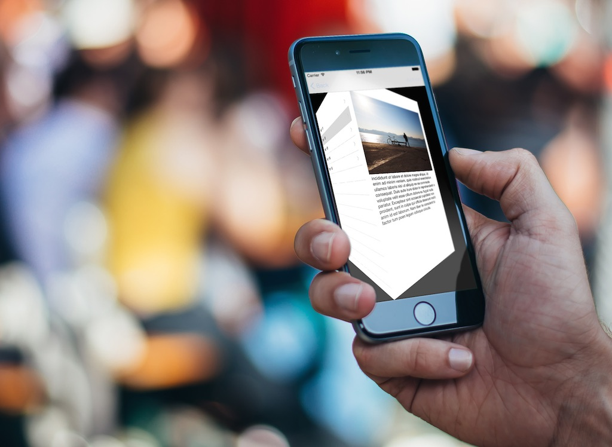
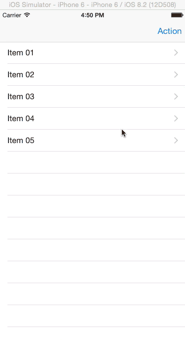
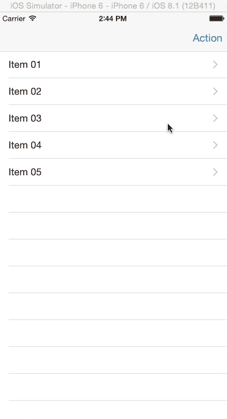
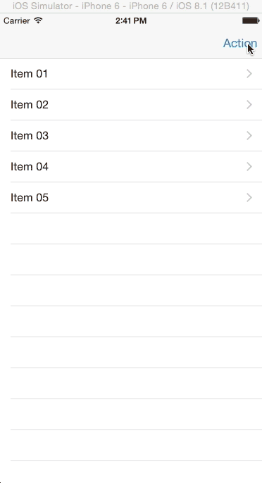
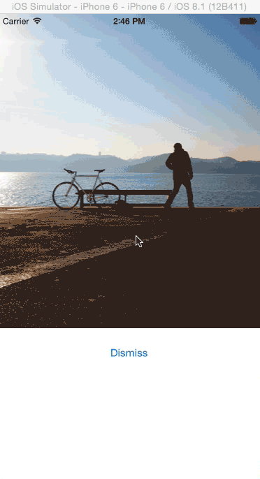
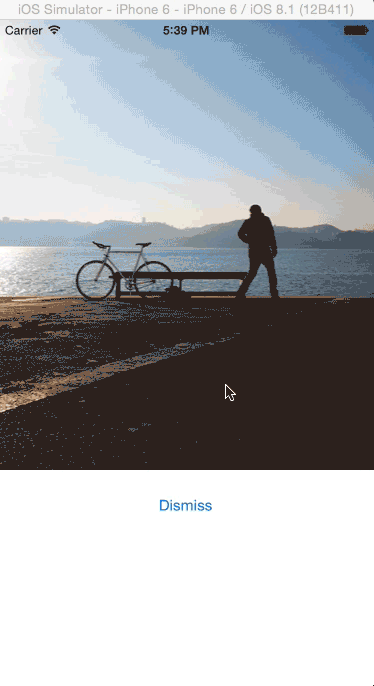
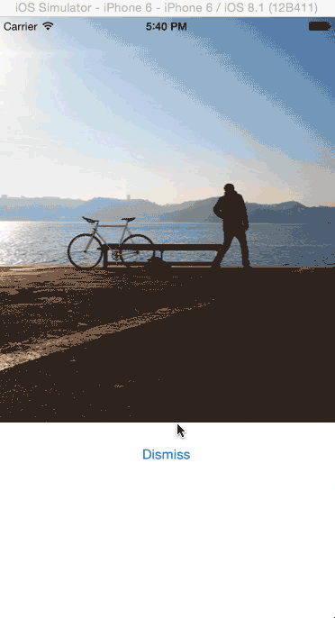
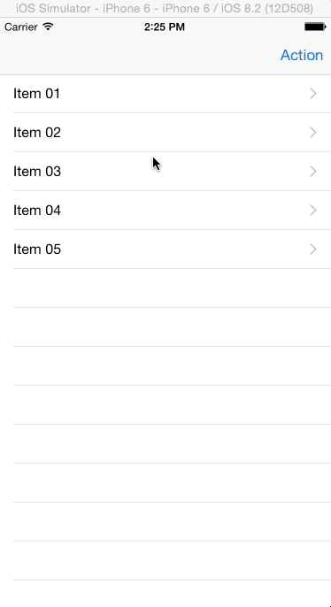
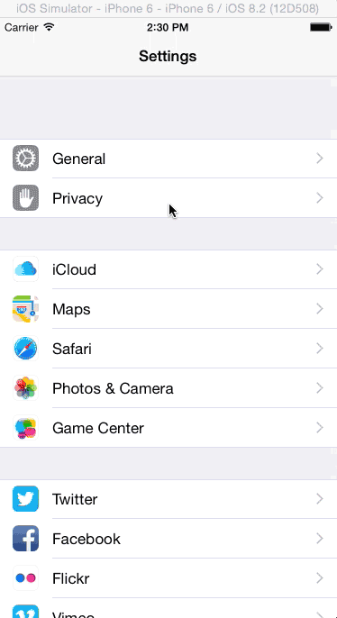

定制视图控制器的切换和动画
===

Looking at the built in apps from Apple on your iOS device, you will notice the various animated transitions as you move from one view to another for example the way view controllers are presented in master-detail views with a swipe that slides the detail view controller over the master view controller as seen in the Messages app or Settings app and the various transitions that represent a segue to another view controller.

iOS 7 introduced custom view controller transitions which make it possible for developers to create their own animated transitions from one view controller to the next in their apps. In this tutorial, we’ll take a look at how to do this. We’ll also look at how to create gesture driven transitions called interactive transitions. To follow along, [download the starter project](https://www.dropbox.com/s/4p6kk0g3qua1kvt/CustomTransitionsStarter.zip?dl=0) which we’ll be using throughout the tutorial.



#### 开始

要创建定制切换效果，你需要做如下的事情：

* 创建一个类来实现`UIViewControllerAnimatedTransitioning`协议。这里你讲编写代码来执行动画。这个类与动画控制器相关联。
* 在呈现一个视图控制器之前，设置一个类作为它的切换效果委托。这个委托将为动画控制器获取一个回调方法，这个回调方法用于视图控制器的呈现。
* 实现回调方法来返回一个在第一步创建的动画控制器的实例。

运行起始项目，你讲看到一个带有项目清单的表格视图。有一个动作按钮在导航栏上，并且当你点击它的时候，将看到另一个视图，这个视图将使用通用的Modal样式从底部滑出。我们将为这个视图定制一个切换效果。



#### 定制呈现切换效果

像之前提到的，要做的第一件事情是创建动画控制器。创建一个叫`CustomPresentAnimationController`的类，并且让它成为`NSObject`的子类。改变它的生命如下所示。

```swift
class CustomPresentAnimationController: NSObject, UIViewControllerAnimatedTransitioning {
```

`UIViewControllerAnimatedTransitioning`协议有两个必须实现的方法，添加下面的方法到类。

```swift
func transitionDuration(transitionContext: UIViewControllerContextTransitioning) -> NSTimeInterval {
    return 2.5
}
    
func animateTransition(transitionContext: UIViewControllerContextTransitioning) {
        
    let fromViewController = transitionContext.viewControllerForKey(UITransitionContextFromViewControllerKey)!
    let toViewController = transitionContext.viewControllerForKey(UITransitionContextToViewControllerKey)!

    let finalFrameForVC = transitionContext.finalFrameForViewController(toViewController)

    let containerView = transitionContext.containerView()
    let bounds = UIScreen.mainScreen().bounds

    toViewController.view.frame = CGRectOffset(finalFrameForVC, 0, bounds.size.height)
    containerView.addSubview(toViewController.view)
        
    UIView.animateWithDuration(transitionDuration(transitionContext), delay: 0.0, usingSpringWithDamping: 0.5, initialSpringVelocity: 0.0, options: .CurveLinear, animations: {
        fromViewController.view.alpha = 0.5
        toViewController.view.frame = finalFrameForVC
        }, completion: {
            finished in
            transitionContext.completeTransition(true)
            fromViewController.view.alpha = 1.0
    })
}
```

第一个方法制定切换动画的持续时间。对于示例APP来说，我们设置2.5秒，但是你或许应该在一个真实的应用中设置一个更小的数值。

在第二个方法中，我们使用`transitionContext`来获取原视图控制器、目标控制器，切换上下文在动画完成后应该有的最终框体和包裹原视图和目标视图的容器视图。

我们放置目标视图在屏幕的底部。然后我们添加目标视图给容器视图，并且在动画闭包中，我们通过设置它的最终框体来催动目标视图到切换上下文给定的位置。我们也催动原视图的透明值，以便当视图向上画出时，原视图将消褪。
The duration of the animation used is the one set in transitionDuration(transitionContext:). In the completion closure, we notify the transition context when the animation completes and then change the from view‘s alpha back to normal. The framework will then remove the from view from the container.

With the animation controller completed, we need to link it to a storyboard segue.

Open the ItemsTableViewController.swift file and change the class declaration as shown.

```swift
class ItemsTableViewController: UITableViewController, UIViewControllerTransitioningDelegate {
```

UIViewController has a property named transitionDelegate that supports custom transitions. When transitioning to a view controller, the framework checks this property to see if a custom transition should be used. UIViewControllerTransitioningDelegate supplies custom transitions.

Open Main.storyboard and select the Present modally segue to Action View Controller and in the Attributes Inspector, set its Identifier to showAction.


Back in ItemsTableViewController add the following to the class.

```swift
let customPresentAnimationController = CustomPresentAnimationController()
 
override func prepareForSegue(segue: UIStoryboardSegue, sender: AnyObject?) {
        
    if segue.identifier == "showAction" {
        let toViewController = segue.destinationViewController as UIViewController
        toViewController.transitioningDelegate = self
    }
}
```

Here we create an instance of our animation controller and then in the prepareForSegue() function, we detect the segue for the Action screen and set the transitionDelegate property of the destination view controller.

Add the following UIViewControllerTransitioningDelegate method to the class. This returns the instance of our custom animation controller.

```swift
func animationControllerForPresentedController(presented: UIViewController, presentingController presenting: UIViewController, sourceController source: UIViewController) -> UIViewControllerAnimatedTransitioning? {
    return customPresentAnimationController
}
```

Run the application and you should see the Action view slide up slowly from the screen and bounce a little before settling.



If you want a slightly different effect, then change this statement in CustomPresentAnimationController.swift

```swift
toViewController.view.frame = CGRectOffset(finalFrameForVC, 0, bounds.size.height)
```

to the statement below, which changes the original position of the to view controller to be above the screen.

```swift
toViewController.view.frame = CGRectOffset(finalFrameForVC, 0, -bounds.size.height)
```

Run the app and the Action view should fall from above.



#### Custom Dismiss Transition

We’ve set a custom transition for presenting our view, but when it is dismissed, it uses the default transition set by Apple.



The UIViewControllerTransitioningDelegate also allows you to specify an animation controller to use when dismissing a view controller as well as when presenting one. We’ll create this next.

Create a class named CustomDismissAnimationController that is a subclass of NSObject. Modify its declaration as shown.

```swift
class CustomDismissAnimationController: NSObject, UIViewControllerAnimatedTransitioning {
```

Add the following to the class.

```swif
func transitionDuration(transitionContext: UIViewControllerContextTransitioning) -> NSTimeInterval {
    return 2
}
 
func animateTransition(transitionContext: UIViewControllerContextTransitioning) {
    let fromViewController = transitionContext.viewControllerForKey(UITransitionContextFromViewControllerKey)!
    let toViewController = transitionContext.viewControllerForKey(UITransitionContextToViewControllerKey)!
    let finalFrameForVC = transitionContext.finalFrameForViewController(toViewController)
    let containerView = transitionContext.containerView()
    toViewController.view.frame = finalFrameForVC
    toViewController.view.alpha = 0.5
    containerView.addSubview(toViewController.view)
    containerView.sendSubviewToBack(toViewController.view)
    
    UIView.animateWithDuration(transitionDuration(transitionContext), animations: {
        fromViewController.view.frame = CGRectInset(fromViewController.view.frame, fromViewController.view.frame.size.width / 2, fromViewController.view.frame.size.height / 2)
        toViewController.view.alpha = 1.0
    }, completion: {
        finished in
        transitionContext.completeTransition(true)
    })
}
```

This is similar to the implementation of the presentation transition. In the animateTransition() function, we get the to and from view controllers. The to view controller here is the table view controller. We change its view’s alpha value so that it will start off as being faded when we start animating. We then add the view to the container and place it behind the from view controller’s view so that it won’t be visible just yet.

In the animation block, we animate the from view‘s size to have a width and height of 0, maintaining its center. This will have an effect of shrinking the from view to nothingness. We also animate the to view‘s alpha to being completely visible.

In ItemsTableViewController add the following property.

```swift
let customDismissAnimationController = CustomDismissAnimationController()
```

Add the following function to the class.

```
func animationControllerForDismissedController(dismissed: UIViewController) -> UIViewControllerAnimatedTransitioning? {
    return customDismissAnimationController
}
```

The UIViewControllerTransitioningDelegate protocol provides the above function which retrieves the animation controller of a dismissed view controller.

Run the app. You should see the following animation.



The animation isn’t what we expected. You can see the white frame of the from view shrinks as expected, but the image on the view doesn’t change in size. This is because changing the view’s frame doesn’t affect its children. We’ll fix this by using UIView snapshotting.

UIView snapshotting works by taking a snapshot of an existing UIView and rendering it into a lightweight UIView. We will then use this snapshot in out animation and not the actual view.

Replace the animateTransition() function with the following.

```swift
func animateTransition(transitionContext: UIViewControllerContextTransitioning) {
    let fromViewController = transitionContext.viewControllerForKey(UITransitionContextFromViewControllerKey)!
    let toViewController = transitionContext.viewControllerForKey(UITransitionContextToViewControllerKey)!
    let finalFrameForVC = transitionContext.finalFrameForViewController(toViewController)
    let containerView = transitionContext.containerView()
    toViewController.view.frame = finalFrameForVC
    toViewController.view.alpha = 0.5
    containerView.addSubview(toViewController.view)
    containerView.sendSubviewToBack(toViewController.view)
        
    let snapshotView = fromViewController.view.snapshotViewAfterScreenUpdates(false)
    snapshotView.frame = fromViewController.view.frame
    containerView.addSubview(snapshotView)
        
    fromViewController.view.removeFromSuperview()
        
    UIView.animateWithDuration(transitionDuration(transitionContext), animations: {
        snapshotView.frame = CGRectInset(fromViewController.view.frame, fromViewController.view.frame.size.width / 2, fromViewController.view.frame.size.height / 2)
        toViewController.view.alpha = 1.0
    }, completion: {
        finished in
        snapshotView.removeFromSuperview()
        transitionContext.completeTransition(true)
    })  
}
```

Here, we create a snapshot of the from view controller‘s view, add it to the container and remove the from view from the container. We then shrink this snapshot in our animation and when the animation completes, we remove the snapshot view from the container.

Run it and the animation should now run smoothly.



#### Navigation controller transitions

We’ve looked at adding a custom transition for modal view controller presentation where we added a transitioning delegate to the presenting view controller. However, setting a delegate on every view controller can get tiresome when working with a UITabBarController or UINavigationController.

These controllers give a simpler approach whereby the animation controller for a transition is supplied via the UITabBarControllerDelegate or UINavigationControllerDelegate.

We’ll see this in action by adding a custom transition to a navigation controller.

To start off, we create an animation controller. Create a class called CustomNavigationAnimationController, make it a subclass of NSObject and change its declaration as follows.

```swift
class CustomNavigationAnimationController: NSObject, UIViewControllerAnimatedTransitioning {
```

Add the following to the class. I use a simplified version of [this cube animation](https://github.com/andresbrun/ABCustomUINavigationController#cube) for this animation controller. The animation controller is set up as usual just like we’ve seen with the previous two animation controllers. Notice the reverse class variable. We use this to determine the direction of the animation, depending on whether we are moving from master to detail view or vice versa.

```swift
var reverse: Bool = false
    
func transitionDuration(transitionContext: UIViewControllerContextTransitioning) -> NSTimeInterval {
    return 1.5
}
    
func animateTransition(transitionContext: UIViewControllerContextTransitioning) {
    let containerView = transitionContext.containerView()
    let toViewController = transitionContext.viewControllerForKey(UITransitionContextToViewControllerKey)!
    let fromViewController = transitionContext.viewControllerForKey(UITransitionContextFromViewControllerKey)!
    let toView = toViewController.view
    let fromView = fromViewController.view
    let direction: CGFloat = reverse ? -1 : 1
    let const: CGFloat = -0.005
        
    toView.layer.anchorPoint = CGPointMake(direction == 1 ? 0 : 1, 0.5)
    fromView.layer.anchorPoint = CGPointMake(direction == 1 ? 1 : 0, 0.5)
        
    var viewFromTransform: CATransform3D = CATransform3DMakeRotation(direction * CGFloat(M_PI_2), 0.0, 1.0, 0.0)
    var viewToTransform: CATransform3D = CATransform3DMakeRotation(-direction * CGFloat(M_PI_2), 0.0, 1.0, 0.0)
    viewFromTransform.m34 = const
    viewToTransform.m34 = const
        
    containerView.transform = CGAffineTransformMakeTranslation(direction * containerView.frame.size.width / 2.0, 0)
    toView.layer.transform = viewToTransform
    containerView.addSubview(toView)
        
    UIView.animateWithDuration(transitionDuration(transitionContext), animations: {
        containerView.transform = CGAffineTransformMakeTranslation(-direction * containerView.frame.size.width / 2.0, 0)
        fromView.layer.transform = viewFromTransform
        toView.layer.transform = CATransform3DIdentity
    }, completion: {
        finished in
        containerView.transform = CGAffineTransformIdentity
        fromView.layer.transform = CATransform3DIdentity
        toView.layer.transform = CATransform3DIdentity
        fromView.layer.anchorPoint = CGPointMake(0.5, 0.5)
        toView.layer.anchorPoint = CGPointMake(0.5, 0.5)
    
        if (transitionContext.transitionWasCancelled()) {
            toView.removeFromSuperview()
        } else {
            fromView.removeFromSuperview()
        }
        transitionContext.completeTransition(!transitionContext.transitionWasCancelled())
    })        
}
```

Open ItemsTableViewController.swift and modify the class declaration as follows.

```swift
class ItemsTableViewController: UITableViewController, UIViewControllerTransitioningDelegate, UINavigationControllerDelegate {
```

UINavigationControllerDelegate supplies the animation controller.

Add the following property to the class.

```swift
let customNavigationAnimationController = CustomNavigationAnimationController()
```

Add the following at the end of viewDidLoad().

```swift
navigationController?.delegate = self
```

The above sets the host navigation controller’s delegate so that the new transition delegate methods can be received.

Then add the following to the class.

```swift
func navigationController(navigationController: UINavigationController, animationControllerForOperation operation: UINavigationControllerOperation, fromViewController fromVC: UIViewController, toViewController toVC: UIViewController) -> UIViewControllerAnimatedTransitioning? {
    customNavigationAnimationController.reverse = operation == .Pop
    return customNavigationAnimationController
}
```

The above function is called to request for an animation controller to navigate between the from and to view controllers and it returns an instance of our animation controller. The direction of the transition is based on whether this is a push or pop navigation operation.

Run the app. Select a table view cell and you should see the animation below.



#### Making it Interactive

We’ll make the above transition interactive, i.e. the user will be able to control the transition with gestures.

iOS built-in apps come with this feature. As an alternative to the back button, you can initiate a transition by swiping from the left side of the screen. You can use a short swipe to briefly view the master view and then cancel the transition. A long swipe initiates the pop navigation operation.



To get started, we need an interaction controller. Interactive controllers use the UIViewControllerInteractiveTransitioning protocol. The navigation controller delegate or the transitioning delegate requests for an optional interaction controller after requesting an animation controller.

Let’s create the interaction controller. Create a new class and name it CustomInteractionController and make it a subclass of UIPercentDrivenInteractiveTransition.

UIPercentDrivenInteractiveTransition implements the UIViewControllerInteractiveTransitioning protocol so we wont have to add that to our class.

To use UIPercentDrivenInteractiveTransition, your animation controller must use a single UIView animation, so that the animation will be able to be stopped, reversed and played.

Add the following to the class.

```swift
var navigationController: UINavigationController!
var shouldCompleteTransition = false
var transitionInProgress = false
var completionSeed: CGFloat {
    return 1 - percentComplete
}
    
func attachToViewController(viewController: UIViewController) {
    navigationController = viewController.navigationController
    setupGestureRecognizer(viewController.view)
}
    
private func setupGestureRecognizer(view: UIView) {
        view.addGestureRecognizer(UIPanGestureRecognizer(target: self, action: "handlePanGesture:"))
}
    
func handlePanGesture(gestureRecognizer: UIPanGestureRecognizer) {
    let viewTranslation = gestureRecognizer.translationInView(gestureRecognizer.view!.superview!)
    switch gestureRecognizer.state {
    case .Began:
        transitionInProgress = true
        navigationController.popViewControllerAnimated(true)
    case .Changed:
        var const = CGFloat(fminf(fmaxf(Float(viewTranslation.x / 200.0), 0.0), 1.0))
        shouldCompleteTransition = const > 0.5
        updateInteractiveTransition(const)
    case .Cancelled, .Ended:
        transitionInProgress = false
        if !shouldCompleteTransition || gestureRecognizer.state == .Cancelled {
            cancelInteractiveTransition()
        } else {
            finishInteractiveTransition()
        }
    default:
        println("Swift switch must be exhaustive, thus the default")
    }
}
```

The attachToViewController() method is passed a reference of the navigation controller which it uses to initiate a pop transition when a gesture occurs. We then set up a gesture recognizer, which will call the handlePanGesture() method when a swipe is made. This checks the gesture recognizer state and does the following at each stage:

* Began: It sets transitionInProgress to true and initiates a pop navigation.
* Changed: Here the gesture is in progress, so it determines the percentage of the transition. A 200 point swipe will cause the transition to be 100% complete. It then determines if the transition should complete depending on where the gesture finishes. Here we check if the user swiped to at least half the screen before releasing.
* Cancelled/Ended: Sets the transitionInProgress to false and cancels the transition if shouldCompleteTransition was set to false or if the gesture was cancelled. Otherwise, the transition is completed.

We used a computed property to determine the completion speed. completionSeed is a UIPercentDrivenInteractiveTransition property that informs the framework how much of the animation remains when a gesture completes. A larger number will make the view controller snap back quicker if the interaction is cancelled.

To use our interaction controller, open ItemsTableViewController.swift and add the following to the class.

```swift
let customInteractionController = CustomInteractionController()
```

Add the following at the beginning of the navigationController(_:animationControllerForOperation:
fromViewController:toViewController:) function.

```swift
if operation == .Push {
    customInteractionController.attachToViewController(toVC)
}
```

This calls the CustomInteractionController’s attachToViewController() method and passes it a reference of the to view controller when it detects a push navigation operation.

Then add the following to the class.

```swift
func navigationController(navigationController: UINavigationController, interactionControllerForAnimationController animationController: UIViewControllerAnimatedTransitioning) -> UIViewControllerInteractiveTransitioning? {
    return customInteractionController.transitionInProgress ? customInteractionController : nil
}
```

After the framework asks for and gets an animation controller, it asks for an interaction controller using the method above. The above returns an instance of our interaction controller if a transition is in progress.

Run the app and you should see the transition shown.


#### Conclusion

We’ve looked at how to create custom view controller transitions and how to make a transition interactive. With these features, developers now have full control over the animations used in their application as it transitions from one view controller to the next and thus can build unique experiences to delight their users. You can [download the completed project here](https://github.com/appcoda/CustomViewTransitionDemo).