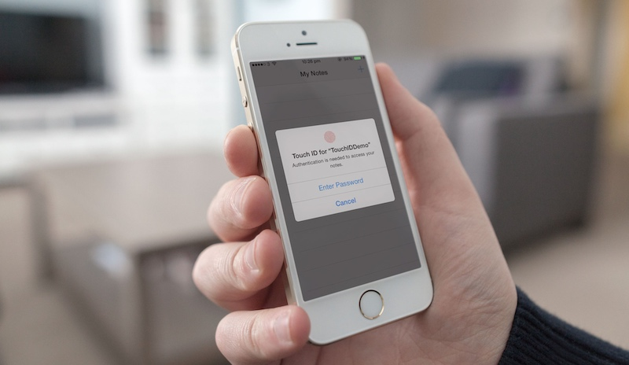
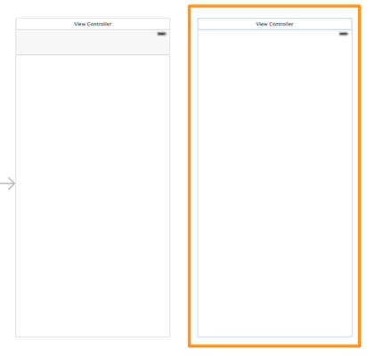
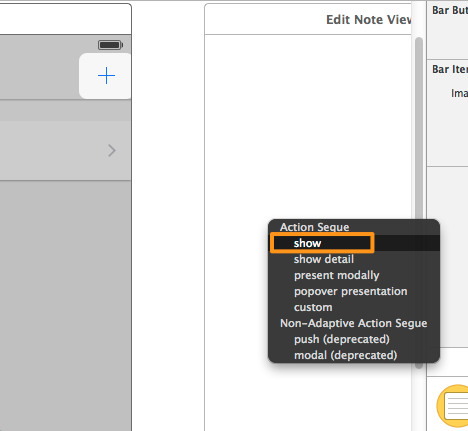

Working with Touch ID API in iOS 8 SDK
===

[](http://www.appcoda.com/touch-id-api-ios8/)

With every major version release of iOS, Apple ships along a great number of new technologies and frameworks. iOS 8 is going to be released officially pretty soon, and new great stuff awaits both users and developers. This version of iOS brings quite exciting new things, and among them, don’t forget the new programming language named Swift, that Apple presented at the WWDC this summer. So, with this tutorial I would like to welcome you to a series of new posts, in which we are going to work with frameworks introduced in iOS 8, and with improvements made to the existing SDK.

Starting from this tutorial, we are going to develop all the sample applications for the next ones in Swift. Not because it’s a brand new language and it would be cool to get to know it, but mostly because it’s quite possible to become the official language of iOS (and Mac OS) after a while. We have been working with Objective-C for some time, some of us for years, and of course, we don’t mean to forget it. However, as technology evolves, it’s our duty to learn this new language.



Before I start talking about the topic of this tutorial, I would like to make a few observations regarding Swift, since this is the first time I write about it. I am pretty sure that all of you that you are now reading these lines, you have seen the related [WWDC session videos](https://developer.apple.com/videos/wwdc/2014/), you have [downloaded the e-book](https://itunes.apple.com/us/book/swift-programming-language/id881256329?mt=11), and you’ve [read a few (or more) things about Swift](http://www.appcoda.com/swift-programming-language-intro/). Compared to Objective-C, Swift is much simpler from the point of syntax, the code is much clearer and of course, thanks to the nature of Swift, safer. Furthermore, one could say that reminds a combination of other languages. Even though it’s necessary to get used to a new way of writing code and to forget old habits (such as adding the semicolon ; at the end of each command), there are only a few new things you have to learn in Swift (such as optionals, tuples, new way to handle structures, etc.). If it has been easy for you to develop applications in Objective-C, then it’s really easy to write code in Swift too, and you will find this out through this tutorial. Closing this short talk about Swift, I must say that since this language is new, I recommend you to keep the e-book always open for study, and of course… to [read the tutorials](http://www.appcoda.com/ios-programming-course/) at Appcoda!

Now, let’s talk about the topic of this tutorial. As you see from the title, we are going to deal with the TouchID, the biometric authentication technology that Apple introduced in iOS 7 and used in iPhone 5s to allow users to unlock their devices and make purchases in the App Store. TouchID, even though a great new technology, had not been given to developers from the beginning. In iOS 8 though things change and developers can add TouchID as an authentication mechanism to their applications, and as you will see in a while, in a very fast and easy manner.

The usage of the TouchID is based on a new framework, named Local Authentication. I am not going to talk extensively about it, as you can find much more information to the respective WWDC session video and in the Apple documentation, and besides that, my target is to show how things work in practice. However, it’s necessary to say that this framework handles almost everything when the TouchID is about to be used to an application. It provides a default view that prompts the user to place a finger to the iPhone’s button for scanning. If that fails or users don’t want to use it, the framework allows developers to provide their own, custom made view so users can enter credentials, and provide that way an alternative for accessing the application. The framework also allows developers to set a custom string literal describing the reason of asking authentication. Besides that, it supports a variety of error types, where each one represents a fail reason and gives the option to developers to take the proper action in each case. The error types are implemented as an enum:

```swift
enum LAError : Int {
    case AuthenticationFailed
    case UserCancel
    case UserFallback
    case SystemCancel
    case PasscodeNotSet
    case TouchIDNotAvailable
    case TouchIDNotEnrolled
}
```

* AuthenticationFailed: This error type is returned when the user doesn’t provide the correct credentials, for example when using a wrong finger.
* UserCancel: This one is returned when the user deliberately cancels the authentication process.
UserFallback: It’s returned in case the user intentionally doesn’t use the * TouchID authentication and falls back to the custom way of entering credentials.
* SystemCancel: In this case, the system stops the authentication process because another application became active.
* PasscodeNotSet: When no passcode has been set by the user in the device’s Settings.
* TouchIDNotAvailable: This one regards the lack of TouchID because it’s not supported by the device.
* TouchIDNotEnrolled: It’s returned when the TouchID is supported, but there are no enrolled fingers.

As you understand, each one of the above error types has its own significance, and it’s obvious that we must handle every case. Anyway, we are going to see more about them in detail later, so there’s no need to continue here.

Besides the demonstration of the TouchID and the Local Authentication framework, my goal is to also show you how usual tasks are implemented using Swift. For example, I’m going to show you how to use a table view, the delegation pattern, how to access the documents directory and many more. Swift has many nice features and we will use them in combination with the Cocoa Touch framework. Beyond any doubt, I believe it’s extremely beneficial and educational to see as many aspects of it as we can.

Before we dive in, I strongly encourage you to take a taste of the Swift before you start reading here in case you haven’t done so yet. It will much easier for you to understand all those that we’ll discuss next. Without any more delay, let’s get started with our first topic in OS 8!

#### Demo App Overview

In order to test the TouchID and the Local Authentication framework, we are going to create a personal note editing application. It will be a simple example, but good enough to get us into the point of the framework and the Swift language. It’s going to be a navigation based application, and it will be parted by two view controllers:

* In the first view controller, there will be a table view, where the titles of all the created notes will be listed. From this view controller, we’ll be able to write a new note, and to edit and delete existing notes.
* In the second view controller, there will be a textfield and a textview. The textfield will be used to set a title for the note, while the textview will be used to compose the body of the note. This view controller will also contain a Save button, which obviously will save a new or an edited note to the disk.

As I just said, the notes are going to be stored permanently to the disk, in the documents directory of the app. Actually, an array (Objective-C array, NSMutableArray) will be used for containing, saving and loading all notes. Each object of such an array will represent a note, and it will be a simple dictionary (Swift dictionary) containing the title and the body of the note.

When the app will be launched, the default dialog of the Local Authentication framework will be presented to the user in order to be authenticated and access the notes. In addition to that authentication method, we will provide an alternative way of entering credentials: We will display an alert view with a secure textfield for typing a password. We could create an extra view controller to do that, but let’s keep things simple. Of course, I discourage you to use an alert view as an alternative for allowing users to enter password in a real application.

Finally, keep in mind that the sample app that will develop here can be tested only on a real device, an iPhone 5s. As you understand, it’s not possible to test the TouchID in the Simulator, and by using any other device you’ll be able to enter only the password. Remember that you should have the TouchID enabled in the Settings of your device, and of course you must have enrolled one finger at least.

* Important Notice: If you haven’t updated your device yet to iOS 8 (GM) and you are about to do it, then first backup your device and then perform the update. It’s possible to lose your data, so you must be able to restore it after the update has finished.*

The next screenshot can give you a first taste of what we are about to implement:


#### App Creation

Let’s get started by launching [Xcode 6 (GM)](https://developer.apple.com/swift/resources/). Select to create a new project, and in the first step of the guide select the Single View Application in the Application category of the iOS section. Next, set the TouchIDDemo as the name of our project. You must be also sure that in the Language drop down menu the Swift value is selected, and that the iPhone is the selected device:


Finally, find a location on your computer to store the new project, and create it. If you haven’t done so before, then congratulations as this is your first project in Swift!

#### Interface Setup

Previously, while I was describing the sample app of this tutorial, I mentioned that this application is going to be a navigation based one, but we just created a single view app instead. So, let’s begin the setup of our interface by adding an navigation controller.

At first, click on the Main.storyboard file in the Project Navigator, so the Interface Builder appears. Next, select the view controller scene that already exists there, and go to the menu Editor > Embed In > Navigation Controller.


Once you do so, you’ll see a navigation controller to be added to the Interface Builder, at the left side of the view controller scene.


As you notice, the default scene existing on the canvas is quite big, and its size doesn’t remind at all an iPhone screen size. Starting from Xcode 6 and iOS 8, we all must get used to the idea of adaptivity and adaptive interfaces, where we won’t talk any more about screen size, but for size classes. I strongly recommend you (and you should really do it) to watch the #215 WWDC 2014 session video named Building adaptive apps with UIKit, so you get the idea of this new concept and a lot more other and important things. In short, there is the compact size class that refers on a compact layout, and the regular size class that refers to a regular layout. These two size classes exist for both the horizontal and the vertical axis, and all together they give four possible options for the layout of the interface. For example, for an iPhone interface layout, the horizontal size class is compact, and the vertical is regular for portrait orientation, while for an iPad interface layout, the size classes are both regular in both the horizontal and vertical axis. Again, if you don’t understand what I’m talking about, then please watch the video I mentioned before.

So, our next move is to specify the correct size classes for the iPhone in portrait orientation. At the bottom side of the Interface Builder, there is a new button that says wAny yAny. By clicking on it, a small grid appears, where simply by dragging the mouse in it we can specify the size class for each axis, and to setup the proper interface. In our case, we want to have a compact width and a regular height, just as it’s shown to the next image:


By selecting these size classes, the view controller scene instantly changes its shape to an iPhone’s one. If you are curious about it, play around a bit with all that but at the end make sure to set again the proper size classes.

Now, double click on the middle of the navigation bar, and set the My Notes text as its title.

Next, we must add a new view controller to the canvas, the one that we’ll use to edit a note. From the Object Library drag and drop one, and place it next to the existing view controller.



Before we add any subviews at all, we must create a new class and set it to this new view controller. So, go to the File > New > File… menu, and select to add a Cocoa Touch Class.


Proceed and make sure that in the Subclass of field the UIViewController value is set. Then, name the class EditNoteViewController, and also make sure that the Swift is the selected language.


Get finished with the guide, and let Xcode to create the new class. Here’s how your Project Navigator should look like now:


Notice that when working with Swift, there are no more two files (.h and .m) per class, just one.

Back to the Interface Builder now, select the new view controller scene we previously added to the canvas. Next, show the Utilities and the Identity Inspector. In the Custom Class section and in the Class field specifically, set the name of the new class we just created (EditNoteViewController).


Finally, we are ready to start adding subviews to the view controllers. Let’s start from the view controller scene (the first one that already existed). Add the next subviews and set their attributes, as it’s shown right next:

#### Bar Button Item

* Place it at the right side of the navigation bar.
* Identifier: Add

#### UITableView

* Frame: (0, 0, 400, 800)
* UITableViewCell
* Style: Basic
* Accessory: Disclosure Indicator
* Identifier: idCell
* Row Height: 60

Let’s connect the two view controllers now. Ctrl – Click on the Add bar button item you added earlier to the navigation bar, and drag towards the second view controller scene. In the black popup window that appears, select the first option named Show.



Note that the old-fashion push segue is now deprecated. Next, select the new segue (the line that connects the two view controllers), and open the Utilities, Attributes Inspector. In the Identifier field, set the idSegueEditNote value. After having done this, double click in the middle of the navigation bar in the Edit Note View Controller scene and set the Edit Note title.

Let’s add the subviews to the Edit Note View Controller scene now. Just like we did before, add the following subviews and configure the given attributes:

#### Bar Button Item

* Add it at the right side of the navigation bar
* Identifier: Save

#### UITextField

* Frame: (16, 72, 368, 30)
* Placeholder: Note title…

#### UITextView

* Frame: (0, 120, 400, 195)
* Text: None (remove the existing content)
* Background Color: Group Table View Background Color (from the predefined colors in the list)

These are the subviews we need to the second view controller. Now, there are two more things we should do: The first one is to set some constraints so as all the subviews to properly appear to iPhone. The other is to declare and connect a few IBOutlet properties.

We will begin by setting the constraints. Select the View Controller scene, and then the tableview. Next, click the Pin button at the bottom-right side of the Interface Builder.


In the popover window, click at the left and right margin constraints at the top of it, as shown to the above image. Next, click on the Add 2 Constraints button. Xcode will add these two constraints, but it will show a red border around the tableview, meaning that some constraints are still missing. To fix this, open the Document Outliner, and click on the small red arrow at the top-right side.


Then, click on the red image and in the popup window click the Add Missing Constraints button.


Let’s add some constraints to the Edit Note View Controller scene now. Select the textfield, and once again click on the Pin button of the Interface Builder and set the left and right margin constraints as you did before.


Click the Add 2 Constraints button and let them to be added to the textfield. Xcode will indicate that there are still missing constraints, therefore act as before and add the missing constraints by clicking on the red arrow in the Document Outliner pane.

Xcode will issue new errors and warnings regarding the constraints. Before you fix everything by clicking on the red images, select the textview and by using the Pin button set the left and right margin constraints. Also, check the Height checkbox and then add the 3 new constraints. Once you add them, any existing issues will be fixed.

Lastly, let’s declare some IBOutlet properties. We are going to need one such property for the tableview, one for the textfield and one for the textview. Click on the ViewController.swift file, and at the top of the class add the next line:

```swfit
class ViewController: UIViewController {
 
    @IBOutlet weak var tblNotes: UITableView!
 
    ...
}
```

The above line is the exact way that Xcode declares IBOutlet properties as well. Notice that the tblNotes tableview property is declared as an optional. Now, let’s connect it to our tableview. Go to the Main.storyboard again, and select the View Controller scene. Open the Connections Inspector in the Utilities pane, and in the Outlets section drag and drop from the circle at the right side of the tblNotes property right on to the tableview.


Let’s declare the IBOutlet properties for the Edit Note View Controller scene now. Open the EditNoteViewController.swift file, and add the next two:

```swift
class EditNoteViewController: UIViewController {
 
    @IBOutlet weak var txtNoteTitle: UITextField!
 
    @IBOutlet weak var tvNoteBody: UITextView!
 
    ...
}
```

Lastly, using the previous steps connect these properties to the textfield and the textview respectively.

The interface is ready, so we can now continue by writing some code!

#### Implementing the TouchID Authentication

The very first thing that we will work with after having our project and the interface set up is the integration of the TouchID authentication mechanism to our application. As I said to the introduction of the tutorial, the use of TouchID is based on the Local Authentication framework, but for the time being this framework doesn’t exist to our project. So, as you guess, we must add it first, and then we’ll be able to implement the TouchID features.

In the Project Navigator, click on the Project row and then click on the Build Phases tab at the right. In there you will find some collapsed options. The one we need is the Link Binary With Libraries (0 items). Click on the disclosure icon to expand it, and then click on the small plus icon.


In the modal window that appears, type the phrase Local Authentication (or at least start typing it), and Xcode will bring it right in front of you.


Next, select it and click on the Add button, and the framework will be added to the project. Now we are ready to write code. Go back to the ViewController.swift file, and at the top of it import the new framework:

```swift
import LocalAuthentication
```

Next, create a new function named authenticateUser():

```swift
func authenticateUser() {
 
}
```

In here we will write the needed code for integrating the TouchID authentication. As you see, I set no return type to the method, as it’s a void one. Also, it doesn’t accept any parameters at all.

The first step that is always required when using the TouchID and the Local Authentication framework, is to get the authentication context from the framework, exactly as shown below:

```swift
func authenticateUser() {
        // Get the local authentication context.
        let context : LAContext = LAContext()
}
```

Note that the above command could be written like this as well:

```swfit
let context = LAContext()
```

The type of the context constant is inferred and we can omit it, however I personally like the first way more in this case, it makes things more clear. Anyway, besides that, we must declare two more variables: One of NSError type, and one of String type in order to specify the reason we present the TouchID dialog. Let’s add these two lines:

```swift
func authenticateUser() {
        // Get the local authentication context.
        let context = LAContext()
 
        // Declare a NSError variable.
        var error: NSError?
 
        // Set the reason string that will appear on the authentication alert.
        var reasonString = "Authentication is needed to access your notes."
}
```

Notice that the error variable is declared as an optional, because if there’s no error it will be nil. Let me remind you that the nil in Swift is different from the nil in Objective-C, and it means that there’s no value at all. Also, for the reasonString variable I omitted its type, as the compiler will infer it from the assigned value. The reasonString can be customised, so feel free to set any message you like to it.

The next step is to ask the framework if the TouchID authentication can be applied to the specific device, by calling a special function named canEvaluatePolicy. It accepts two parameters, the policy we want to evaluate and an error object. Here’s how it’s used:

```swift
func authenticateUser() {
        ...
 
        // Check if the device can evaluate the policy.
        if context.canEvaluatePolicy(LAPolicy.DeviceOwnerAuthenticationWithBiometrics, error: &error) {
 
        }
 
}
```

The DeviceOwnerAuthenticationWithBiometrics is a property of the LAPolicy class. Note that the error variable is passed by reference. If this condition is true, then the device supports the TouchID authentication, the TouchID mechanism has been enabled in the device’s Settings, a passcode has been also set, and of course, one finger at least has been enrolled. That means that the specific authentication policy can be applied, and the TouchID authentication dialog to appear:

```swift
func authenticateUser() {
        ...
 
        // Check if the device can evaluate the policy.
        if context.canEvaluatePolicy(LAPolicy.DeviceOwnerAuthenticationWithBiometrics, error: &error) {
            [context .evaluatePolicy(LAPolicy.DeviceOwnerAuthenticationWithBiometrics, localizedReason: reasonString, reply: { (success: Bool, evalPolicyError: NSError?) -> Void in
 
            })]
        }
 
    }
```

The evaluatePolicy accepts three arguments, where the third one is a completion handler block. In case of a successful authentication, we will load the notes from the disk (we’ll do it later). If any error occurs though, it must be handled. Actually, this is just a tutorial and not a real application, therefore we are only going to display some error messages. Note that among the possible errors there is the user’s choice to fallback to the custom authentication and avoid the fingerprint scanning, so, when it’s appropriate, we will call another method that we’ll implement later for showing a custom alert view to allow users to enter their password.

```swift
func authenticateUser() {
        ...
 
        // Check if the device can evaluate the policy.
        if context.canEvaluatePolicy(LAPolicy.DeviceOwnerAuthenticationWithBiometrics, error: &error) {
            [context .evaluatePolicy(LAPolicy.DeviceOwnerAuthenticationWithBiometrics, localizedReason: reasonString, reply: { (success: Bool, evalPolicyError: NSError?) -> Void in
 
                if success {
 
                }
                else{
                    // If authentication failed then show a message to the console with a short description.
                    // In case that the error is a user fallback, then show the password alert view.
                    println(evalPolicyError?.localizedDescription)
 
                    switch evalPolicyError!.code {
 
                    case LAError.SystemCancel.toRaw():
                        println("Authentication was cancelled by the system")
 
                    case LAError.UserCancel.toRaw():
                        println("Authentication was cancelled by the user")
 
                    case LAError.UserFallback.toRaw():
                        println("User selected to enter custom password")
                        NSOperationQueue.mainQueue().addOperationWithBlock({ () -> Void in
                            self.showPasswordAlert()
                        })
 
                    default:
                        println("Authentication failed")
                        NSOperationQueue.mainQueue().addOperationWithBlock({ () -> Void in
                            self.showPasswordAlert()
                        })
                    }
                }
 
            })]
        }
    }
```

If the success parameter of the completion handler is true, then we’ll load the notes data. However, if there’s an error, then we do two things: At first, we display a description of that error to the console. The evalPolicyError parameter value is an optional, therefore the question mark (?) symbol is necessary to be used so as the error value to be unwrapped. Then in a switch statement we examine all the possible error cases (you can use an if statement if you want as well). It’s necessary to mention here two facts: The first one is that not all error types exist here, as some of them can happen when asking the Local Authentication framework if the TouchID authentication can be applied using the canEvaluatePolicy method, and we are about to face them right next. The second is that we use the toRaw() method along with every error type, because we want each error type to be converted from an enum value to a raw integer value. If we wouldn’t use it, the compiler would issue an error (feel free to try it).

Besides all the above, you see that there is a call to the showPasswordAlert method. This one doesn’t exist yet and we’ll implement it in a while. As you assume, when it’s called, the custom alert for typing a password is appeared. Notice that we call it in two cases: When the user decides to fallback to the custom password entry, and when the authentication fails because the TouchID mechanism cannot recognise the user’s fingerprint. The important here is that we execute this method on the main thread, because the appearance of the alert view is meaning a visual change on the app and this can’t be done to a secondary thread, in which the completion handler is executed. Anyway, in the other two cases we just display messages to the console.

The above implementation is more or less what you need in order to integrate the TouchID authentication system to your application. However, we are not over yet, because we haven’t dealt with the case where the TouchID dialog cannot be shown up. This can happen for specific reasons:

* The TouchID is not enabled.
* A passcode has not been set to the device’s Settings.
* No finger has been enrolled with the TouchID.
* The TouchID is not supported by the device.

To encounter all the above, we’ll add an else case to the initial if statement. If you look at the first code snippet, initially we had declared a variable named error, but we haven’t done anything with it yet. For the sake of the tutorial, we’ll just determine the reason of the error and we’ll just display a message (just like we did before). Of course, here we’ll call the showPasswordAlert method no matter what the error is, as it’s mandatory to display the password alert view if the TouchID cannot appear. Here’s the method once again, with the else case added:

```swift
func authenticateUser() {
        // Get the local authentication context.
        let context = LAContext()
 
        // Declare a NSError variable.
        var error: NSError?
 
        // Set the reason string that will appear on the authentication alert.
        var reasonString = "Authentication is needed to access your notes."
 
        // Check if the device can evaluate the policy.
        if context.canEvaluatePolicy(LAPolicy.DeviceOwnerAuthenticationWithBiometrics, error: &error) {
            [context .evaluatePolicy(LAPolicy.DeviceOwnerAuthenticationWithBiometrics, localizedReason: reasonString, reply: { (success: Bool, evalPolicyError: NSError?) -> Void in
 
                if success {
 
                }
                else{
                    // If authentication failed then show a message to the console with a short description.
                    // In case that the error is a user fallback, then show the password alert view.
                    println(evalPolicyError?.localizedDescription)
 
                    switch evalPolicyError!.code {
 
                    case LAError.SystemCancel.toRaw():
                        println("Authentication was cancelled by the system")
 
                    case LAError.UserCancel.toRaw():
                        println("Authentication was cancelled by the user")
 
                    case LAError.UserFallback.toRaw():
                        println("User selected to enter custom password")
                        self.showPasswordAlert()
 
                    default:
                        println("Authentication failed")
                        self.showPasswordAlert()
                    }
                }
 
            })]
        }
        else{
            // If the security policy cannot be evaluated then show a short message depending on the error.
            switch error!.code{
 
            case LAError.TouchIDNotEnrolled.toRaw():
                println("TouchID is not enrolled")
 
            case LAError.PasscodeNotSet.toRaw():
                println("A passcode has not been set")
 
            default:
                // The LAError.TouchIDNotAvailable case.
                println("TouchID not available")
            }
 
            // Optionally the error description can be displayed on the console.
            println(error?.localizedDescription)
 
            // Show the custom alert view to allow users to enter the password.
            self.showPasswordAlert()
        }
    }
```

I believe there’s nothing particularly difficult that needs to be discussed. As I said, no matter what the error is, we call the showPasswordAlert method to allow users to enter their password.

Well, this is how the TouchID authentication mechanism is integrated into an application using Swift. What you just have to do, is to take the proper actions in each error case, and you’re all set. Before we move on, don’t forget that we must call this function, therefore go to the viewDidLoad method and do it:

```swift
override func viewDidLoad() {
        super.viewDidLoad()
        // Do any additional setup after loading the view, typically from a nib.
 
        authenticateUser()
}
```

Note that in Swift the self keyword can be omitted when you perform method calls. However, inside blocks this cannot happen, and that’s why in the completion handler block of our method we used the self.

Now that we have the authentication mechanism ready, we can implement the alert view for entering a password.

#### Providing a Custom Way to Authenticate

Previously we made a call to the showPasswordAlert method three times. Currently, Xcode indicates that there are some errors to the code, as this method has not been defined yet. As I have already said, and in order to keep things simple, we won’t create an extra view controller to allow users to type in a password as an alternative way to authenticate themselves. Instead, we will display an alert view with a secure textfield in it.

The showPasswordAlert() is going to be very simple, as we just need to display the alert message with the proper content. Here it is:

```swfit
func showPasswordAlert() {
        var passwordAlert : UIAlertView = UIAlertView(title: "TouchIDDemo", message: "Please type your password", delegate: self, cancelButtonTitle: "Cancel", otherButtonTitles: "Okay")
        passwordAlert.alertViewStyle = UIAlertViewStyle.SecureTextInput
        passwordAlert.show()
    }
```

Now, every time the user chooses to fall back to this way of authentication, or the TouchID authentication fails, the alert view will appear. However, that’s not enough in order to allow access to the app. What we also have to do, is to check if the typed password is the correct one. To do so, we must implement the alertView(alertView:, clickedButtonAtIndex:) alert view delegate method. If you see closely to the above code segment, we set our class (self) as the delegate of the alert view.

In the implementation that follows we assume that the user password is the appcoda word. It’s pointless to implement here an extra view controller with a form for setting a password. Also, as you’ll see, if the password is incorrect, or if the user hasn’t typed in any password at all, we display the alert view again.

```swift
func alertView(alertView: UIAlertView!, clickedButtonAtIndex buttonIndex: Int) {
        if buttonIndex == 1 {
            if !alertView.textFieldAtIndex(0)!.text.isEmpty {
                if alertView.textFieldAtIndex(0)!.text == "appcoda" {
 
                }
                else{
                    showPasswordAlert()
                }
            }
            else{
                showPasswordAlert()
            }
        }
    }
```

In case that the given password is correct, then we’ll just load the note data and we’ll display it to the tableview (in a while).

Now, Xcode issues a new error. That’s because we haven’t adopted the UIAlertViewDelegate protocol. This is easy to be fixed, you just have to go to the top of the file, and next to the UIViewController superclass to add it:

```swift
class ViewController: UIViewController, UIAlertViewDelegate
```

Note that when subclassing and adopting protocols, the superclass is written first and then all the protocols you need, and all of them are separated by commas.

The alternate authentication mechanism is ready. As an advice, don’t use alert views to ask for a password, it’s a really bad idea. This is just a demo and therefore it doesn’t matter, but in the real world… it matters!

#### Creating a New Note

Now that we have implemented all possible ways to let users authenticate themselves and access the app, we can proceed by implementing the app itself. We will begin by building the feature of creating a new note, as this is necessary before we display any notes to the tableview. If we don’t create data, we can’t display data.

Since the beginning of the tutorial, I’ve mentioned several times that the note data is going to be stored to the disk, in the documents directory of the app specifically. Programmatically speaking, that means that we must develop the necessary methods to get the path of the notes file to the documents directory, and to check if that file exists. These two functionalities are needed in two places: In the ViewController class for checking if the file exists and for loading the data, and in the EditNoteViewController class, for loading any existing data and appending the new one, and of course for saving the edited note.

Because we need to do almost the same thing in two different classes, we’ll implement the two methods in the AppDelegate class and then by instantiating an application delegate object, we’ll access them directly. The first method is going to return the full path of the notes file. Go to the AppDelegate.swift file, and add the next implementation:

```swift
func getPathOfDataFile() -> String {
        let pathsArray = NSSearchPathForDirectoriesInDomains(NSSearchPathDirectory.DocumentDirectory, NSSearchPathDomainMask.UserDomainMask, true)
        let documentsPath = pathsArray[0] as String
        let dataFilePath = documentsPath.stringByAppendingPathComponent("notesData")
 
        return dataFilePath
    }
```

As you see, I named the note file “notesData”, but it actually doesn’t matter how you’ll name it. In the above implementation, it’s demonstrated how we can access the documents directory in Swift. That’s useful, and you can keep it as a small reusable piece of code for future use in your applications. Besides that, this is the first time that we write a method that returns a value, and in this case as string value. When this method will be called, the full path to the notes data file will be returned, so we won’t have to manually compose it again.

Now, let’s write one more method that checks if the file actually exists or not to the documents directory:

```swift
func checkIfDataFileExists() -> Bool {
        if NSFileManager.defaultManager().fileExistsAtPath(getPathOfDataFile()) {
            return true
        }
 
        return false
    }
```

This is extremely simple! Here we use the NSFileManager class to determine whether the file exists or not, and it works just like it does in Objective-C. If the file is found, then we return true, otherwise the false value is returned.

With these two handy methods in our toolbox, we can move on to the note creation feature. Go to the EditNoteViewController.swift file, and begin by declaring and instantiating at the same time an application delegate constant:

```swift
let appDelegate = UIApplication.sharedApplication().delegate as AppDelegate
```

You can write the above command right after the last IBOutlet method. Notice that we use the as keyword to downcast the value we assign to the appDelegate constant.

Now, what do we need in order to make a new note to be created? The answer is simple: To make the Save button working. But before that, let’s do something else first.

It would be really nice if the keyboard would appear once this view controller is pushed to the navigation stack. That way, it would be much easier for our (hypothetic) users to start writing their notes. It only takes one line to do that, and it must be added to the viewDidLoad method:

```swift
self.txtNoteTitle.becomeFirstResponder()
```

With this, every time the view controller gets loaded the textfield will gain the focus and the keyboard will appear. Also, it would be cool if we would make the textview the first responder when the return key of the textfield keyboard gets tapped. For this, we need three things: To adopt the UITextFieldDelegate protocol, to make our class the delegate of the textfield, and finally to implement a textfield delegate method and control the behaviour of the return key.

Let’s see all that, as this is a nice chance to write even more code in Swift. At first, adopt the necessary protocol:

```swift
class EditNoteViewController: UIViewController, UITextFieldDelegate
```

Next, let’s make this class the delegate of the textfield. This will take place in the viewDidLoad method:

```swift
txtNoteTitle.delegate = self
```

Lastly, the textfield delegate method:

```swift
func textFieldShouldReturn(textField: UITextField!) -> Bool {
        // Resign the textfield from first responder.
        textField.resignFirstResponder()
 
        // Make the textview the first responder.
        tvNoteBody.becomeFirstResponder()
 
        return true
    }
```

As you see in the above code snippet, when the return key of the keyboard is tapped, we resign the textfield from first responder, and the textview gains the focus.

Now, let’s return to the Save button, and let’s focus on how we’ll make it to properly work. At first, as you know, we need to create an IBAction method that will trigger the saving action. To do so, open the Main.storyboard file, and once the Interface Builder appears, open the Assistant Editor as well.


Make sure that in the Assistant Editor the ViewController.swift file is on:


Now, Ctrl-Click on the Save bar button item, and drag and drop to the Assistant Editor:


In the dialog that appears, select the Action option in the Connection drop down menu, and set the saveNote value as the name for the IBAction method. Then, click on the Connect button and you are ready.


Now you can close the Assistant Editor, and return to the EditNoteViewController.swift file.

The first thing we’ll do in the saveNote method, is to check whether the user has typed in a title or not. If there’s not a title, then we’ll do nothing at all, we’ll just return from the method:

```swift
@IBAction func saveNote(sender: AnyObject) {
        if self.txtNoteTitle.text.isEmpty {
            println("No title for the note was typed.")
            return
        }
}
```

The logic that we’ll follow next is this:

* At first, we’ll set to a Dictionary object (Swift dictionary) the title and * the note body values.
Next, we’ll declare a mutable array (NSMutableArray).
* If the notes data file already exists, then we’ll initialize the above array with its contents, and then we’ll append the new dictionary to that array.
* If the notes data doesn’t exist, we’ll simply initialize the array by adding * the dictionary to the init method.
* We’ll store the file back to disk.
* We’ll pop the view controller from the navigation controller stack.

All the above are interpreted into code as follows:

```swift
@IBAction func saveNote(sender: AnyObject) {
        if self.txtNoteTitle.text.isEmpty {
            println("No title for the note was typed.")
            return
        }
 
        // Create a dictionary with the note data.
        var noteDict = ["title": self.txtNoteTitle.text, "body": self.tvNoteBody.text]
 
        // Declare a NSMutableArray object.
        var dataArray: NSMutableArray
 
        // If the notes data file exists then load its contents and add the new note data too, otherwise
        // just initialize the dataArray array and add the new note data.
        if appDelegate.checkIfDataFileExists() {
            // Load any existing notes.
            dataArray = NSMutableArray(contentsOfFile: appDelegate.getPathOfDataFile())
 
            // Add the dictionary to the array.
            dataArray.addObject(noteDict)
        }
        else{
            // Create a new mutable array and add the noteDict object to it.
            dataArray = NSMutableArray(object: noteDict)
        }
 
        // Save the array contents to file.
        dataArray.writeToFile(appDelegate.getPathOfDataFile(), atomically: true)
 
        // Pop the view controller
        self.navigationController!.popViewControllerAnimated(true)
    }
```

Simple as that! Notice how handy the two methods we implemented in the application delegate are. The same useful are going to be proved later as well.

The above implementation is fine, as every time that the Save button will be tapped, the note will be saved to the disk and the view controller will be popped. However, there’s a major problem here: The ViewController class can’t know if a note has been saved when the EditNoteViewController view controller gets popped, and it won’t update the tableview as it should do. This is a serious issue, and we’ll counter attack it by implementing a custom protocol and using the delegation pattern. However, we’ll do this after a while, as we must first return to the ViewController class and implement the data loading feature.

#### Listing Notes

Many times during the TouchID and the custom authentication implementation I mentioned that the notes data should be loaded in certain cases, but we still haven’t done anything about that. Now that we can create notes successfully, we can implement the data loading feature and list any existing notes to the tableview.

Begin by going to the ViewController.swift file. Here, we have to perform two specific tasks: The first is to create a new method and load the data. The second is to implement all the necessary tableview methods, so we can properly display the loaded method to the tableview.

We’ll begin from the first one, and we’ll write a new method named loadData. Before we do so however, we need two things. At first, we must instantiate an application delegate object, so we can access the two methods of the AppDelegate class we implemented earlier. Go right after the IBOutlet property at the top of the class, and write the next line:

```swift
let appDelegate = UIApplication.sharedApplication().delegate as AppDelegate
```

Also, we need an array (a NSMutableArray) that will be used as a data container. If you’re wondering why a mutable array and not an immutable one, then I must say because later we’ll implement another feature for deleting notes, and we’ll need to modify the array’s contents. Right below the appDelegate declaration, add this:

```swift
var dataArray: NSMutableArray!
```

Note that the array has been declared as an optional, because if no data file exists, the array will remain nil.

Now, we can proceed to the new method implementation. As you’ll see, it’s pretty simple. If the data file exists, then we load its contents to the array and we reload the tableview, otherwise we just display a message to the console.

```swift
func loadData(){
        if appDelegate.checkIfDataFileExists() {
            self.dataArray = NSMutableArray(contentsOfFile: appDelegate.getPathOfDataFile())
            self.tblNotes.reloadData()
        }
        else{
            println("File does not exist")
        }
    }
```

By having the above method ready, we can go and call it wherever it’s needed. Let’s begin by going to the authenticateUser method, in the completion handler block and in the successful authentication case:

```swift
if success {
        NSOperationQueue.mainQueue().addOperationWithBlock({ () -> Void in
            self.loadData()
        })
    }
```

Once again, I must underline the need to use the main thread for loading and displaying the data.

Also, let’s call it when the correct password is typed in the alert view:

```swift
if alertView.textFieldAtIndex(0).text == "appcoda" {
        loadData()
    }
```

Let’s go now to the second mission of this section. This is to setup the tableview properly, so we can list the notes that we load from the file.

Initially, we must adopt the UITableViewDelegate and UITableViewDataSource protocols, therefore go to the top of the file and add them:

```swift
class ViewController: UIViewController, UIAlertViewDelegate, UITableViewDelegate, UITableViewDataSource
```

Of course, we shouldn’t forget that our own class must be the delegate and datasource for the tableview. Go to the viewDidLoad method and do that:

```swift
override func viewDidLoad() {
        ...
 
        tblNotes.delegate = self
        tblNotes.dataSource = self
    }
```

Finally, let’s begin the implementation of the necessary tableview delegate and datasource methods. At first, we must specify the number of sections in the tableview:

```swift
func numberOfSectionsInTableView(tableView: UITableView!) -> Int {
        return 1
    }
```

Next, we must return the proper number of rows. Remember at this point that if the notes data file doesn’t exist, the dataArray mutable array we declared earlier won’t get initialised and it will remain nil. So, we must be sure first that the array is not nil and return the proper number of rows, otherwise we must return 0.

```swift
func tableView(tableView: UITableView, numberOfRowsInSection section: Int) -> Int {
        if let array = dataArray {
            return array.count
        }
        else{
            return 0
        }
    }
```

As you see, if the dataArray actually exists, we unwrap it to the array constant and we return the total number of its objects.

Before we keep going, I must say that there’s an alternative to the above implementation. Actually, you can return just the total number of objects existing on the array as follows…

```swift
func tableView(tableView: UITableView, numberOfRowsInSection section: Int) -> Int {
        return dataArray.count
    }
```

… as long as you don’t declare the dataArray as an optional, but you initialize it upon its declaration so it will never be nil. So, instead of writing this…

```swift
var dataArray: NSMutableArray!
```

… you just need to write this:

```swift
var dataArray: NSMutableArray = NSMutableArray()
```

However, this approach would make the dataArray to be initialised once again with the contents of the file in the loadData method, but furthermore, our initial implementation consists of a nice chance to work with optionals!

Our next step is to return a cell:

```swift
func tableView(tableView: UITableView, cellForRowAtIndexPath indexPath: NSIndexPath) -> UITableViewCell {
        var cell = tableView.dequeueReusableCellWithIdentifier("idCell") as UITableViewCell
 
        let currentNote = self.dataArray.objectAtIndex(indexPath.row) as Dictionary<String, String>
        cell.textLabel!.text = currentNote["title"]
 
        return cell
    }
```

After having dequeued the cell, we assign the dictionary with each note data to the currentNote constant. Next, we just get the each note’s title and we set it as the text to the cell’s label.

Finally, we need one more method in order to specify the height of each row:

```swift
func tableView(tableView: UITableView, heightForRowAtIndexPath indexPath: NSIndexPath) -> CGFloat {
        return 60.0
    }
```

Now, any notes existing to the file can be listed to the tableview. Next, we’ll see how to implement the delegation properly, so the tableview is reloaded when a new note is composed.

#### The Delegation Pattern

When it’s necessary to use the delegation pattern in Objective-C in order to inform the delegate class about data changes that took place in a different class, there are specific steps that are required to be done. These steps include the creation of a protocol, the declaration of specific methods, the conformance of the delegate class to the new protocol, etc. In Swift, using delegation isn’t difficult at it looks a lot to the way of the Objective-C.

I said in a previous section of the tutorial that we must tell the ViewController class when a new note gets created (or updated as we’ll see next), so it reloads the data from the disk and refreshes the tableview. Right now, this is not possible to happen simply because the EditNoteViewController class doesn’t inform the ViewController class, and the best possible way would be to use the delegation pattern.

The first step is to create a new protocol. Open the EditNoteViewController.swift file, and go to the top of it, before the implementation of the class. Then, add the protocol:

```swift
protocol EditNoteViewControllerDelegate{
 
}
```

In there, we’ll declare just one method that will be called every time a note gets saved:

```swift
protocol EditNoteViewControllerDelegate{
    func noteWasSaved()
}
```

Next, we must declare a delegate property (variable). Inside the class this time, write the next line:

```swift
var delegate : EditNoteViewControllerDelegate?
```

Note the question mark at the end of the above command. The delegate property must be an optional value, because it’s possible no object to be assigned to it (if, for example, we don’t set any delegate class), so it will remain nil.

There are now two important tasks we need to perform: The first one, is to update the saveNote IBAction method, so when a note is saved the noteWasSaved delegate method to be called. The second is to implement this method in the ViewController class, so every time it receives a message to load the data and update the tableview.

Beginning with the first one, go to the saveNote IBAction method and right before the command that pops the view controller from the navigation stack, add the following line:

```swift
@IBAction func saveNote(sender: AnyObject) {
    ...

    // Notify the delegate class that the note has been saved.
    delegate?.noteWasSaved()

    // Pop the view controller
    self.navigationController!.popViewControllerAnimated(true)
}
```

This is all we need in order to let the delegate class know about the note saving.

Now, let’s go back to the ViewController class. First of all, it’s required to adopt the new protocol, so do it now:

```swift
class ViewController: UIViewController, UIAlertViewDelegate, UITableViewDelegate, UITableViewDataSource, EditNoteViewControllerDelegate
```

By adding the protocol as shown above, Xcode issues an error saying that the ViewController class doesn’t conform to it. That happens because we still haven’t implemented the noteWasSaved delegate method. Here it is:

```swift
func noteWasSaved() {
        // Load the data and reload the table view.
        loadData()
    }
```

The loadData method will do all the work we want. It will load the notes data from the disk and it will refresh the tableview.

There’s one final thing we must do, otherwise nothing is going to work. That is to make the ViewController class the delegate of the EditNoteViewController. We’ll do that in the prepareForSegue method, as that’s the proper place to do such things when working with segues. Here it is:

```swift
override func prepareForSegue(segue: UIStoryboardSegue, sender: AnyObject!) {
        // Get the new view controller using segue.destinationViewController.
        // Pass the selected object to the new view controller.
 
        if segue.identifier == "idSegueEditNote"{
            var editNoteViewController : EditNoteViewController = segue.destinationViewController as EditNoteViewController
 
            editNoteViewController.delegate = self
    }
```

Even though there’s no other segue and the if statement above could be omitted, I intentionally added it as I wanted to show how to check for the proper segue in Swift. Anyway, using the destinationViewController property of the segue, we get an instance of the EditNoteViewController and then we set our class as its delegate.

That’s all! If you review what we just did, you’ll notice that using protocols and delegation in Swift is easy, and the steps involved in the process are quite specific.

#### Editing Notes

At this point, our demo application is fully functional and besides that, fully protected as well. However, it would be quite interesting to keep working a bit more on it, so we have the chance to get to know Swift even more. Therefore, we’ll add two more features regarding the editing of existing notes and the deletion of them.

In this part we’ll focus on how we’ll edit a note. The logic that we’ll follow is quite simple: Once the user taps on a tableview cell to edit a note, the index of the tapped row matching to the note that should be edited will be sent to the EditNoteViewController view controller. This view controller will load the notes from the disk, and it will display the details of the note that matches to the received index. However, we shouldn’t forget to update the saveNote method, so it won’t save an edited note as a new one.

We’ll see everything step by step. At first, we must implement the next tableview method to handle the taps on the cells:

```swift
func tableView(tableView: UITableView, didSelectRowAtIndexPath indexPath: NSIndexPath) {
 
    }
```

When a cell is tapped, we want to keep its row index and then display the EditNoteViewController view controller by performing the appropriate segue. We must declare a new property for storing the row index, so go at the top of the class where all property declarations exist, and add the next one:

```swift
var noteIndexToEdit: Int!
```

In the new tableview method now, here’s what we only need to do:

```swift
func tableView(tableView: UITableView, didSelectRowAtIndexPath indexPath: NSIndexPath) {
        noteIndexToEdit = indexPath.row
 
        performSegueWithIdentifier("idSegueEditNote", sender: self)
    }
```

Nothing hard, we just store the row index and we perform the segue by specifying its identity.

According to what I said earlier, the noteIndexToEdit property’s value is the one that we must send to the EditNoteViewController once it gets loaded. Programmatically, that means that we have to create a similar property to the EditNoteViewController class, and then assign to it the value of the noteIndexToEdit property.

Open the EditNoteViewController.swift file, and declare the next one:

```swift
var indexOfEditedNote : Int!
```

Now, return to the ViewController.swift file and locate the prepareForSegue method. In there, do what I described right before:

```swift
override func prepareForSegue(segue: UIStoryboardSegue, sender: AnyObject!) {
        if segue.identifier == "idSegueEditNote"{
            ...
 
            if (noteIndexToEdit != nil) {
                editNoteViewController.indexOfEditedNote = noteIndexToEdit
 
                noteIndexToEdit = nil
            }
        }
    }
```

An important observation now. Notice that after we have assigned the index of the note that’s about to be edited to the indexOfEditedNote property, we make the noteIndexToEdit nil. That’s necessary to be done if we want to be able to create new notes later. If we wouldn’t do so, then after having edited a note, the noteIndexToEdit property would still have a value, and upon the creation of a new note the EditNoteViewController view controller would “think” that we want to edit an existing one. Of course, that would cause a big problem later.

At this point, we have finished what we had to do in this class. Let’s visit again now the EditNoteViewController.swift, where we need to do some more work. At first, and in order to make things a bit cleaner, let’s create a new method as shown below:

```swift
func editNote() {
        // Load all notes.
        var notesArray: NSArray = NSArray(contentsOfFile: appDelegate.getPathOfDataFile())
 
        // Get the dictionary at the specified index.
        let noteDict : Dictionary = notesArray.objectAtIndex(indexOfEditedNote) as Dictionary<String, String>
 
        // Set the textfield text.
        txtNoteTitle.text = noteDict["title"]
 
        // Set the textview text.
        tvNoteBody.text = noteDict["body"]
    }
```

As you can see, we perform some specific steps. At first we load all the notes from the disk, then we assign to a dictionary object the one matching to the note we want to edit, and finally we set the textfield and textview texts so we can modify them.

By having the above method prepared, we must find the proper place to call it. It’s important to select the correct point to do that, because it’s possible both the textfield and the textview not to have been initialised by the time we call that method. For example, if we call this method in the viewDidLoad method, then our app will probably crash, because the textfield and the textview will be still nil.

The best place in which we know that our subviews have been initialised, is after the view has appeared, so we just have to override and implement the viewDidAppear method. Here it is:

```swift
override func viewDidAppear(animated: Bool) {
        if (indexOfEditedNote != nil) {
            editNote()
        }
    }
```

Note that before we call our method, we check if the indexOfEditedNote has actually a value and it’s not nil.

Finally, we need to modify a bit once again the saveNote IBAction method, so to properly store an edited note. As you can guess, we’ll check if the indexOfEditedNote property has a value or it’s nil. If it has a value, we’ll replace the existing note with the edited one, and if it’s nil, we’ll just store the new note.

Go to the saveNote IBAction method, and find the next if statement:

```swift
if appDelegate.checkIfDataFileExists
```

In it’s body, we’ll perform exactly what we said. Modify it as shown below:

```swift
@IBAction func saveNote(sender: AnyObject) {
        ...
        if appDelegate.checkIfDataFileExists() {
            // Load any existing notes.
            dataArray = NSMutableArray(contentsOfFile: appDelegate.getPathOfDataFile())
 
            // Check if is editing a note or not.
            if indexOfEditedNote == nil {
                // Add the dictionary to the array.
                dataArray.addObject(noteDict)
            }
            else{
                // Replace the existing dictionary to the array.
                dataArray.replaceObjectAtIndex(indexOfEditedNote, withObject: noteDict)
            }
        }
        ...
    }
```

If the indexOfEditedNote property is nil, then we just add the dictionary with the note details to the dataArray array. However, if that property has a value, then we replace the existing dictionary to the array with the new one in the index specified by the property.

Now our application is capable of editing and saving existing notes too!

#### Deleting Notes

We have seen many different things up to this point in the tutorial, and now it’s time to implement the last one remaining: The notes deletion. By adding this feature too, our sample app will become as complete as possible.

At first, open the ViewController.swift file. Here we’ll implement the next tableview method:

```swift
func tableView(tableView: UITableView, commitEditingStyle editingStyle: UITableViewCellEditingStyle, forRowAtIndexPath indexPath: NSIndexPath) {
 
    }
```

Using an if statement, we’ll determine if the user slides the finger on a cell towards left in order to reveal the Delete button. If that’s the case, then we’ll remove the proper dictionary from the data source array (the dataArray), and we’ll store the array’s contents back to file so they remain updated, and finally we’ll refresh the tableview using an animated way. Here it is:

```swift
func tableView(tableView: UITableView, commitEditingStyle editingStyle: UITableViewCellEditingStyle, forRowAtIndexPath indexPath: NSIndexPath) {
 
        if editingStyle == UITableViewCellEditingStyle.Delete{
            // Delete the respective object from the dataArray array.
            dataArray.removeObjectAtIndex(indexPath.row)
 
            // Save the array to disk.
            let appDelegate = UIApplication.sharedApplication().delegate as AppDelegate
            dataArray.writeToFile(appDelegate.getPathOfDataFile(), atomically: true)
 
            // Reload the tableview.
            tblNotes.reloadSections(NSIndexSet(index: 0), withRowAnimation: UITableViewRowAnimation.Automatic)
        }        
    }
```

That’s all we need! Any existing note can now be deleted straight away. It might be useful to add a confirmation alert view, but it would be pointless to do that here.

#### Compile and Run

Even though I’m pretty sure that you have already run and tested the app, it’s my duty to say that now is the best time to try it. Run it and play around with the TouchID, the custom alert view, and of course, add, edit and delete notes. Right next there are some screenshots from the app:

The TouchID dialog:


Here’s the alert view with the secure textfield for typing the password:


Composing a new note:


Displaying notes:


Deleting a note:


#### Summary

We just reached the end of the first tutorial regarding a technology shipped with iOS 8. For the first time, we created a whole application using the all brand new Swift programming language, and we wrote code for a lot of programming aspects with it. I intentionally demonstrated so many features of the sample application in this tutorial, as it was a great opportunity to learn many new things.

Before I finish the tutorial, I would like to make a quick recap. Using Swift we:

* Implemented the TouchID authentication mechanism and used the LocalAuthentication framework.
* Created IBOutlet properties and IBAction methods.
* Implemented the required tableview methods.
* Created a simple protocol.
* Used the delegation pattern.
* Worked with files and the documents directory.
* Executed a method on the main thread using the NSOperationQueue class.
* Converted the logic of an application from simple thoughts to code.

I really want to believe that this tutorial will help all of you. As you see, there are a lot of new things waiting for us to learn and explore, and that’s exactly what we will do. Don’t hesitate to experiment as much as possible with Swift and the iOS 8 new features. Until next time, I wish you farewell, and don’t forget to share your thoughts with us!

For your reference, you [can download the complete Xcode project from here](https://www.dropbox.com/s/cbqj8bf5ndsuq6z/TouchIDDemo.zip?dl=0).