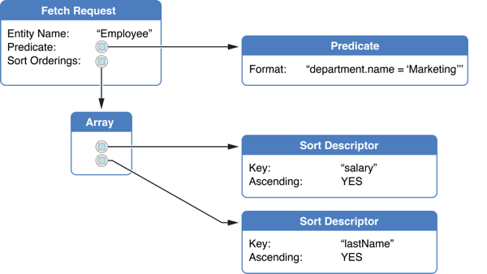

Core Data 学习笔记（一）框架简介
===

## 零、前言

学习iOS开发已经有一段时间了，由于一直没有系统的去从头到尾的学，多半是到AppCoda上面找文章来看，所以当真正开始想要做一个小应用时，却无从下手了。经过思考，感觉上应该是由于一直是看别人的教程，从头到尾的跟下来，但是却从来没有针对具体的细节进行思考的原因。所以开始打算在iOS应用开发过程中遇到的技术要点都深入的学习一下，然后整理成笔记，发在博客园、开源中国一个Github仓库当中。发在博客园的原因在于一直以来都是以博客园作为主要的博客平台来使用，发在开源中国是因为感觉开源中国的社交氛围要好一些。至于单独开一个Github仓库，纯粹是处于一种备份的目的。左右这三个平台都支持Markdown格式，所以也就没所谓了。

笔记中所涉及的图片，大都来自每篇笔记最下面的参考文章当中。我将参考文章分为了两个类别，一个是在苹果开发者库中找到的教程，第二个是通过互联网找到的各类博客文章。

每篇笔记发表之后，我还会根据在实际使用中的新的发现以及在网络上看到的比较好的文章之后，整理出新的心得到对应的笔记当中。

## 一、简单介绍

Core Data框架是用来管理数据在iOS应用当中的持久化操作的一种方式。其具有如下特性：

* 变更追踪及撤销操作
* 数据实体关系维护
* 延迟加载
* 自动属性验证
* 模式迁移
* 可选择的与应用控制器层的集成以支持用户交互的同步
* 对键值对变成和监视提供完整的、自动的支持
* 在内存和用户界面中组合、过滤、组织数据
* 额外数据仓库的自动化支持
* 查询字符串
* 合并策略

> 注意：
> 
> * Core Data不是一个数据库管理系统（RDBMS），其只是一个用于操作数据的持久化框架
> * 使用Core Data，你仍然需要在真实的项目中编写代码以操作数据
> * Core Data不依赖Cocoa绑定

## 二、基础说明

### 2.1 基础CoreData框架结构

从下图可知，在CoreData框架中，我们首先要创建一个持久化数据库对象用于持久化数据的存储，需要一个持久化存储协调器，用于处理持久化库对象与被管理对象上下文之间的操作。然后需要一个持久化上下文对象，在持久化上下文当中，包含了各种需要持久化的实体。

#### 2.1.1 管理对象和上下文

[持久化上下文（NSManagedObjectContext）]()：当我们将数据从数据库中提取出来后，将会放到持久化上下文当中，在持久化上下文中，我们可以对数据进行各种操作，但是这种操作在执行“保存”之前，是不会影响到数据库中的原有数据的。

[被管理实体对象（NSManagedObject）]()：数据模型对象在CoreData中被称为“被管理对象”。所有的被管理对象都需要被放置到一个持久化上下文当中，这样才能够使用上下文对被管理对象进行插入、删除、修改等各种操作。持久化上下文将会监视对被管理对象的各种修改，这样持久化上下文才能够对这些修改进行“撤销”、“重做”以及“保存”等操作。

当你决定将上下文中的所有改变都写入数据库时，CoreData将会检测所有上下文中的数据对象的可用性，当所有的数据对象都可用时，将会将上下文中的修改都写入到数据库当中。

#### 2.1.2 “数据提取”请求

为了使用持久化上下文从数据库中提取数据，需要创建一个[数据提取请求对象（NSFetchRequest）]()，数据提取请求对象用于描述你需要从数据库中提取怎样的数据出来，类似于其他ORM框架的查询条件。数据提取请求对象包含三个部分：想要操作的被管理实体对象名称，[条件格式字符串（NSPredicate）]()，条件数组（键值对）。如下图所示：

将数据提取请求提交给持久化上下文，持久化上下文将从数据库中提取出满足数据提取请求的数据，作为被管理对象返回。提取返回的被管理对象将会自动加入接受请求的持久化上下文中，如果被提取的数据已经存在于持久化上下文当中，那么直接从持久化上下文档中返回这些符合提取请求条件的数据对象。

#### 2.1.3 持久化存储协调器

持久化存储协调器[(NSPersistentStoreCoordinator)]()如下图所示，是用于处理被管理对象上下文（一个或多个）与数据库（一个或多个）之间操作的。换句话说，在CoreData框架中，如果说最上层为持久化上下文，最下层为数据库的话，持久化存储协调器就是处于框架的中间层。

持久化存储协调器实际上是定义了一个栈。协调器被设计为供上下文访问的一个“面”，协调器将整合多个数据库，这样在上下文对象看来，就只有一个“数据库”存在。所有在上下文中处理的数据对象，都来自协调器，不论这些数据是否是来自一个真实的数据库。所有在上下文中对数据对象的处理，都将有协调器自动针对各个数据库进行处理。

#### 2.1.4 持久化存储

[持久化存储（NSPersistentStore）]()是对某一个外部数据存储数据库文件或其他数据库在应用程序内的映射，以便可以使用持久化上下文进行操作。一般情况下，我们需要对一个持久化存储实例操作的，仅仅是指定其外部数据数据库的位置，其他的大部分有关数据持久化操作都是使用持久化上下文来进行的。

> 注意：
> 
> * 虽然CoreData支持对SQLite的持久化管理，但是CoreData无法处理不是使用框架创建的SQLite数据库，也就是说，CoreData只能处理和持久化自己创建的SQLite数据库。

### 2.2 被管理对象与被管理对象模型

[被管理对象模型（NSManagedObjectModel）]()提供用于描述[被管理对象（NSManagedObject）]()纲要（Schema）。一般被管理对象模型可以使用"Xcode Data Model Design"工具创建。

被管理对象模型是一个实体描述对象的集合，每一个实体描述对象都是一个关于实体的元数据，包括实体名称、在应用中使用的实体名称（类实例变量/常量名）、实体属性以及实体与其他实体的关系。如下图所示：

需要持久化的数据对象必须是`NSManagedObject`类的实例，或这个类的子类的实例。被管理对象类使用一个私有的内部存储来维护属性和实现被管理对象各种所需的基础行为。一个被管理对象有一个到实体描述的索引。这个索引关联到数据实体的元数据，包括实体名称以及关于实体属性和关系的描述信息。

> 注意：
>  
> * 可以创建`NSManagedObject`的子类来丰富被管理对象的行为。

## 参考

### [官方文档](https://developer.apple.com/library/ios/navigation/)

* [Core Data Programming Guide](https://developer.apple.com/library/ios/documentation/Cocoa/Conceptual/CoreData/cdProgrammingGuide.html) 
* [Technology Overview]()
* [Core Data Basics]()
* [Predicate Format String Syntax](https://developer.apple.com/library/prerelease/ios/documentation/Cocoa/Conceptual/Predicates/)

### 网摘文章

* [Core Data入门](http://www.cnblogs.com/mjios/archive/2013/02/26/2932999.html) by [@M了个J](https://github.com/CoderMJLee)
