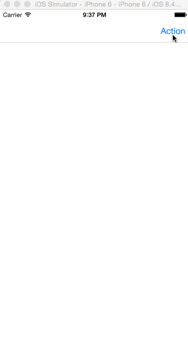
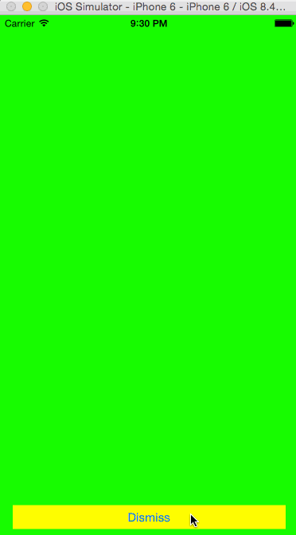
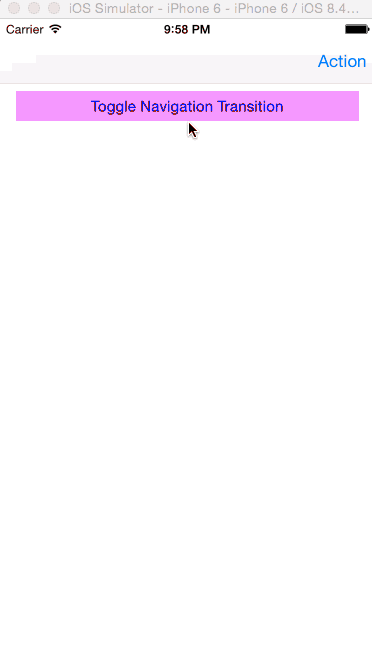

UIView Animation 学习笔记 应用示例
===

## 示例一 视图内动画

### 1. 准备

1. 使用Xcode创建一个"Single View Application"项目
2. 从控件库中选择一个标签（Label）以及一个按钮（Button）放在默认的视图上
3. 设置标签（水平居中、垂直居中）以及按钮（宽度、距离屏幕下边框的位置、水平居中）的约束
4. 将标签的两个约束使用Ctrl拖拽到对应的`ViewController`当中，并分别命名为`centerXAlign`与`centerYAlign`
5. 使用Ctrl拖动按钮到代码中，并命名其为`button`
6. 添加并重载方法`viewWillAppear`与`viewDidAppear`

准备完成后，代码部分如下所示：

```swift
import UIKit

class ViewController: UIViewController {

    @IBOutlet weak var centerXAlign: NSLayoutConstraint!
    @IBOutlet weak var centerYAlign: NSLayoutConstraint!
    
    @IBOutlet weak var button: UIButton!
    
    // ... 

    override func viewWillAppear(animated: Bool) {
        super.viewWillAppear(animated)
        
    }
    
    override func viewDidAppear(animated: Bool) {
        super.viewDidAppear(animated)

    }
}
```

### 2. 添加水平移入动画

根据之前的准备，我们可以开始进行动画效果的编写。为了让标签实现水平移入的动画效果，我们需要改变标签的初始位置到屏幕的外面。如下所示：

```swift
override func viewWillAppear(animated: Bool) {
    super.viewWillAppear(animated)
    
    centerXAlign.constant -= view.bounds.width
}
```

`viewWillAppear`方法用于执行在视图还没有显现，但是将要显现时候，需要进行的操作。`.constant`为约束的值。`view.bounds`表示当前视图的边界。

> 注意：上面代码中`centerXAlign.constant`减去的内容并不是其精确的需要减去的数值，只是出于方便的考虑才直接使用视图的宽度进行设置。

在视图将要载入时，将要显示的内容移除屏幕后，我们需要在视图完成显示时，再将屏幕外的标签移动进来。由于想要达到水平移动的效果，我们只需要改变标签水平约束的值就可以了。如下所示：

```swift
override func viewDidAppear(animated: Bool) {
    super.viewDidAppear(animated)
    
    UIView.animateWithDuration(1.0, delay: 0.0, options: UIViewAnimationOptions.CurveEaseOut, animations: {
        self.centerXAlign.constant += self.view.bounds.width
        
        self.view.layoutIfNeeded()
    }, completion: nil)
}
```

我们设置标签移入动画的持续时间为1秒，延迟0秒执行，使用`.CurveEaseOut`效果执行动画。动画的内容为对标签的约束执行“加”操作，并调用`self.view.layoutIfNeeded()`方法，使动画效果生效。

此时，我们执行程序将会发现，标签从屏幕的右方水平移入。

> 注意：所有的动画效果，都是通过改变UIView实例的如下属性来进行的。
> 
> * center —— 中心
> * alpha —— 透明度
> * frame —— 边框
> * bounds —— 约束
> * transform —— 切换
> * backgroundColor —— 背景色
> * contentStretch —— 内容缩放

### 3. 添加弹性动画

之前我们已经完成对标签水平移入的操作，这里我们为之前添加的按钮添加弹性动画的效果。按钮将在标签水平移入后，执行弹性动画。具体实现如下所示：

```swift
override func viewDidAppear(animated: Bool) {
    super.viewDidAppear(animated)
    
    // ...
    
    let bounds = self.button.bounds
    UIView.animateWithDuration(2.0, delay: 1.2, usingSpringWithDamping: 0.1, initialSpringVelocity: 100.0, options: nil, animations: {

        self.button.bounds = CGRect(x: bounds.origin.x - 80, y: bounds.origin.y, width: bounds.size.width + 160, height: bounds.height)

        }, completion: nil)
}
```

在上面的代码中，我们通过使用一个新的矩形描述改变按钮的边界值，从而实现对按钮大小改变的弹性动画。

## 示例二 视图间切换

### 1. 准备

1. 新建一个Xcode iOS项目，类型选择“Single View Application”
2. 打开StoryBoard，拖入一个`View Controller`
3. 向项目添加文件，分别为“ActionViewController.swift”、“CustomPresentAnimationController.swift”、“CustomDismissAnimationController.swift”、“CustomNavigationAnimationController.swift”。其中“ActionViewController.swift”为`UIViewController`的子类，“CustomPresentAnimationController.swift”、“CustomDismissAnimationController.swift”“CustomNavigationAnimationController.swift”、“CustomNavigationAnimationController.swift”为`NSObject`的子类。
4. 设置新拖入的`View Controller`的类为`ActionViewController`
5. 设置`Action View Controller`的背景色，并拖入一个按钮，修改按钮标题为“Dismiss”
6. 为主视图添加一个导航条按钮，并添加到`Action View Controller`的Segue，设置Segue的类型为`Present Modal`，用于弹出`Action View Controller`
7. 为主视图添加一个按钮，并修改文字为“Toggle Navigation Transition”
8. 拖拽一个ViewController到画板，然后关联“Toggle Navigation Transition”按钮到新添加的ViewController

> 注意：
>
> * 在向项目添加文件的时候，要注意不要选择了OSX应用类型。

### 2. 视图出现切换效果

向CustomPresentAnimationController.swift文件添加如下代码。

```swift
import UIKit

class CustomPresentAnimationController: NSObject, UIViewControllerAnimatedTransitioning {

    func transitionDuration(transitionContext: UIViewControllerContextTransitioning) -> NSTimeInterval {
        return 5.0
    }

    func animateTransition(transitionContext: UIViewControllerContextTransitioning) {
        
        let fromViewController = transitionContext.viewControllerForKey(UITransitionContextFromViewControllerKey)!
        let toViewController = transitionContext.viewControllerForKey(UITransitionContextToViewControllerKey)!
        let finalFrameForVC = transitionContext.finalFrameForViewController(toViewController)
        let containerView = transitionContext.containerView()
        
        let bounds = UIScreen.mainScreen().bounds
        toViewController.view.frame = CGRectOffset(finalFrameForVC, 0, bounds.size.height)
        containerView.addSubview(toViewController.view)
        
        UIView.animateWithDuration(transitionDuration(transitionContext), delay: 0.0, usingSpringWithDamping: 0.5, initialSpringVelocity: 0.0, options: .CurveLinear, animations: {
            fromViewController.view.alpha = 0.5
            toViewController.view.frame = finalFrameForVC
            }, completion: {
                finished in
                transitionContext.completeTransition(true)
                fromViewController.view.alpha = 1.0
        })
    }
}
```

向ViewController.swift文件添加如下代码。

```swift
import UIKit

class ViewController: UIViewController, UIViewControllerTransitioningDelegate {

    // ...
    
    let customPresentAnimationController = CustomPresentAnimationController()
    
    override func prepareForSegue(segue: UIStoryboardSegue, sender: AnyObject?) {
        
        if segue.identifier == "showAction" {
            let toViewController = segue.destinationViewController as! UIViewController
            toViewController.transitioningDelegate = self
        }
    }
    
    func animationControllerForPresentedController(presented: UIViewController, presentingController presenting: UIViewController, sourceController source: UIViewController) -> UIViewControllerAnimatedTransitioning? {
        return customPresentAnimationController
    }    
}
```



### 3. 视图消失切换效果

向CustomDismissAnimationController.swift添加如下代码。

```swift
import UIKit

class CustomDismissAnimationController: NSObject, UIViewControllerAnimatedTransitioning {

    func transitionDuration(transitionContext: UIViewControllerContextTransitioning) -> NSTimeInterval {
        return 1.0
    }
    
    func animateTransition(transitionContext: UIViewControllerContextTransitioning) {
        
        let fromViewController = transitionContext.viewControllerForKey(UITransitionContextFromViewControllerKey)!
        let toViewController = transitionContext.viewControllerForKey(UITransitionContextToViewControllerKey)!
        let finalFrameForVC = transitionContext.finalFrameForViewController(toViewController)
        let containerView = transitionContext.containerView()
        
        toViewController.view.frame = finalFrameForVC
        toViewController.view.alpha = 0.5
        containerView.addSubview(toViewController.view)
        containerView.sendSubviewToBack(toViewController.view)
        
        UIView.animateWithDuration(transitionDuration(transitionContext), animations: {
            fromViewController.view.frame = CGRectInset(fromViewController.view.frame, fromViewController.view.frame.size.width / 2, fromViewController.view.frame.size.height / 2)
            toViewController.view.alpha = 1.0
            }, completion: {
                finished in
                transitionContext.completeTransition(true)
        })
    }
}
```

向ViewController.swift添加如下代码。

```swfit
import UIKit

class ViewController: UIViewController, UIViewControllerTransitioningDelegate {

    // ..

    // MARK: - for Segue's present modally action
    
    // ...

    let customDismissAnimationController = CustomDismissAnimationController()
    
    @IBAction func dimssViewController(segue: UIStoryboardSegue) {
        
    }
    
    // MARK: - UIViewControllerTransitioningDelegate's method
    
    // ...
    
    func animationControllerForDismissedController(dismissed: UIViewController) -> UIViewControllerAnimatedTransitioning? {
        return customDismissAnimationController
    }
}
```



### 4. 视图导航切换效果

向CustomNavigationAnimationController.swift添加如下代码。（实际上是使用第三步的切换效果）

```swift
import UIKit

class CustomNavigationAnimationController: NSObject, UIViewControllerAnimatedTransitioning {
    
    func transitionDuration(transitionContext: UIViewControllerContextTransitioning) -> NSTimeInterval {
        return 2.0
    }
    
    func animateTransition(transitionContext: UIViewControllerContextTransitioning) {
        let fromViewController = transitionContext.viewControllerForKey(UITransitionContextFromViewControllerKey)!
        let toViewController = transitionContext.viewControllerForKey(UITransitionContextToViewControllerKey)!
        let finalFrameForVC = transitionContext.finalFrameForViewController(toViewController)
        let containerView = transitionContext.containerView()
        
        toViewController.view.frame = finalFrameForVC
        toViewController.view.alpha = 0.5
        containerView.addSubview(toViewController.view)
        containerView.sendSubviewToBack(toViewController.view)
        
        UIView.animateWithDuration(transitionDuration(transitionContext), animations: {
            fromViewController.view.frame = CGRectInset(fromViewController.view.frame, fromViewController.view.frame.size.width / 2, fromViewController.view.frame.size.height / 2)
            toViewController.view.alpha = 1.0
            }, completion: {
                finished in
                transitionContext.completeTransition(true)
        })
    }
}
```

向ViewController.swift添加如下代码。

```swift
import UIKit

class ViewController: UIViewController, UIViewControllerTransitioningDelegate, UINavigationControllerDelegate {

    // ...

    // MARK: - for Segue's present modally action
    
    // ...

    let customNavigationAnimationController = CustomNavigationAnimationController()
    
    // MARK: - UIViewControllerTransitioningDelegate's method
    
    // ...
    
    // MARK: - UINavigationControllerDelegate's method
    
    func navigationController(navigationController: UINavigationController, animationControllerForOperation operation: UINavigationControllerOperation, fromViewController fromVC: UIViewController, toViewController toVC: UIViewController) -> UIViewControllerAnimatedTransitioning? {
        return customNavigationAnimationController
    }
}
```



#### 添加交互

注：此效果是后来添加的，由于在设计Demo的时候没有考虑到，所以就在Demo项目中就没有实现。代码来自参考的文章。

新建一个“CustomInteractionController”类。并编辑这个类文件为如下所示。

```swift
import UIKit

class CustomInteractionController: UIPercentDrivenInteractiveTransition {
    
    var navigationController: UINavigationController!
    var shouldCompleteTransition = false
    var transitionInProgress = false
    
    var completionSeed: CGFloat {
        return 1 - percentComplete
    }
    
    func attachToViewController(viewController: UIViewController) {
        navigationController = viewController.navigationController
        setupGestureRecognizer(viewController.view)
    }
    
    private func setupGestureRecognizer(view: UIView) {
        view.addGestureRecognizer(UIPanGestureRecognizer(target: self, action: "handlePanGesture:"))
    }
    
    func handlePanGesture(gestureRecognizer: UIPanGestureRecognizer) {
        let viewTranslation = gestureRecognizer.translationInView(gestureRecognizer.view!.superview!)
        switch gestureRecognizer.state {
        case .Began:
            transitionInProgress = true
            navigationController.popViewControllerAnimated(true)
        case .Changed:
            var const = CGFloat(fminf(fmaxf(Float(viewTranslation.x / 200.0), 0.0), 1.0))
            shouldCompleteTransition = const > 0.5
            updateInteractiveTransition(const)
        case .Cancelled, .Ended:
            transitionInProgress = false
            if !shouldCompleteTransition || gestureRecognizer.state == .Cancelled {
                cancelInteractiveTransition()
            } else {
                finishInteractiveTransition()
            }
        default:
            println("Swift switch must be exhaustive, thus the default")
        }
    }
}
```

向ViewController.swift文件添加如下代码。

```swift
//
//  ViewController.swift
//  ViewTransition
//
//  Created by CongJunfeng on 15/8/2.
//  Copyright (c) 2015年 46day. All rights reserved.
//

import UIKit

class ViewController: UIViewController, UIViewControllerTransitioningDelegate, UINavigationControllerDelegate {

    // ...

    // MARK: - for Segue's present modally action
    
    // ...
    
    let customInteractionController = CustomInteractionController() // for Interaction
    
    // MARK: - UIViewControllerTransitioningDelegate's method
    
    // ...
    
    // MARK: - UINavigationControllerDelegate's method
    
    func navigationController(navigationController: UINavigationController, animationControllerForOperation operation: UINavigationControllerOperation, fromViewController fromVC: UIViewController, toViewController toVC: UIViewController) -> UIViewControllerAnimatedTransitioning? {
        
        /**
        *  for Interaction
        */
        if operation == .Push {
            customInteractionController.attachToViewController(toVC)
        }
        
        return customNavigationAnimationController
    }
    
    // for Interaction
    func navigationController(navigationController: UINavigationController, interactionControllerForAnimationController animationController: UIViewControllerAnimatedTransitioning) -> UIViewControllerInteractiveTransitioning? {
        return customInteractionController.transitionInProgress ? customInteractionController : nil
    }
}
```

## 参考

* [Creating Simple View Animations in Swift](http://www.appcoda.com/view-animation-in-swift/)
* [Introduction to Custom View Controller Transitions and Animations](http://www.appcoda.com/custom-view-controller-transitions-tutorial)